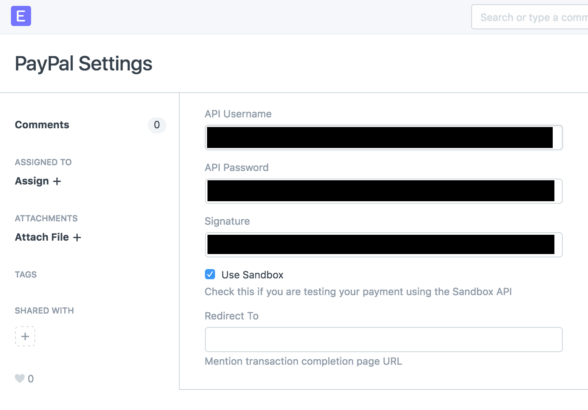
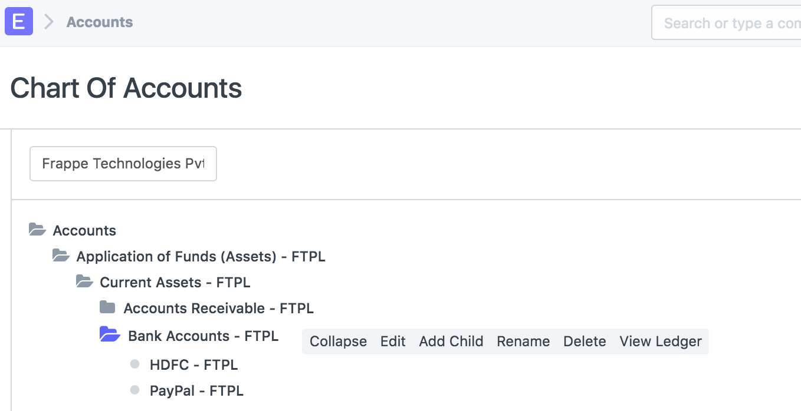
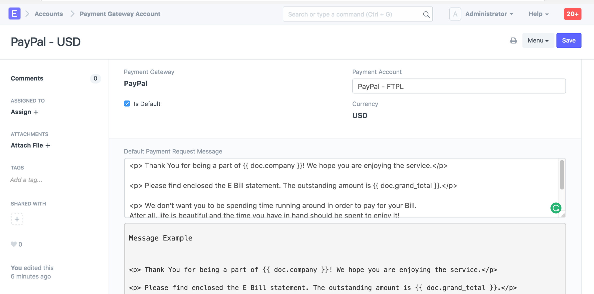
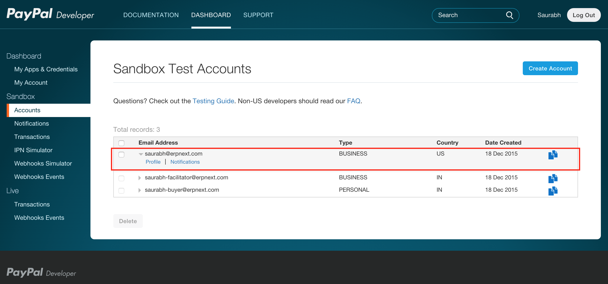
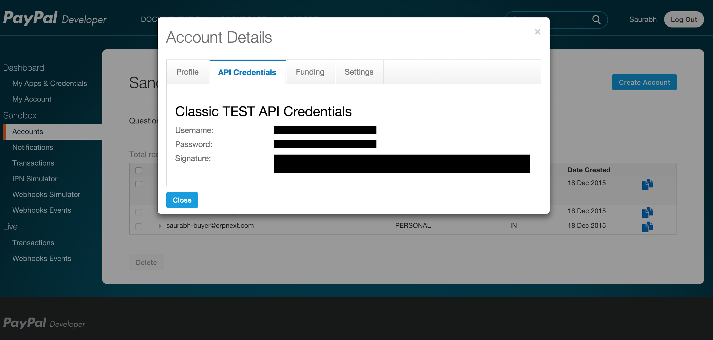
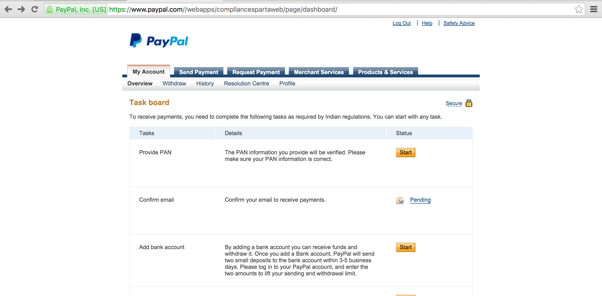
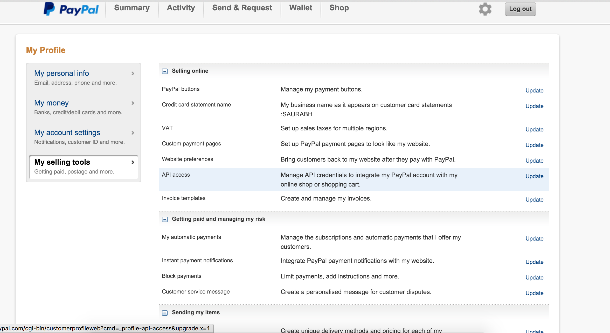
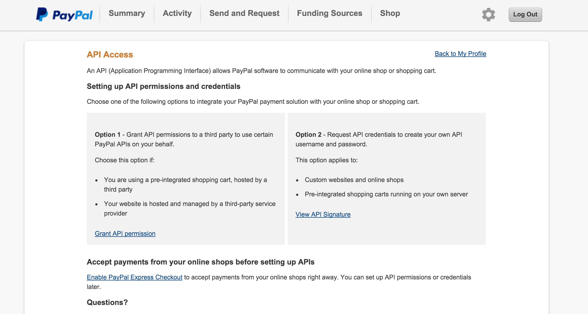

# Setting up PayPal

[ Edit ](https://docs.frappe.io/wiki/spaces/24hrpr6es9/page/0s7f8688s2)

Open in ChatGPT  Ask ChatGPT about this page Open in Claude  Ask Claude about this page

# Setting up PayPal 

[ Edit ](https://docs.frappe.io/wiki/spaces/24hrpr6es9/page/0s7f8688s2)

Open in ChatGPT  Ask ChatGPT about this page Open in Claude  Ask Claude about this page

A payment gateway is an e-commerce application service provider service that authorizes credit card payments for e-businesses, online retailers, bricks and clicks, or traditional brick and mortar.

A payment gateway facilitates the transfer of information between a payment portal (such as a website, mobile phone or interactive voice response service) and the Front End Processor or acquiring bank.

To setup PayPal , `Explore > Integrations > PayPal Settings`

#### Setup PayPal

To enable PayPal payment service, you need to configure parameters like API Username, API Password and Signature.

You also can set test payment environment, by settings `Use Sandbox`

On enabling service, the system will create Payment Gateway record and Account head in chart of accounts having account type as Bank.

Also it will create Payment Gateway Account entry. Payment Gateway Account is configuration hub from this you can set account head from existing COA, default Payment Request email body template.

After enabling service and configuring Payment Gateway Account your system is able to accept online payments.

####Supporting transaction currencies AUD, BRL, CAD, CZK, DKK, EUR, HKD, HUF, ILS, JPY, MYR, MXN, TWD, NZD, NOK, PHP, PLN, GBP, RUB, SGD, SEK, CHF, THB, TRY, USD

##Get PayPal credentials

#### Paypal Sanbox API Signature

  * Login to paypal developer account, [PayPal Developer Account](https://developer.paypal.com/)

  * From **Accounts** tab. create a new business account. 

  * From this account profile you will get your sandbox api credentials 

* * *

#### PayPal Account API Signature

  * Login to PayPal Account and go to profile 

  * From **My Selling Tools** go to **api Access** 

  * On API Access Page, choose option 2 to generate API credentials 

[ Previous Page ERPNext Shipping ](erpnext_shipping.md) [ Next Page RazorPay Integration  ](https://docs.frappe.io/erpnext/razorpay-integration)

Last updated 2 weeks ago 

Was this helpful?
