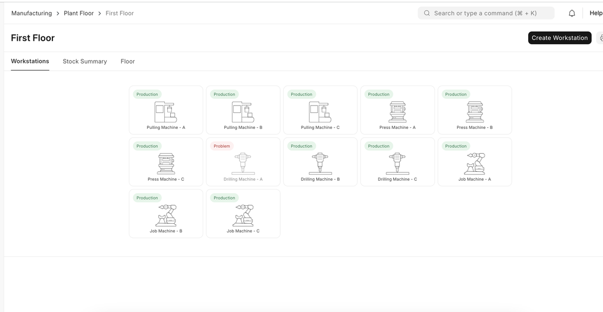
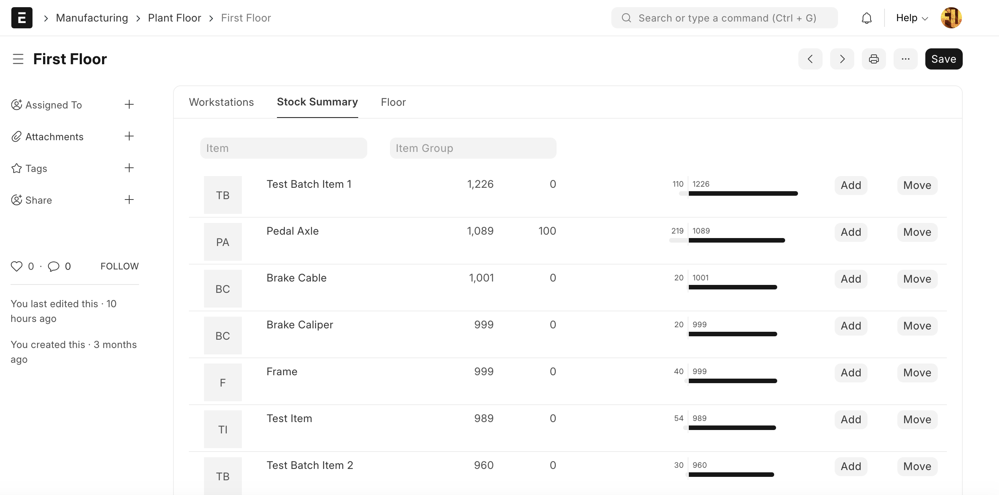
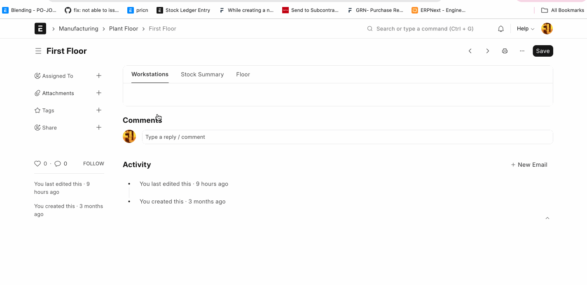

# Plant Floor

[ Edit ](https://docs.frappe.io/wiki/spaces/24hrpr6es9/page/0t5p696tda)

Open in ChatGPT  Ask ChatGPT about this page Open in Claude  Ask Claude about this page

# Plant Floor

[ Edit ](https://docs.frappe.io/wiki/spaces/24hrpr6es9/page/0t5p696tda)

Open in ChatGPT  Ask ChatGPT about this page Open in Claude  Ask Claude about this page

Plant Floor feature in the ERPNext is used to visualize the status of machines and workstations within the corresponding plant floor. This feature provides visual interface for processing job cards.

## How It Works

  * Create the plant floor and set the warehouse (Manufacturing -> Plant Floor -> New)
  * Create machine using workstation and select the plant floor.
  * Set the Illustration for the active and inactive status in the workstation.

After that you can see the status of machines and workstations using plant floor.

### Visualize Stock Summary

Using plant floor, users can visualize the stock of the corresponding plant floor. Using this feature user can add or move the stock.

### Visualize Job Cards

[ Previous Page Job Card  ](job-card.md) [ Next Page Manufacturing Reports  ](https://docs.frappe.io/erpnext/manufacturing-reports)

Last updated 2 weeks ago 

Was this helpful?
