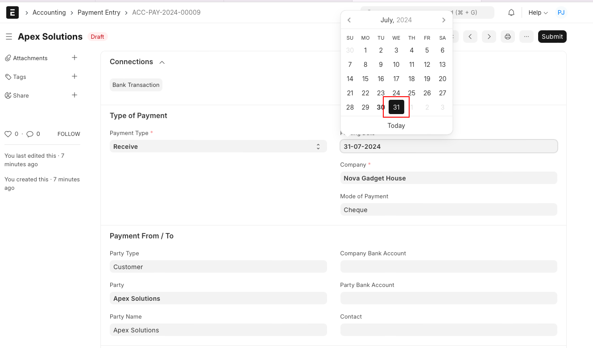

# Post Dated Cheque Entry

[ Edit ](https://docs.frappe.io/wiki/spaces/24hrpr6es9/page/0sn1g6c6sj)

Open in ChatGPT  Ask ChatGPT about this page Open in Claude  Ask Claude about this page

# Post Dated Cheque Entry

[ Edit ](https://docs.frappe.io/wiki/spaces/24hrpr6es9/page/0sn1g6c6sj)

Open in ChatGPT  Ask ChatGPT about this page Open in Claude  Ask Claude about this page

Post Dated Cheque is a cheque dated on future date. Party generally give post dated cheque, as advance payment. This cheque would be cleared only when cheque date arrives.

In ERPNext, create Payment Entry for post dated cheque.

#### New Payment Entry

To open new journal voucher go to:

> `Accounting > Payment Entry > New`

#### Set Posting Date

Assuming your Cheque Date is 31st December, 2016 (or any future date). As a result, this posting in your bank ledger will appear on Posting Date updated.

Note: Payment Entry Reference Date should equal to or less than Posting Date.

#### Save and Submit

After entering required details, Save and Submit the Payment Entry.

#### Adjusting Post Dated Cheque Entry

You can adjust Post Dated Payment Entry against an invoice via [Payment Reconciliation Tool](payment-reconciliation.md).

When cheque is cleared, i.e. on actual date on the cheque, you can update its Clearance Date via [Bank Reconciliation Tool](bank-reconciliation.md).

In the Chart of Accounts, you might find value of this Payment Entry already reflecting against bank Account. You should check **Bank Reconciliation Statement** , a report in the account module to know difference of bank balance as per system, and actual balance in the bank's statement.

[ Previous Page Difference Entry  ](difference-entry-button.md) [ Next Page Adjusting Withhold Amount ](https://docs.frappe.io/erpnext/adjusting-withhold-amount)

Last updated 1 week ago 

Was this helpful?
