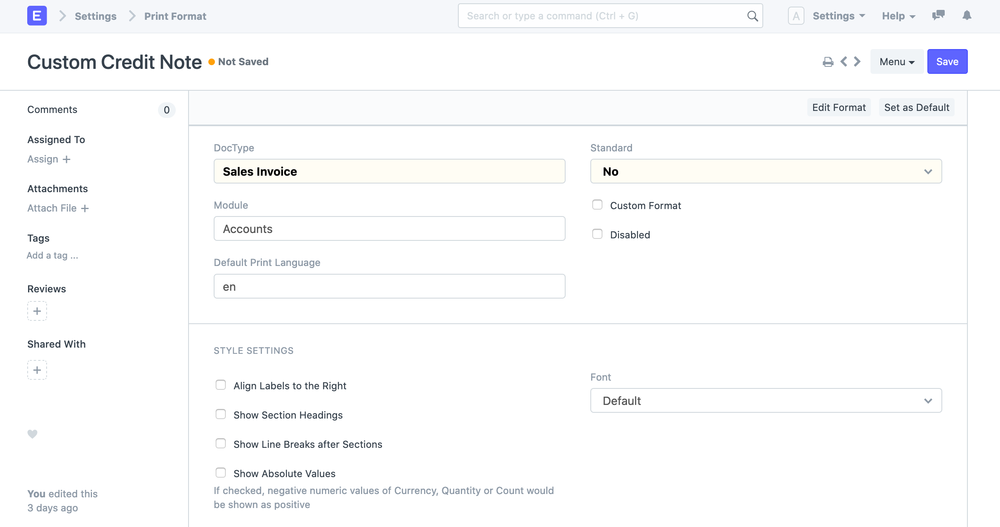
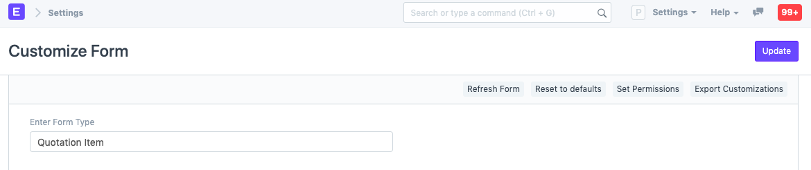
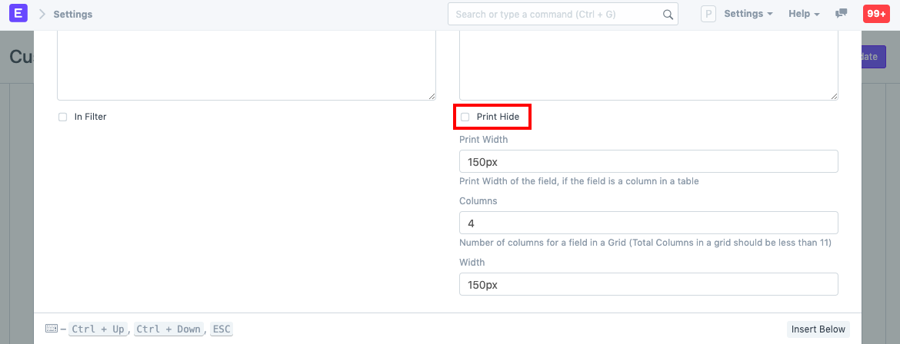
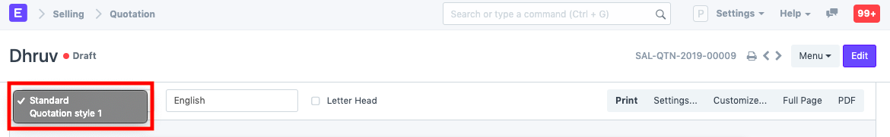

# Print Format

[ Edit ](https://docs.frappe.io/wiki/spaces/24hrpr6es9/page/0rae6ma818)

Open in ChatGPT  Ask ChatGPT about this page Open in Claude  Ask Claude about this page

# Print Format 

[ Edit ](https://docs.frappe.io/wiki/spaces/24hrpr6es9/page/0rae6ma818)

Open in ChatGPT  Ask ChatGPT about this page Open in Claude  Ask Claude about this page

**With Print Format, you can set how document types look when printing.**

Every transaction has a default Print Format called 'Standard'. You can change Print Formats by:

  * Using the Print Format form
  * Using Jinja/JS scripting under Print Format
  * Using the [Print Format Builder](print-format-builder.md) to create print formats with UI
  * Using Customize Form to hide/unhide fields

To access Print Format, go to:

> Home > Settings > Print Format

## 1\. How to create a Print Format

  1. Go to the Print Format List, click on New.
  2. Enter a name and select a DocType for which the Print Format is to be used.
  3. The module for which it should apply will be selected automatically.

  1. Save.

Under Style Settings, there are options to change the styling options. With those options, you can change the font, align the labels together on the left or right, add headings for sections, etc.

To style the Print Format using custom Jinja/JS, click on Custom Format. If you select this option, there'll be a checkbox for raw printing. To know more about raw printing, [click here](raw-printing.md).

If developer mode is enabled, you can select Standard as yes to contribute a print format as a standard (preset) print format in the system.

## 1.1 Using Customize form to change the Print Format items

Fields in the transactions and their child tables can be hidden/shown using Customize Form. For example, if you want to hide the 'Item Code' when printing a Quotation, click on the print icon to enter the print screen.

Go to Menu > Customize, select Quotation Item in the 'Enter Form Type' field. 

To know more, visit the [Customize Print Format](print-format.md) page.

In the fields table, expand the 'Item Code' row, scroll down and tick the 'Print Hide' checkbox. 

A newly created Print Format can be selected on the print screen of a transaction. From there you can see how it looks and proceed to print. 

## 2\. Video

### 3\. Related Topics

  1. [Print Style](print-style.md)
  2. [Print Headings](print-headings.md)
  3. [Letter Head](letter-head.md)
  4. [Cheque Print Template](cheque-print-template.md)
  5. [Disabling Line Breaks in Print Format Sections](https://docs.frappe.io/erpnext/print-format-sections)

[ Previous Page Printing ](printing.md) [ Next Page Print Format Builder  ](print-format-builder.md)

Last updated 1 week ago 

Was this helpful?
