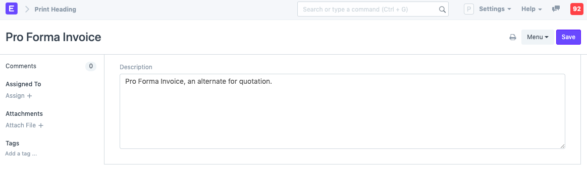
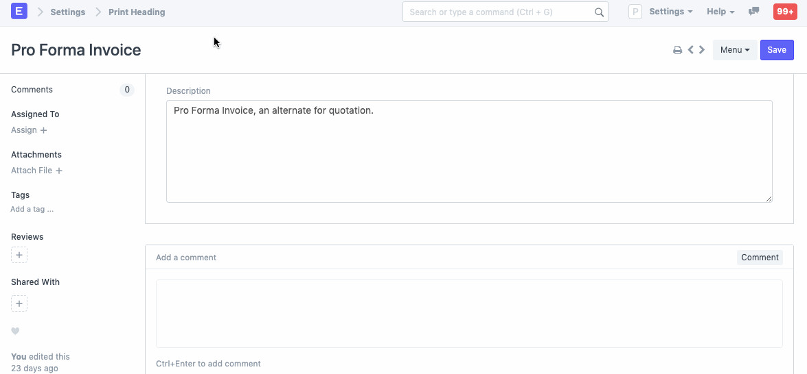
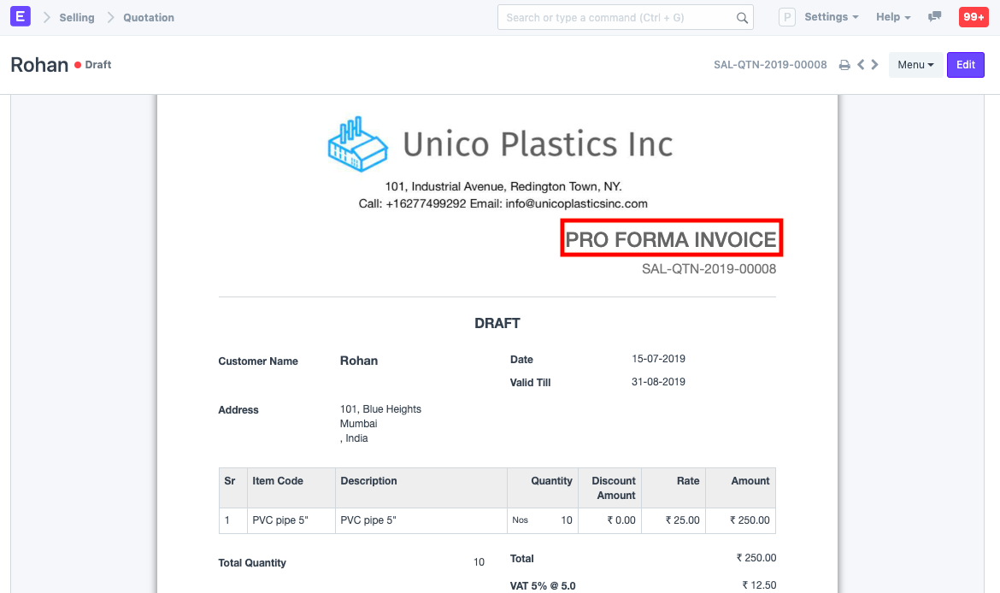

# Print Headings

[ Edit ](https://docs.frappe.io/wiki/spaces/24hrpr6es9/page/0raiaeubno)

Open in ChatGPT  Ask ChatGPT about this page Open in Claude  Ask Claude about this page

# Print Headings 

[ Edit ](https://docs.frappe.io/wiki/spaces/24hrpr6es9/page/0raiaeubno)

Open in ChatGPT  Ask ChatGPT about this page Open in Claude  Ask Claude about this page

**Print Headings are the names/titles you can give your transactions.**

These transactions include Sales Invoices, Supplier Quotations, etc. You can create a list of names for different business communications.

If you want to rename a transaction on how it appears when printing, you can do so via Print Headings. For example, a Quotation is also called a "Proposal", Estimate", or "Pro Forma Invoice".

To access Print Headings go to:

> Home > Settings > Print Heading

## 1\. How to create a Print Heading

  1. Go to the Print Heading list, click on New.
  2. Enter the heading that will appear on the document.
  3. Save.

To use the print heading, select the created print heading in the 'Print Heading' field transaction, shown as follows:

Example of a change in print heading is shown as follows:

## 2\. Video

### 3\. Related Topics

  1. [Print Format](print-format.md)
  2. [Print Style](print-style.md)
  3. [Letter Head](letter-head.md)
  4. [Cheque Print Template](cheque-print-template.md)
  5. [Quotation](quotation.md)

[ Previous Page Letter Head  ](letter-head.md) [ Next Page Cheque Print Template ](cheque-print-template.md)

Last updated 1 week ago 

Was this helpful?
