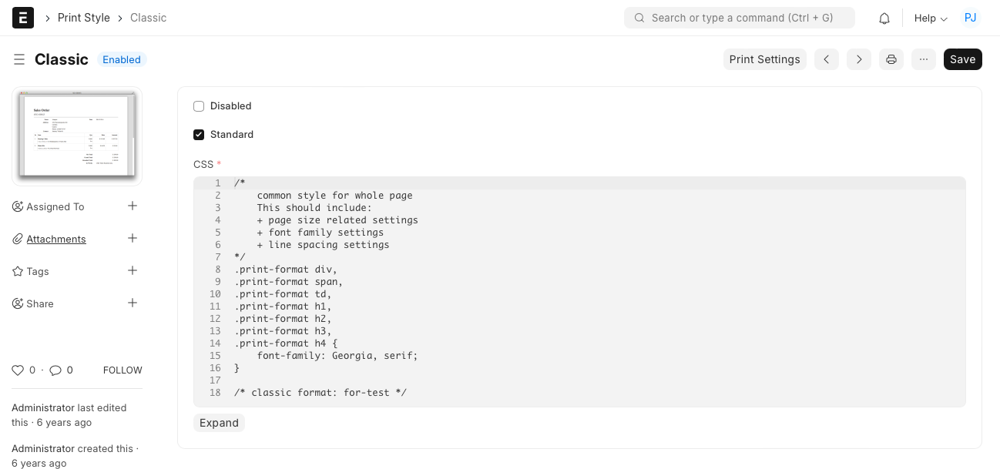

# Print Style

[ Edit ](https://docs.frappe.io/wiki/spaces/24hrpr6es9/page/0rai0hcqu6)

Open in ChatGPT  Ask ChatGPT about this page Open in Claude  Ask Claude about this page

# Print Style

[ Edit ](https://docs.frappe.io/wiki/spaces/24hrpr6es9/page/0rai0hcqu6)

Open in ChatGPT  Ask ChatGPT about this page Open in Claude  Ask Claude about this page

**'Print Style' helps you define custom CSS styles which can be applied to Print Formats.**

ERPNext comes with preset styles for printing documents. You can also create new styles using CSS that can be applied to all your print formats.

The standard print Styles in ERPNext are: Monochrome, Modern, Redesign and Classic.

To create a new Print Style go to:

> Home > Settings > Print Style

## How to create a new Print Style?

  1. Go to the Print Style list and click on New.
  2. Enter a name for the Print Style.
  3. Enter the CSS that'll define how the style will look like.
  4. Save.

The styles you create here apply to both standard and custom print formats. To find out the various CSS classes available, you can make a standard print format, open in a new page and see the source.

A default Print Style, can be set from [Print Settings](print-settings.md).

All Print Format styles are based on Bootstrap (Version 3) CSS Framework.

If you have enabled developer mode and tick on Standard then system will generate the JSON file for the Print Style. You can contribute a default print style with this.

### Related Topics

  1. [Print Format](print-format.md)
  2. [Print Headings](print-headings.md)
  3. [Letter Head](letter-head.md)
  4. [Cheque Print Template](cheque-print-template.md)

[ Previous Page Print Settings  ](print-settings.md) [ Next Page Printing and Branding  ](print.md)

Last updated 1 week ago 

Was this helpful?
