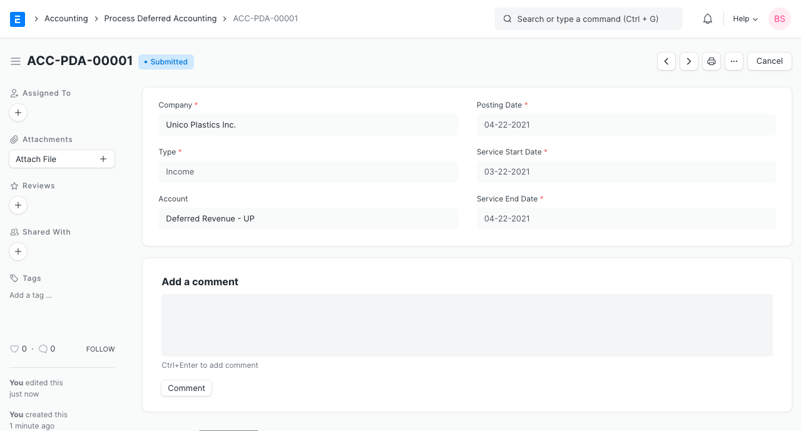
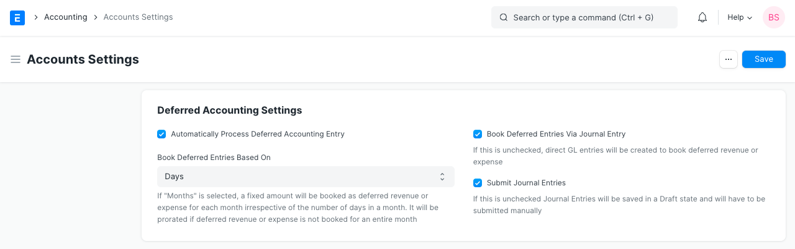

# Process Deferred Accounting

[ Edit ](https://docs.frappe.io/wiki/spaces/24hrpr6es9/page/0ropbupi7s)

Open in ChatGPT  Ask ChatGPT about this page Open in Claude  Ask Claude about this page

# Process Deferred Accounting 

[ Edit ](https://docs.frappe.io/wiki/spaces/24hrpr6es9/page/0ropbupi7s)

Open in ChatGPT  Ask ChatGPT about this page Open in Claude  Ask Claude about this page

**Process Deferred Accounting is a log which is created on every processing of deferred revenue or expense.**

Process Deferred Accounting records are automatically created on booking Deferred Revenue or Expense. It is done via a background job but the user can also create a record for manual Deferred Revenue or Expense booking.

To access the Process Deferred Accounting list, go to:

> Home > Accounting > General Ledger > Process Deferred Accounting

## 1\. Prerequisites

Before creating and using a Process Deferred Accounting, it is advised to create and understand the following first:

  * [Deferred Revenue](deferred-revenue.md)
  * [Deferred Expense](deferred-expense.md)

## 2\. How to create a Process Deferred Accounting

  1. Go to Process Deferred Accounting list, click on New.
  2. Enter the Company.
  3. Select the type of deferred accounting process. Select 'Income' for booking deferred revenue or select 'Expense' for booking deferred expense
  4. Expand the posting date.
  5. Enter service Start Date and End Date.
  6. Save and Submit.

## 3\. Features

### 3.1 On Submitting

On submitting a Process Deferred Accounting document, GL Entries for deferred revenue or expense booking will be created for all the invoices falling between the service Start Date and End Date.

Enter the account if Deferred Revenue or Expense has to be booked only for specific deferred income or expense account

### 3.2 Enabling automatic deferred accounting

To enable automatic deferred accounting, enable the 'Automatically Process Deferred Account Entry' checkbox by navigating to Accounts Settings.

To access Accounts Settings go to:

> Home > Accounting > Accounting Masters > Accounts Settings

[ Previous Page Deferred Accounting ](deferred-accounting.md) [ Next Page Currency  ](currency.md)

Last updated 2 weeks ago 

Was this helpful?
