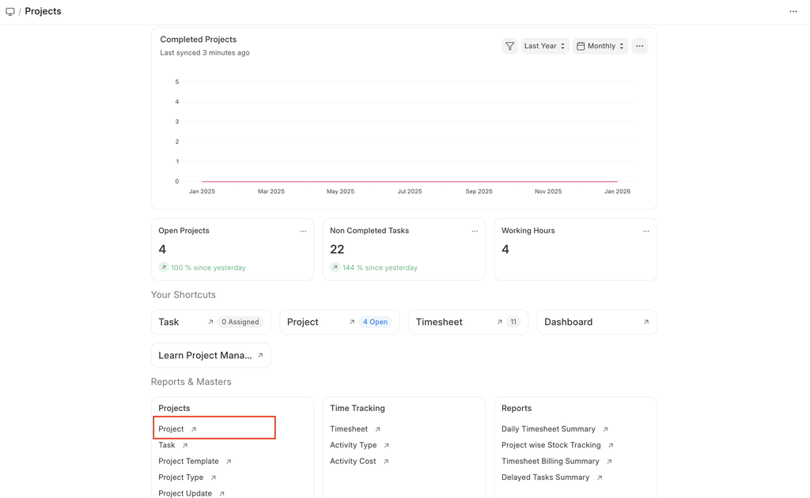
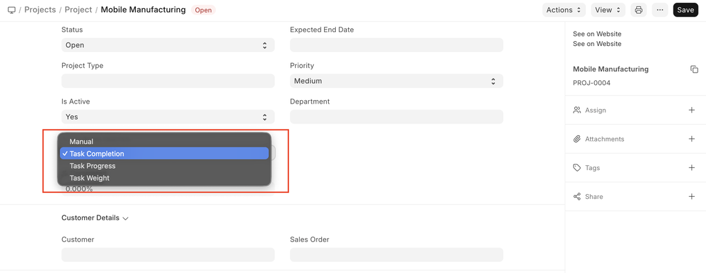
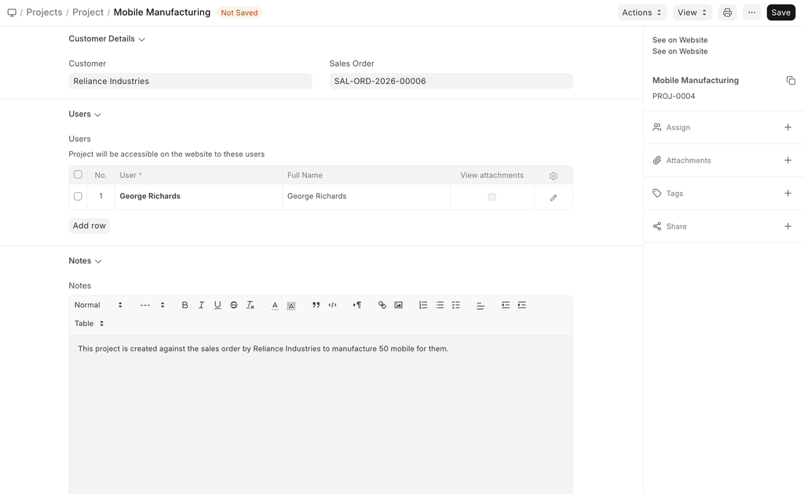
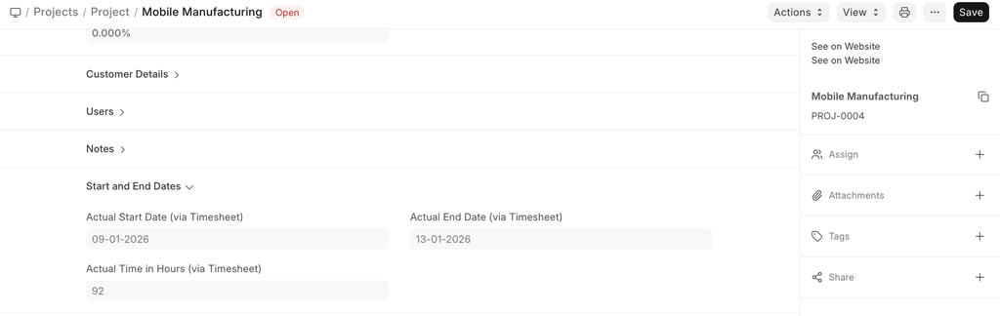
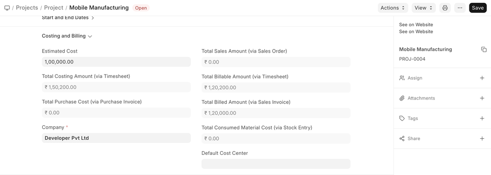
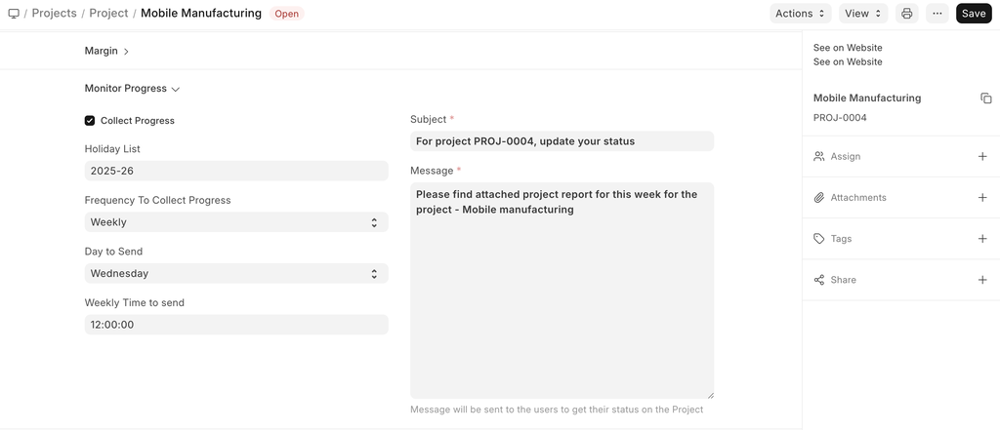

# Project

[ Edit ](https://docs.frappe.io/wiki/spaces/24hrpr6es9/page/0s26g1c9n7)

Open in ChatGPT  Ask ChatGPT about this page Open in Claude  Ask Claude about this page

# Project 

[ Edit ](https://docs.frappe.io/wiki/spaces/24hrpr6es9/page/0s26g1c9n7)

Open in ChatGPT  Ask ChatGPT about this page Open in Claude  Ask Claude about this page

**A Project is a planned piece of work that is designed to find information about something, to produce something new, or to improve something.**

In ERPNext, project management is task-driven. You can create a Project and divide it into multiple Tasks.

A Project has a broad scope and hence can be divided into tasks. Think of coming up with a new smartphone for the next year as a Project. Then things like designing, prototyping, testing, delivery, etc. become tasks under the project.

Whilst each task within a Project can be assigned to an individual or a group of individuals, the assignment can also be done at the project level.

These Tasks can be created from a Project itself or a Task can be created separately as well.

To access Projects, go to:

> Home > Projects > Project

## How to Create a Project

  1. Go to the Project list and click on New.
  2. Add the following details:

  * **Project Name** : Title of the Project.
  * **Status** : The default status of a Project is going to be 'Open', which can later be changed to 'Completed' or 'Cancelled'.
  * **Expected End Date** : Enter the date on which you aim to finish the project.

### Additional Options while creating a Project

  1. **From Template** : If you have an existing [Project Template](project-template.md), you can choose to create your project using this template.
  2. **Expected Start Date** : If you have a time-line fixed for the project, you can define both expected Start Date and Expected End Date in the form.
  3. **Project Type** : You can classify your projects into different [types](project-type.md), e.g., Internal or External.
  4. **Priority** : You can select the priority level of the Project based on how crucial it is. You can also add more priority levels.
  5. **Department** : If the project belongs to, or is owned by a [Department](https://docs.frappe.io/hr/department) in the organization, you can add that here.
  6. **Is Active** : A Yes/No tab, which lets you change the active status of the project at any later stage.
  7. **Completion Method** : You can track the % completion of your project based on one of the three methods, viz. **Manual, Task Completion, Task Progress and Task Weight**.

Some examples of how the Percentage Completion is calculated based on Tasks:

Project | Activity | % Progress | Weight | Status  
---|---|---|---|---  
SC001 | Build | 100 | 0.4 | Completed  
SC001 | Operate | 100 | 0.2 | Completed  
SC001 | Transfer | 50 | 0.2 | Open  
Method | Formula | Calculation | % Task Completed  
---|---|---|---  
**Manual** | - | - | Manual  
**Task Completion** | Task completed / Total no. of Tasks | 2/3 | 66.66  
**Task Progress** | Sum of % Progress of all Tasks / Total No. of Tasks | (100+100+50)/3 | 83.33  
**Task Weight** | Sum of (Task weight + % Progress) | (0.4 * 100 + 0.2 * 100 + 0.2 * 100) | 70  
  
**Note:** If the total weight of the Tasks is not 100, then the calculated result will be divided by the total weight. For example, if the total of task weights is 70, then the percentage completed = (70/0.8)% = 87.5%.

## Project Configuration

### Customer, Sales, and Access Control

  * **Customer** : If a Project is being carried out for a particular Customer, the details can be fed in here.
  * **Sales Order** : If the Project originates from a Sales Order, you can fetch its details here. This allows you to:
    * Track Project execution against the Sales Order
    * Update Customers on progress as per the agreed scope
  * **Project Users and Access** : You can add Website Users to the Project to grant them access. This is useful for:
    * Customers who want to monitor progress or provide feedback
    * Suppliers, Freelancers, or Contractual Employees working on the Project. You can also:
      * Send a **Welcome Email** when adding a user
      * Control **Attachment Viewing permissions** for each user
  * **Notes** : You can add any additional notes to the project.

> Learn more about allowing users to view projects - click [here](project-customer-portal.md)

### **Project Timeline Tracking**

  * **Actual Start Date** : The Actual Start Date and Time are automatically captured based on the first Timesheet entry linked to the Project.
  * **Actual End Date** : The Actual End Date and Time are automatically recorded based on the latest Timesheet update for the Project.

> To learn more about Timesheets, click [here](timesheets.md).

### Costing, Billing, and Financial Tracking

  * **Estimated Cost** : Enter the Estimated Cost of the Project.
  * **Total Sales Amount** : If you have already linked the Project with a Sales Order, the Total Sales Order Amount will be auto-populated here.
  * **Total Costing Amount** : The system will automatically fetch the Total Costing Amount from all the Timesheets linked to this project.
  * **Total Billable Amount** : The system will automatically fetch the Total Billable Amount from all the Timesheets linked to this project.
  * **Total Expense Claim** : Based on the expenses claimed by an Employee for the completion of the Project, the Total Expense Claim will be auto-calculated.
  * **Total Billed Amount** : The Total Billed Amount gets auto-populated in the system using the Sales Invoice created against the Sales Order.
  * **Total Purchase Cost** : The Total Purchase Cost of a Project is the cost fetched from the Purchase Invoices that get created against a Purchase Order issued for supply of Materials required for a Project.
  * **Total Consumed Material Cost** : Using the Stock Entry made as per the requirement of Materials in the Project, the Total Consumed Material Cost gets captured.

### Margin

**Gross Margin** : Gross Margin would give you the margin you have between your Total Costing Amount and the Total Billed Amount.
[code] 
    Gross Margin = (Total Sales Amount + Total Billable Amount) 
                    - Total Costing Amount 
                    + Total Billable Amount 
                    + Total Expense Claim 
                    + Total Purchase Cost + Total Consumed Material Cost)
    
[/code]

**Gross %** : The percentage of the Total Billed Amount spent in the Total Costing Amount makes for the Gross %.
[code] 
     ((Total Sales Amount + Total Billable Amount)
     - Total Costing Amount + Total Billable Amount
     + Total Expense Claim + Total Purchase Cost 
    + Total Consumed Material Cost) / Total Sales Amount) 100*
    
[/code]

### Monitor progress

When you enable the 'Collect Progress' option by checking the box, it will enable you to add monitoring details to the project. A report on the progress of the project shall be sent to all stakeholders of the project.

  * **Holiday List** : You can select the Holiday List for your company. This will allow you to collect the Progress Reports only on the Working Days.
  * **Frequency** : You can set the frequency at which you wish to get the reports. It can be set to an hourly, twice daily, daily or on a weekly frequency.

## Related Topics

  1. [Task](tasks.md)
  2. [Project Type](project-type.md)
  3. [Project Template](project-template.md)

[ Previous Page Activity Cost  ](activity-cost.md) [ Next Page Tasks  ](tasks.md)

Last updated 2 weeks ago 

Was this helpful?
