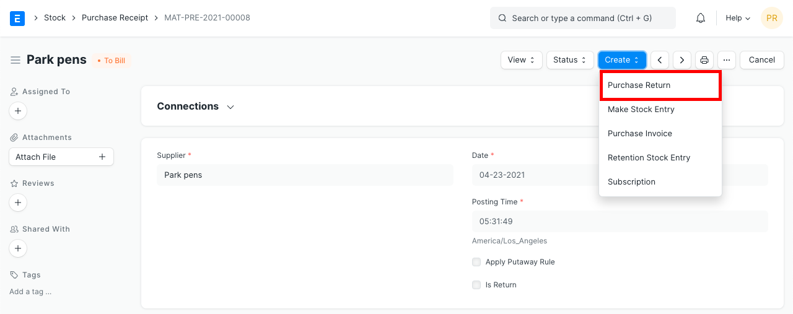
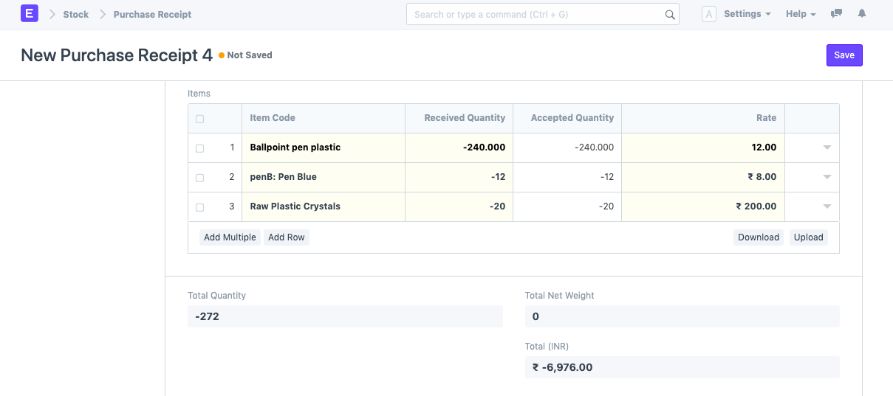
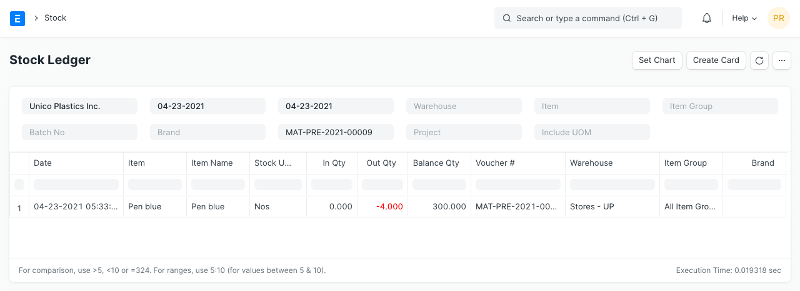
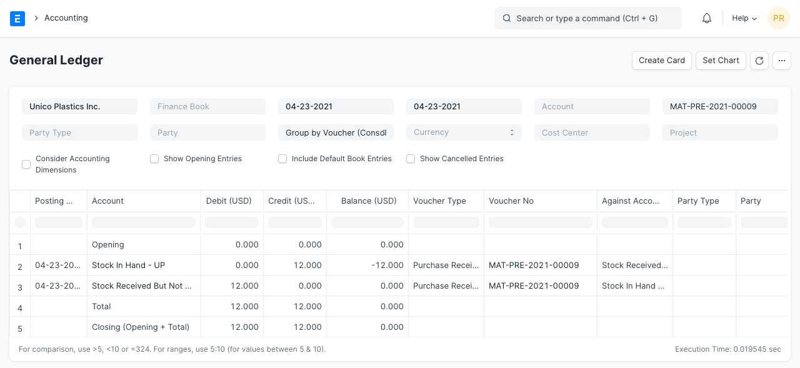
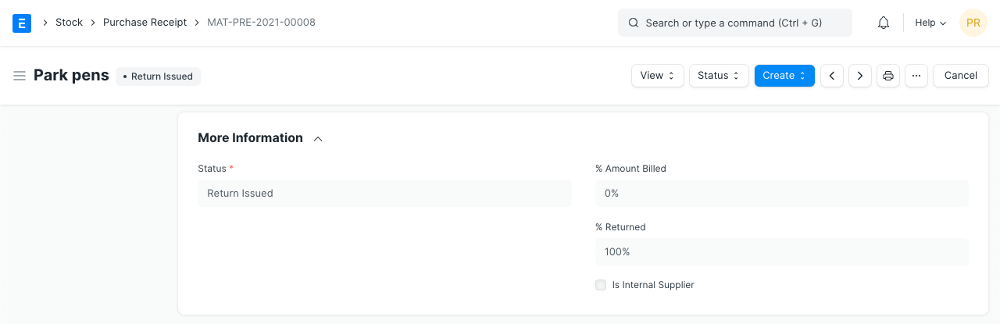

# Purchase Return

[ Edit ](https://docs.frappe.io/wiki/spaces/24hrpr6es9/page/1i49il88cg)

Open in ChatGPT  Ask ChatGPT about this page Open in Claude  Ask Claude about this page

# Purchase Return 

[ Edit ](https://docs.frappe.io/wiki/spaces/24hrpr6es9/page/1i49il88cg)

Open in ChatGPT  Ask ChatGPT about this page Open in Claude  Ask Claude about this page

**A purchased Item being returned is known as a Purchase Return.**

With the Purchase Return feature, you can return products to the Supplier. This may be on account of a number of reasons like defects in goods, quality not matching, the buyer not needing the stock, etc.

## 1\. Prerequisites

Before creating and using a Purchase Return, it is advised that you create the following first:

  * [Item](item.md)
  * [Purchase Invoice](purchase-invoice.md)

Or

[Purchase Receipt](purchase-receipt.md)

## 2\. How to create a Purchase Return

  1. First open the original Purchase Receipt, against which supplier delivered the Items.

  1. Click on 'Create > Return', it will open a new Purchase Receipt with 'Is Return' checked. Items, Rate, and taxes will negative numbers.

  1. On submission of Return Purchase Return, the system will decrease item quantity from the mentioned Warehouse. To maintain correct stock valuation, stock balance will also go up according to the original purchase rate of the returned items.

  1. In the Accounting Ledger, the Stock In Hand account will be credited and the Stock Received but Not Billed account will be debited.

If Perpetual Inventory enabled, the system will also post accounting entry against warehouse account to sync warehouse account balance with stock balance as per Stock Ledger.

## 3\. Impact on Stock Return via Purchase Receipt

On Creating a Purchase Return against a Purchase Receipt:

  * The **Returned Quantity** in the original Purchase Receipt along with any Purchase Order linked to it, is updated.

  * The original Purchase Receipt's status is changed to **Return Issued** if 100% returned: 

### 4\. Related Topics

  1. [Sales Return](sales-return.md)
  2. [Perpetual Inventory](perpetual-inventory.md)

[ Previous Page Material Request ](material-request.md) [ Next Page Request for Quotation ](request-for-quotation.md)

Last updated 1 week ago 

Was this helpful?
