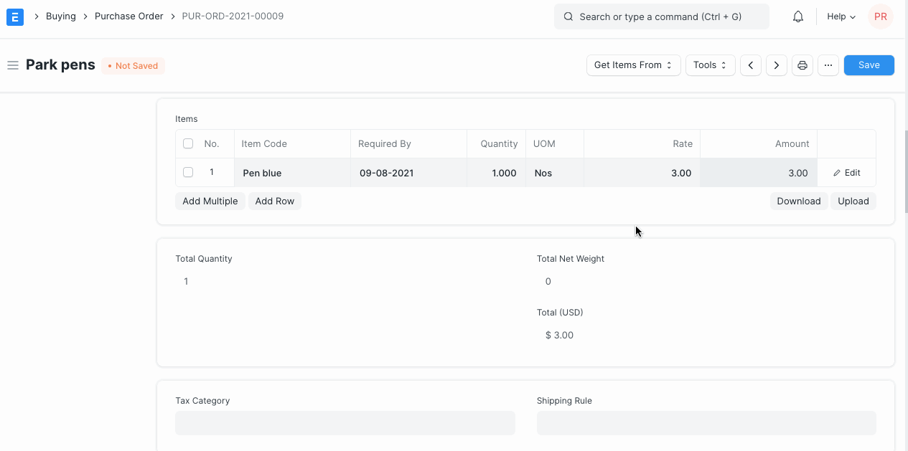
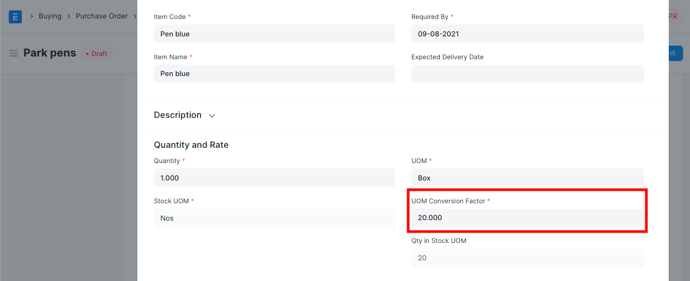
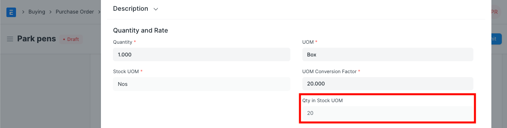
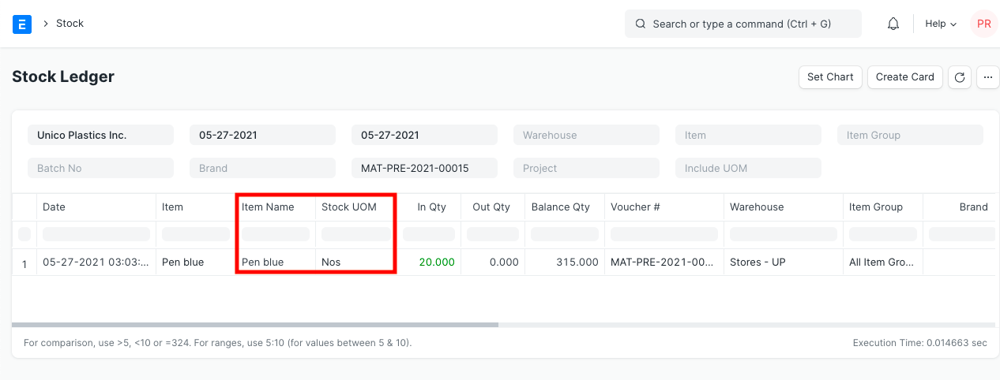
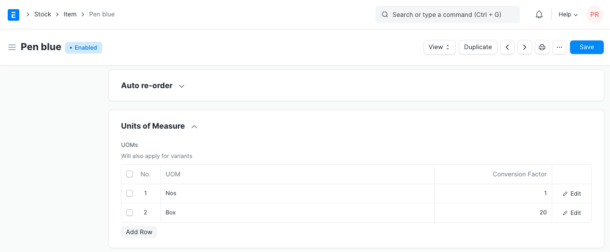

# Purchasing in Different UoM

[ Edit ](https://docs.frappe.io/wiki/spaces/24hrpr6es9/page/0shs1pa81v)

Open in ChatGPT  Ask ChatGPT about this page Open in Claude  Ask Claude about this page

# Purchasing in Different UoM

[ Edit ](https://docs.frappe.io/wiki/spaces/24hrpr6es9/page/0shs1pa81v)

Open in ChatGPT  Ask ChatGPT about this page Open in Claude  Ask Claude about this page

Each item has a stock unit of measurement (UoM) associated with it. For example, the UoM of pen could be numbers (Nos) and sand could be stocked kg. However, when we place an order with a supplier, the UoM for an item could change. Like we can order 1 set/box of pens, or one truck of sand to our supplier. When creating a purchase transaction, you can change Purchase UoM for an item.

Scenario:

Item Pen is stocked in Nos, but purchased in Box. Hence, we will make a Purchase Order for a Pen in a box.

#### Step 1: Edit UoM in the Purchase Order

In the Purchase Order, you will find two UoM fied.

  * UoM
  * Stock UoM

In both fields, the default UoM of an item will be fetched by default. You should edit UoM field, and select Purchase UoM (Box in this case). Updating Purchase UoM is mainly for the reference of the supplier. In the print format, you will see item qty in the Purchase UoM.

#### Step 2: Update UoM Conversion Factors

In one Box, if you get 20 Nos. of Pen, UoM Conversion Factor will be 20.

Based on the Qty and Conversion Factor, qty will be calculated in the Stock UoM of an item. If you purchase just one Box, then the Qty in the stock UoM will be set as 20.

### Stock Ledger Posting

Irrespective of the Purchase UoM selected, stock ledger posting will be done in the Default UoM of an item. Hence, you should ensure that the conversion factor is entered correctly while purchasing an item in a different UoM.

### Set Conversion Factor in Item

In the Item master, under the Purchase section, you can list all the possible UOM purchases of an item, with its UoM Conversion Factor.

[ Previous Page Maintaining Supplier's Item Code In the Item master  ](maintaining-suppliers-part-no-in-item.md) [ Next Page Amending Purchase Order after Submit  ](amending-purchase-order-after-submit.md)

Last updated 1 week ago 

Was this helpful?
