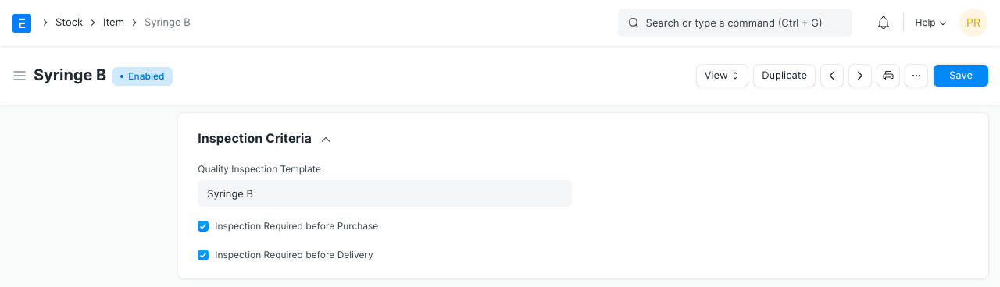
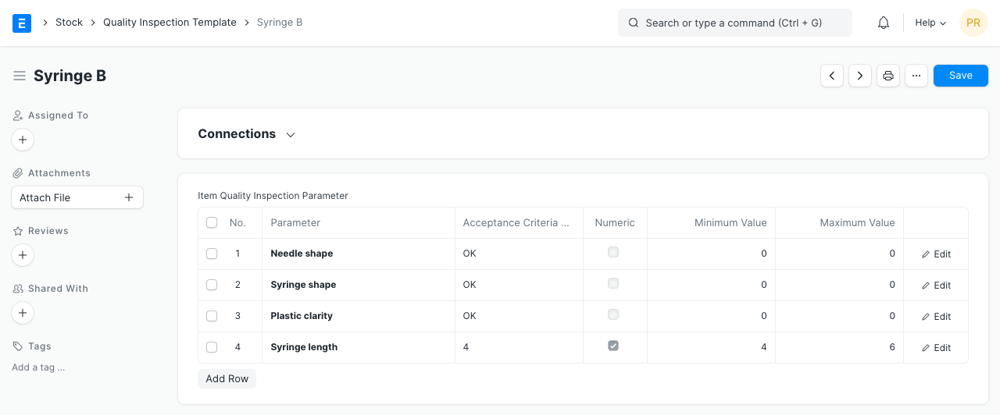
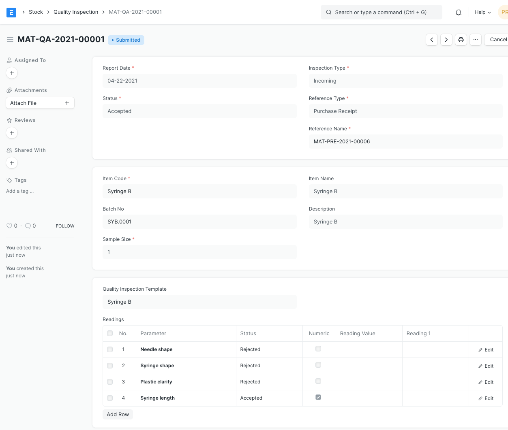
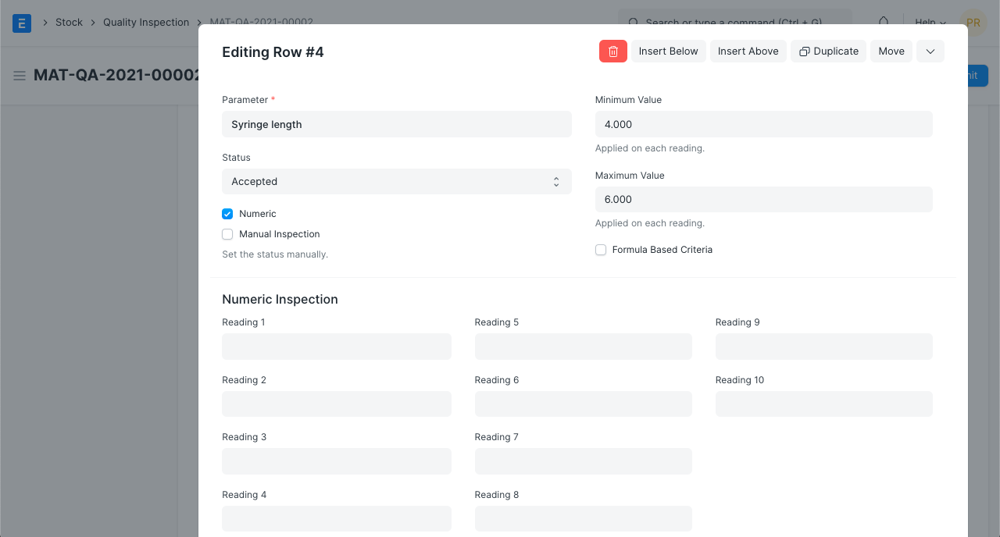
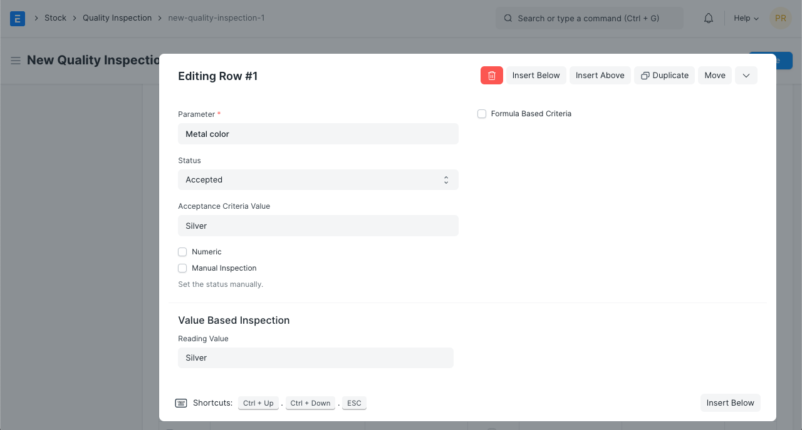
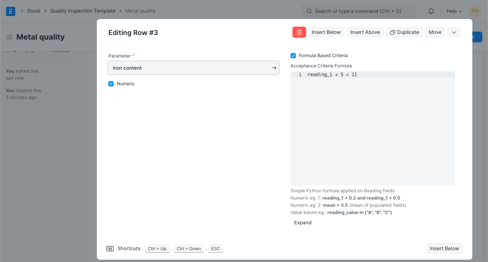
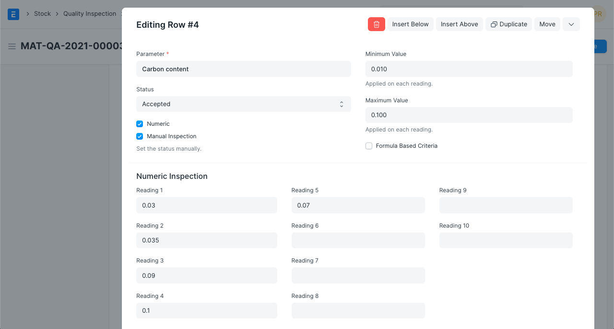

# Quality Inspection

[ Edit ](https://docs.frappe.io/wiki/spaces/24hrpr6es9/page/0rtarstul7)

Open in ChatGPT  Ask ChatGPT about this page Open in Claude  Ask Claude about this page

# Quality Inspection

[ Edit ](https://docs.frappe.io/wiki/spaces/24hrpr6es9/page/0rtarstul7)

Open in ChatGPT  Ask ChatGPT about this page Open in Claude  Ask Claude about this page

In ERPNext, you can mark your incoming or outgoing products for Quality Inspection.

To access this feature go to:

> Home > Stock > Tools > Quality Inspection

  1. Prerequisites

* * *

Before creating and using a Quality Inspection, it is advised that you do the following first:

  * **Create an** [**Item**](item.md).
  * **Enable Quality Inspection Criteria in the Item master**. On enabling either checkboxes, **submission** of a stock delivery/receipt document will be allowed only after a Quality Inspection is done against it: 
  * (Optional) **Create a Quality Inspection Template**. You can add inspection parameters and acceptance criteria in the template, which can be easily fetched into any Quality Inspection. After saving the template, you can set this template in the Item Master (as shown above). 

  2. How to create a new Quality Inspection

* * *

  1. From a **Draft** Purchase/Subcontracting Receipt or Delivery Note, go to the Item table's Quality Inspection field and click on Create a New Quality Inspection. You can also create a Quality Inspection for Job Card in order to monitor the quality of in-process items. In this case, you can create a Quality Inspection for the Production Item in Job Card.
  2. Select the inspection type whether Incoming (Purchase), Outgoing (Sales), or In Process (Manufacturing).
  3. Select the Reference Document Type whether Purchase Receipt, Purchase Invoice, Delivery Note, Sales Invoice, Stock Entry, or Job Card.
  4. Select the Item and set the sample size which will be inspected. Note that only Items having Inspection Criteria enabled in the Item master, will be fetched.
  5. The Quality Inspection Template set in the Item master will be fetched.
  6. You can change who it's inspected by and also add who it's verified by.
  7. Any additional Remarks about the Inspection can be added.
  8. Save. Set the Status. Submit.

  3. Features

* * *

A single Quality Inspection consists of many Quality Checks (Parameters) within it. Each of these checks could be Numeric, Non-numeric or Formula Based.

### 3.1 Numeric Quality Checks

Numeric Quality Checks include all checks that require number-based readings and acceptance criteria.

E.g. checking if a reading is in a certain range.

By default the checks are numeric. There are two fields: **Minimum Value** and **Maximum Value** , to define a range that **each** reading must be in. These fields can be set in the Quality Inspection Template once and be simply fetched into the Quality Inspection.

If any of the readings entered are not within this range, the status on the row will be set to 'Rejected' automatically on Save.

### 3.2 Non-numeric (Value-Based) Quality Checks

Non-numeric Quality Checks include checks that require alphabetical values or those that do not require any mathematical calculations.

E.g. checking if the color is white in a color quality check, Yes/No values for certain parameters, etc.

For Non-numeric checks, enable the 'Non-numeric' checkbox. You will notice the field **Acceptance Criteria Value** and the section **Value-Based Inspection** are visible.

Enter the field Reading Value. The Acceptance Criteria Value can be set in the Quality Inspection Template once and then be fetched into the Quality Inspection.

If the Reading Value does not match the Acceptance Criteria Value, the status on the row will be set to 'Rejected' automatically on Save.

### 3.3 Formula-Based Quality Checks

Formula-Based Quality Checks are useful for more complex scenarios where just specifying a range or an acceptance value is not enough.

E.g. checking if the grade of a material is A/B/C, checking if the mean of some readings is within a certain range, etc.

Formula-Based Quality Checks are applicable to Numeric and Non-numeric Quality Checks.

Enable the 'Formula Based Criteria' checkbox to perform a Formula-Based Quality Check. You will then notice a field called **Acceptance Criteria Formula** where you can specify a formula that determines whether a certain check is Accepted or Rejected. This formula can be set in the Quality Inspection Template once and then be fetched into the Quality Inspection.

This formula depends on the many Reading fields in the Readings table.

For Numeric readings, `reading_1`, `reading_2` and so on are accepted in the formula.

For Non-numeric readings, only `reading_value` is accepted in the formula.

Here are some examples of formulas:
[code] 
    # Numeric
    (reading_1 + reading_2) < 10 # sum of both readings is less than 10
    (reading_1 + reading_2) <= 10 # sum of both readings is less than or equal to 10
    mean < 15  # mean of non empty numeric readings is less than 15
    (reading_1 * 2) < 20 # Reading 1 multiplied by 2 is less than 20
    (reading_1) / 2 < 20 # Reading 1 divided by 2 is less than 20
    
    # Non-numeric
    reading_value in ("A", "B", "C") # Reading Value is either A / B / C
    reading_value != "Red" # Reading Value is not equal to Red
      
    
    
[/code]

Update the readings and Save. The Status field in the Readings table rows is set automatically based on the formula for acceptance.

### 3.3 Manual Inspection

So far, all the Quality Checks have automatic acceptance/rejection on Save. In the real world, there could be cases where a check is rejected but yet will be accepted because there is some tolerance.

Such cases will require the user to determine the row-level status. To avoid any system interference in such checks, enable the 'Manual Inspection' checkbox. You can now set the status manually and it will be untouched on Save.

Here Reading 1 is outside the defined range, this check would be rejected. But, since it is not very far from 0.153 we accept it manually.

The status for the entire Quality Inspection can then be decided by the user.

  4. Video

* * *

### 5\. Related Topics

  1. [Purchase Receipt](purchase-receipt.md)
  2. [Delivery Note](delivery-note.md)
  3. [Stock Entry](stock-entry.md)
  4. [Sales Invoice](sales-invoice.md)
  5. [Purchase Invoice](purchase-invoice.md)
  6. [Job Card](job-card.md)

[ Previous Page Landed Cost Voucher ](stock-transactions-landed-cost-voucher.md) [ Next Page Stock Adjustment / COGS with Negative Stock ](stock-adjustment-cogs-with-negative-stock.md)

Last updated 2 weeks ago 

Was this helpful?
