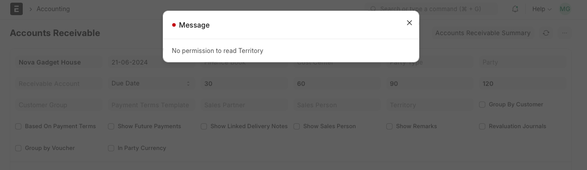
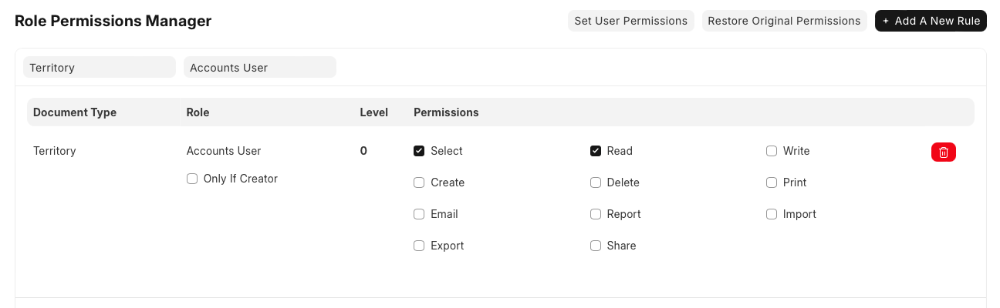

# Permission Error Problems

[ Edit ](https://docs.frappe.io/wiki/spaces/24hrpr6es9/page/0sktvdscgk)

Open in ChatGPT  Ask ChatGPT about this page Open in Claude  Ask Claude about this page

# Permission Error Problems

[ Edit ](https://docs.frappe.io/wiki/spaces/24hrpr6es9/page/0sktvdscgk)

Open in ChatGPT  Ask ChatGPT about this page Open in Claude  Ask Claude about this page

**Question:** User has roles like Account User and Account Manager assigned. Still, when accessing Account Receivable report, User is getting an error message of no permission the territory master.

**Answer:**

As per the permission system in ERPNext, for the User to be able to access a form or a report, s(he) should have at-least read permission on all the link field in that form/report. Since Territory is a link field in Account Receivable report, please add a permission rule to let Account User/Manager have at-least Read permission on the Territory master. Please follow below-given steps to resolve this issue.

  1. Roles assigned to User are Account User and Account Manager.
  2. As indicates in the Error message, the user didn't have permission on the territory master. As per the default permission, none of the above role assigned to that User has any permission on the Territory master.
  3. To resolve this issue, I have assigned Account User permission to Read Territory master.

As per this permission update, User should be able to access Account Receivable report fine.

[ Previous Page Perm Level Error ](https://docs.frappe.io/erpnext/perm-level-error-in-permission-manager) [ Next Page Overview ](https://docs.frappe.io/erpnext/accounting/introduction)

Last updated 1 week ago 

Was this helpful?
