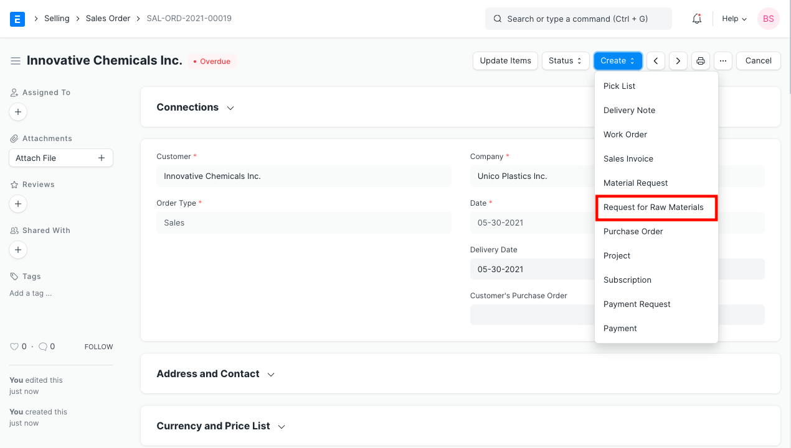
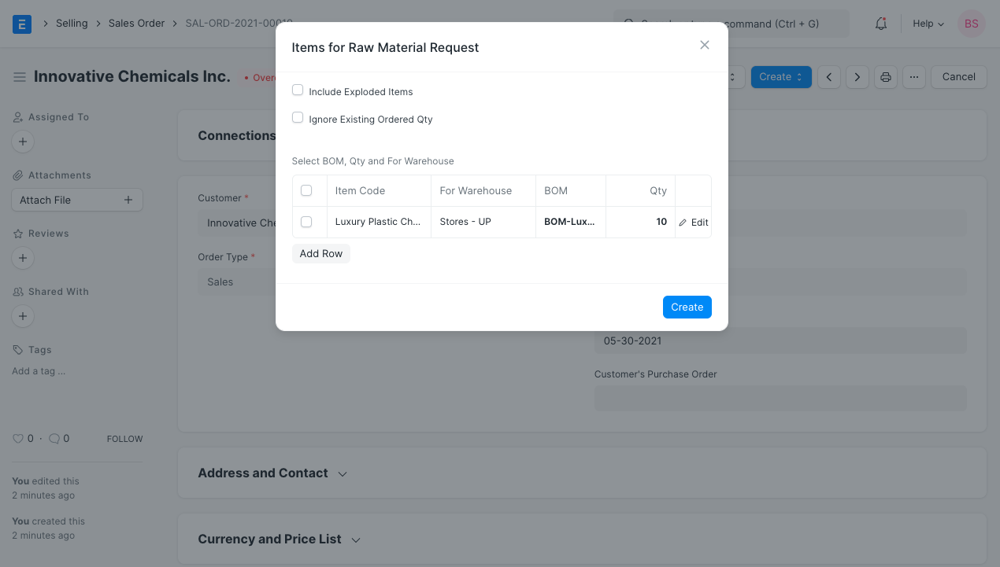
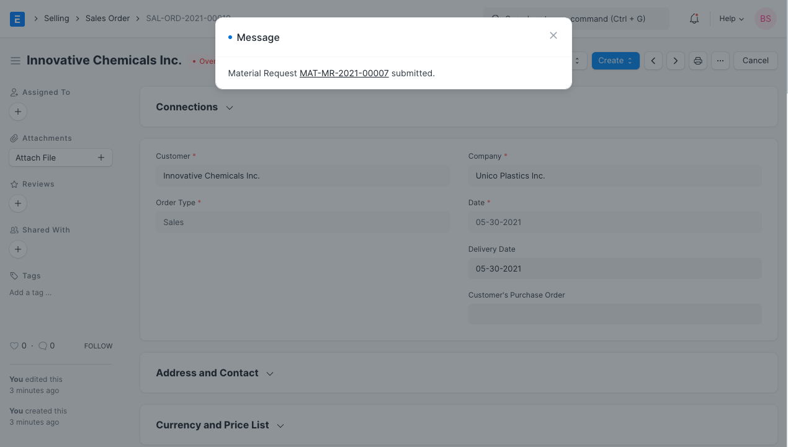
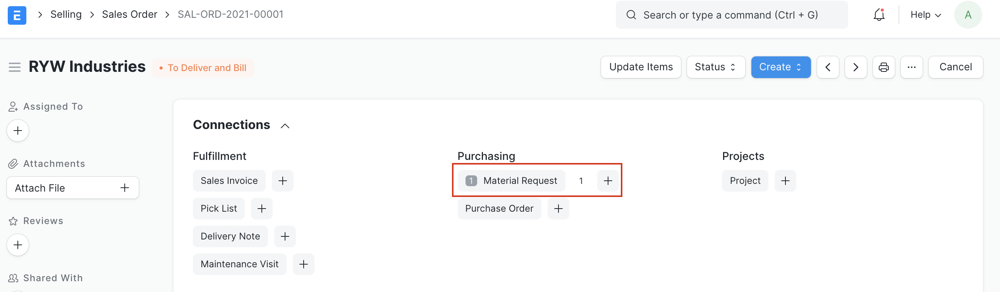

# Request for Raw Materials from Sales Order

[ Edit ](https://docs.frappe.io/wiki/spaces/24hrpr6es9/page/0so9hu95k4)

Open in ChatGPT  Ask ChatGPT about this page Open in Claude  Ask Claude about this page

# Request for Raw Materials from Sales Order 

[ Edit ](https://docs.frappe.io/wiki/spaces/24hrpr6es9/page/0so9hu95k4)

Open in ChatGPT  Ask ChatGPT about this page Open in Claude  Ask Claude about this page

Production Plan helps user to plan production against multiple sales orders and helps in Material Procurement planning for the raw-material item, based on the quantity of finished product to be manufactured.

But, when you only need to plan for raw-material items of a single Sales Order, it becomes a bit of a tedious task. Hence, you can create a Material Request for the raw materials of the finished Items present in the Sales Order, from that Sales Order itself.

To do so, you can follow the below steps.

  * After your Sales Order has been submitted, click on **Make** and select **Request for Raw Materials**.

  * It will open a dialog and display all the Finished Items having a BOM.

  * Here, you can change the BOM as you want and choose the necessary options.

Suppose, enabling the **Include Exploded Items** will fetch the Raw Materials from the Exploded Items of BOM and enabling the **Ignore Existing Ordered Qty** will make a Request even if the required quantities are present.

  * Click on Make, and your Material Request will be submitted.

Material Request generated for the Raw Material of the finished Item present in Sales Order.

[ Previous Page Drop Ship Between Subsidiary Companies ](assistance-sales-purchase-between-companies.md) [ Next Page Applying a Discount  ](applying-discount.md)

Last updated 1 week ago 

Was this helpful?
