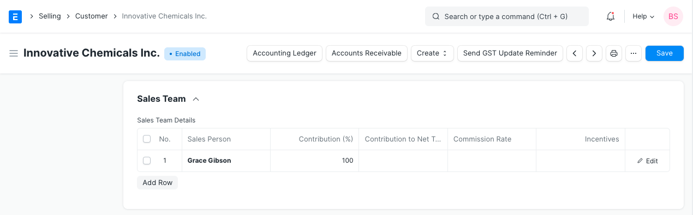
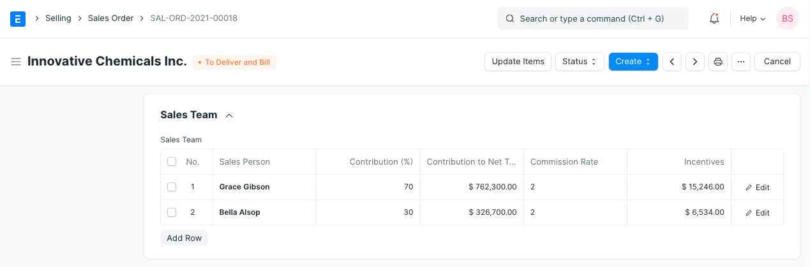
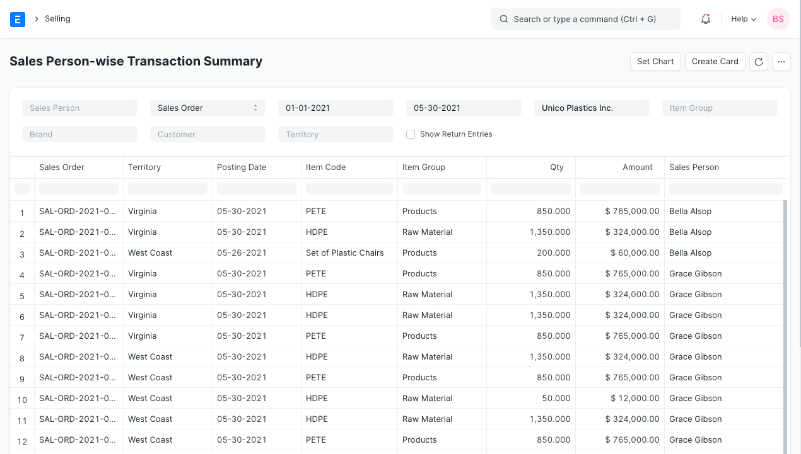

# Sales Persons in the Sales Transactions

[ Edit ](https://docs.frappe.io/wiki/spaces/24hrpr6es9/page/0spi82pdfb)

Open in ChatGPT  Ask ChatGPT about this page Open in Claude  Ask Claude about this page

# Sales Persons in the Sales Transactions 

[ Edit ](https://docs.frappe.io/wiki/spaces/24hrpr6es9/page/0spi82pdfb)

Open in ChatGPT  Ask ChatGPT about this page Open in Claude  Ask Claude about this page

In ERPNext, Sales Person master is maintained in [tree structure](managing-tree-structure-masters.md). Sales Person is selectable in all the sales transactions.

Sales Persons can be updated in the Customer master as well. On selection of Customer in the transactions, Sales Persons as updated in the Customer will fetch into sales transaction.

####Sales Person Contribution

If more than one sales persons are working together on an order, then contribution (%) should be set for each Sales Person.

On saving transaction, based on the Net Total and Contriution (%), `Contribution to Net Total` will be calculated for each Sales Person.

Total % Contribution for all Sales Person must be 100%. If only one Sales Person is selected, then % Contribution will be 100.

####Sales Person Transaction Report

Check Sales Person's Transaction report from:

`Selling > Standard Reports > Sales Person-wise Transaction Summary`

This report can be generated based on Sales Order, Delivery Note and Sales Invoice. It will give you total amount of sale made by an employe.

####Sales Person wise Commission

ERPNext only provide total amount of sale made by a Sales Person. If you offer commission to Sales Person, you should add Sales Person as Sales Partners in ERPNext. For Sales Partners, you can define Commission (%). On selected on Sales Partner in a sales transction, based on Net Total, Commission Amount is calculated as well. You can check Sales Partner's commission report from:

`Accounts > Standard Reports > Sales Partners Commission`

[ Previous Page Incoterm and Named Place ](incoterm-and-named-place.md) [ Next Page Sales Return Management  ](sales-return-use-cases.md)

Last updated 1 week ago 

Was this helpful?
