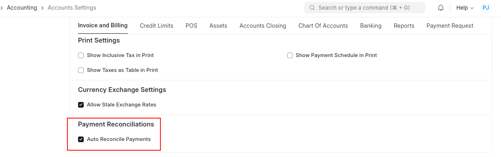
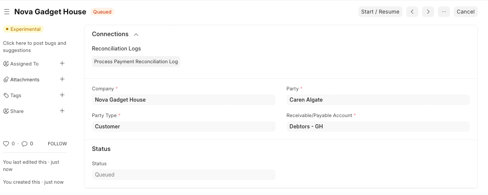
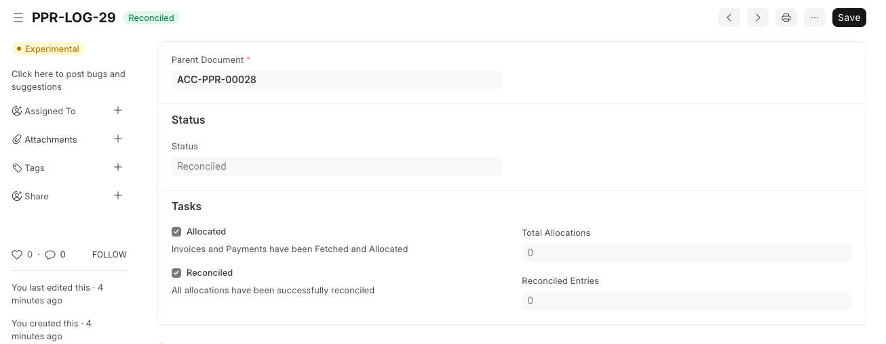

# Semi-Auto Payment Reconciliation

[ Edit ](https://docs.frappe.io/wiki/spaces/24hrpr6es9/page/0rmghgk6fd)

Open in ChatGPT  Ask ChatGPT about this page Open in Claude  Ask Claude about this page

# Semi-Auto Payment Reconciliation

[ Edit ](https://docs.frappe.io/wiki/spaces/24hrpr6es9/page/0rmghgk6fd)

Open in ChatGPT  Ask ChatGPT about this page Open in Claude  Ask Claude about this page

If there are large no of Invoices that needs be reconciled quickly without manual allocation, `Process Payment Reconciliation` doctype can be used.

## Steps:

  1. First this feature must be enabled through Accounts Setting. Enable `Auto Reconcile Payments` in Accounts Settings.

  2. Navigate to `Process Payment Reconciliation` doctype
  3. Select Company, Party and Receivable/Payable Account for which Reconciliation has to be done. Save and Submit
  4. Document will be `Queued` status.

  2. A Background Job that runs every 15 mins will pick up `Queued` docs and will start reconciliation. If needed, the Job can triggered immediately using `Start / Resume` button.
  3. This will create a `Process Payment Reconciliation Log` record with details on the Total No of Allocations that will be processed and the successfully reconciled entries.

## Related Topics

  1. [Payment Reconciliation](payment-reconciliation.md)

[ Previous Page Payment Reconciliation ](payment-reconciliation.md) [ Next Page Journal Entry  ](journal-entry.md)

Last updated 2 weeks ago 

Was this helpful?
