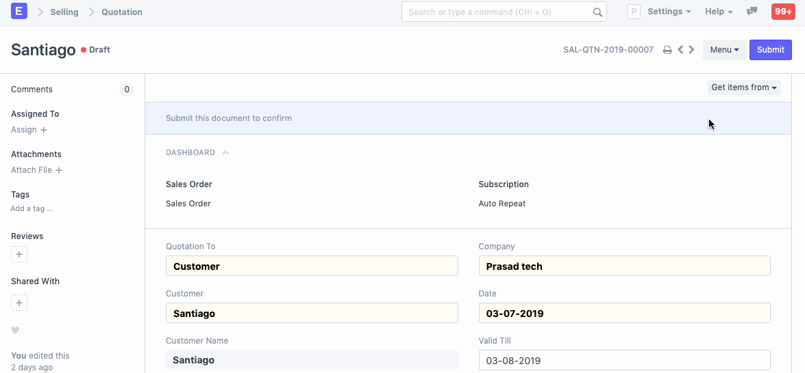
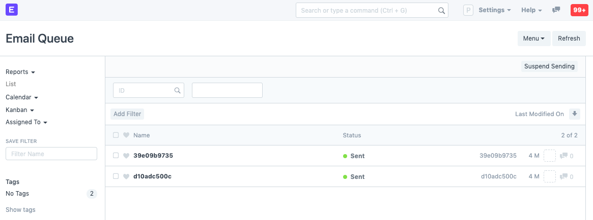
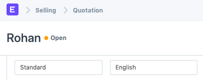

# Sending Email from any Document

[ Edit ](https://docs.frappe.io/wiki/spaces/24hrpr6es9/page/0rbe1bhich)

Open in ChatGPT  Ask ChatGPT about this page Open in Claude  Ask Claude about this page

# Sending Email from any Document

[ Edit ](https://docs.frappe.io/wiki/spaces/24hrpr6es9/page/0rbe1bhich)

Open in ChatGPT  Ask ChatGPT about this page Open in Claude  Ask Claude about this page

In ERPNext you can send any document as email (with a PDF attachment) by clicking on Menu > Email after opening any document.

**Note:** You must have outgoing [Email Accounts](email-account.md) set up for this.

After you click on send, the email gets added to the email queue. It will be in the Sending status until it is Sent. The status of the email is displayed in the queue, if sending has failed, it can be sent by clicking on Send Now.

The following options are available when sending an Email.

  * **TO:** Recipients of the email.
  * **From:** If user has access to multiple outgoing email accounts, the user can select which outgoing email account to use. Multiple outgoing email accounts can be configured from the User document by adding them to the "User Email" table.
  * **CC** : Carbon Copy of the email. Useful when you want to keep someone in the conversation loop but don't want to address the email directly to them.
  * **BCC** : Blind Carbon Copy is similar to CC but everyone else on the email thread cannot see that the mail was also sent to the BCC recipients. This is useful to hide the email address of certain people if you're sending the email to a lot of people who don't necessarily know each other.
  * **Email Template** : You can create preset templates to send out standard replies. Email Templates are already available in the system for Dispatch Notification, Leave Status Notification, and Leave Approval Notification. You can set a Default Email Template via [Customize Form](customize-form.md).
  * **Send me a copy** : This will send a copy to your email address. It's useful to ensure that the email was sent without any errors.
  * **Send Read Receipt** : Ticking this checkbox will send you a notification if the receiver has read the email. In case of multiple receivers, even if one has read the email, you'll get a notification.
  * **Attach Document Print** : Attach the PDF of the document you're sending via email.
  * **Select Attachments** : Any additional attachments can be added here.

The following two fields are the fields which appear on the print screen:

  * **Select Print Format** : The print format of the document. Know more about Print Format [here](print-format.md).
  * **Select Languages** : The language in which the PDF is to be generated.

### Related Topics

  1. [Email Domain](https://docs.frappe.io/erpnext/email-domain)
  2. [Email Account](email-account.md)
  3. [Email Inbox](email-inbox.md)

[ Previous Page Linking Emails to Documents ](https://docs.frappe.io/erpnext/linking-emails-to-document) [ Next Page Auto Email Reports ](auto-email-reports.md)

Last updated 1 week ago 

Was this helpful?
