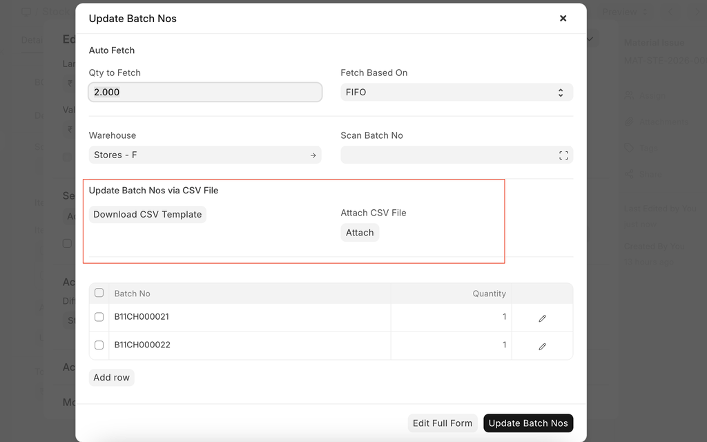
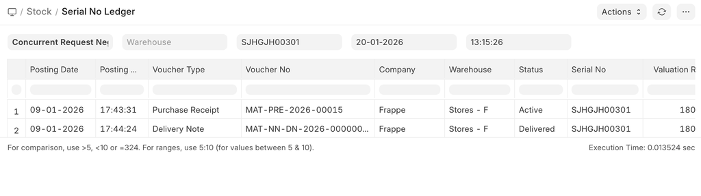

# Serial and Batch Bundle

[ Edit ](https://docs.frappe.io/wiki/spaces/24hrpr6es9/page/0rtiqm5ce0)

Open in ChatGPT  Ask ChatGPT about this page Open in Claude  Ask Claude about this page

# Serial and Batch Bundle

[ Edit ](https://docs.frappe.io/wiki/spaces/24hrpr6es9/page/0rtiqm5ce0)

Open in ChatGPT  Ask ChatGPT about this page Open in Claude  Ask Claude about this page

> NOTE: Users must create a separate **Serial and Batch Bundle** for each stock transaction. They cannot use the same **Serial and Batch Bundle** across multiple stock transactions.
> 
> _Allow Negative Stock_ has been removed for Serial / Batch Items from version 15. From version 15 onward, users cannot make negative stock transactions for serial / batch items, even if _Allow Negative Stock_ is enabled in **Stock Settings**.

* * *

In version 15, we introduced the **Serial and Batch Bundle**. This feature is used to link Serial / Batch Nos in stock transactions.

Before version 15, the _Serial No_ field was a Small Text field, which meant one column could hold more than one serial number. Because of this design, there were a lot of data integrity issues. To solve this, we changed the _Serial No_ field from Small Text to a Link field in version 15. Since we can't add a child table inside a child table, we added a new DocType: **Serial and Batch Bundle** to pick/dispatch multiple Serial / Batch numbers.

## How does this work?

You need to create a **Serial and Batch Bundle** and link it to stock transactions whenever you deal with Serial / Batch numbers. Users must create a separate **Serial and Batch Bundle** for each transaction, and they can't link the same **Serial and Batch Bundle** to multiple transactions.

### Auto Creation of Serial and Batch Bundle for Inward Entry

If the user wants to auto-create a **Serial and Batch Bundle** for an inward entry, they must ensure that _Serial Number Series_ is set for the serial item and that the _Automatically Create New Batch_ checkbox is enabled (with _Batch Number Series_ set) for the batch item.

#### For Serial No

#### For Batch No

After the configuration, when the user creates a **Purchase Receipt** or a **Stock Entry** with the Type "Material Receipt", the system will automatically create the inward **Serial and Batch Bundle** on submission of the record.

### Auto Creation of Serial and Batch Bundle for Outward Entry

If the user wants to auto-create a **Serial and Batch Bundle** for an outward entry, they must enable the checkbox _Auto Create Serial and Batch Bundle For Outward_ in **Stock Settings**. They can also set _Pick Serial / Batch Based On_ to "FIFO / LIFO / Expiry" in **Stock Settings**.

After the configuration, when the user creates a **Delivery Note** or a **Stock Entry** with the Type "Material Issue", the system will automatically create the outward **Serial and Batch Bundle** on submission of the record.

### Manual Creation of Serial and Batch Bundle for Inward Entry

For the **Serial and Batch Bundle** , both **Serial No** and **Batch** records must already exist in the system. With the manual option, the user must first create the **Serial No** / **Batch** records in the system. Users can use the CSV import option to create **Serial No** / **Batch** records. The blank CSV template can be downloaded using the Serial and Batch Selector.

Complete GIF for manual creation of a **Serial and Batch Bundle** for an inward entry is as follows:

### Manual Creation of Serial and Batch Bundle for Outward Entry

Using the Serial and Batch Selector, the user can pick the Serial / Batch Nos based on the "FIFO / LIFO / Expiry" method.

Complete GIF for manual creation of a **Serial and Batch Bundle** for an outward entry is as follows:

### Serial and Batch Bundle Creation Using CSV for Outward Entry

Now users can create serial and batch bundles for outward entries by importing a CSV file.

## History of Serial Numbers

To check the history of serial numbers, see the report "Serial No Ledger".

## Serial / Batch Selector

This is used to select Serial Nos / Batches manually. This popup is also used to create serial nos / batches automatically if they do not exist.

## Disable Serial / Batch Selector

If users don't want to use the Serial and Batch Selector (popup), they can disable it through **Stock Settings**. To disable it, go to **Stock Settings** > Serial and Batch Item (TAB) > enable _Disable Serial No And Batch Selector_ , then save.

## Old Serial / Batch Fields

Many customers requested that we retain the old serial and batch fields to address UX issues. In response to this demand, we retained the old serial/batch fields. These fields are solely used for entering serial numbers and batches. The system will automatically create the **Serial and Batch Bundle** upon submission of the stock transaction. To enable this feature, users must navigate to **Stock Settings** and enable the _Use Serial / Batch Fields_ option (see the image below).

After that, when the user creates a stock transaction (for example, a **Delivery Note**), the system will show the old Serial / Batch fields. For more details, see the GIF below.

Users can disable the old serial / batch fields at the transaction level too.

## Update Serial / Batch on Creation of Auto Bundle

If the user wants to automatically update the Serial No / Batch in the Serial / Batch fields when a **Serial and Batch Bundle** is created, go to **Stock Settings** and disable _Do Not Update Serial / Batch on Creation of Auto Bundle_.

Case:

  1. User has enabled _Use Serial / Batch Fields_ in **Stock Settings**
  2. User wants to create the **Serial and Batch Bundle** per single batch
  3. User has set the auto-create batch in the **Item** master.
  4. On submission of the **Purchase Receipt** , the system has created the auto **Batch** and **Serial and Batch Bundle** , and set the _Batch_ and _Serial and Batch Bundle_ fields on the **Purchase Receipt** line item.
  5. Updating the value of the batch takes time. If you want to skip this step, enable _Do Not Update Serial / Batch on Creation of Auto Bundle_ in **Stock Settings**.
  6. With this, the batch column remains blank, but the **Serial and Batch Bundle** will have the value of the auto-created bundle.

## How to Use **Serial and Batch Bundle**

[https://www.youtube.com/watch?v=-VjZvRtdjDQ&t=820s](https://www.youtube.com/watch?v=-VjZvRtdjDQ&t=820s)

[ Previous Page Serial Number ](serial-no.md) [ Next Page Delivery Trip  ](delivery-trip.md)

Last updated 2 weeks ago 

Was this helpful?
