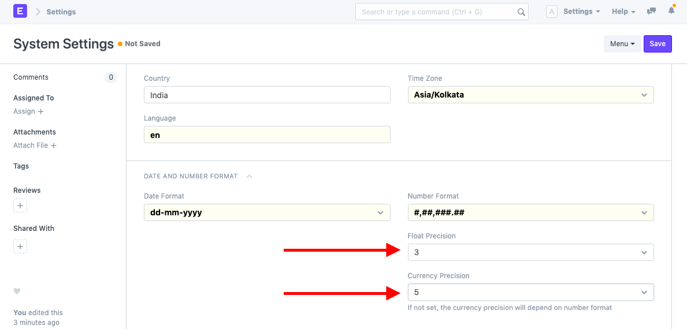
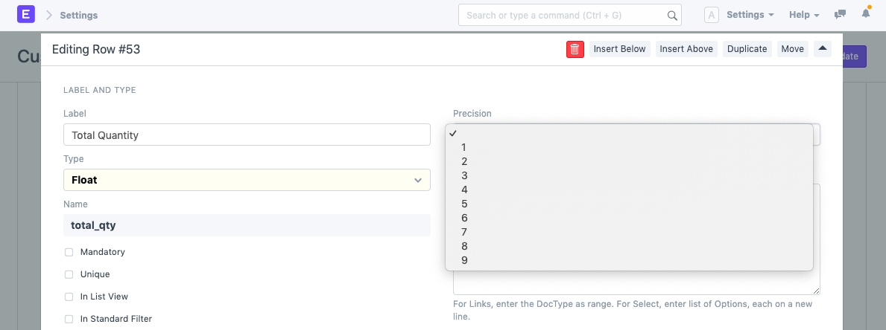

# Set Precision

[ Edit ](https://docs.frappe.io/wiki/spaces/24hrpr6es9/page/0sfb3mtbta)

Open in ChatGPT  Ask ChatGPT about this page Open in Claude  Ask Claude about this page

# Set Precision 

[ Edit ](https://docs.frappe.io/wiki/spaces/24hrpr6es9/page/0sfb3mtbta)

Open in ChatGPT  Ask ChatGPT about this page Open in Claude  Ask Claude about this page

In ERPNext, default precision for **Float** , **Currency** and **Percent** field is three. It allows you to enter value having value upto three decimal places.

You can also change/customize the precision settings globally or for a specific field.

To change the precision globally, go to:

> Home > Settings > System Settings

Alternatively, you can also set field specific precision. To do that go to [Customize Form](customize-form.md) and select the DocType there. Then go to the specific field row and change precision. Precision field is only visible if field-type is one of the Float, Currency and Percent.

[ Previous Page Set Language ](https://docs.frappe.io/erpnext/set-language) [ Next Page Show or Hide Modules  ](show-hide-modules.md)

Last updated 1 week ago 

Was this helpful?
