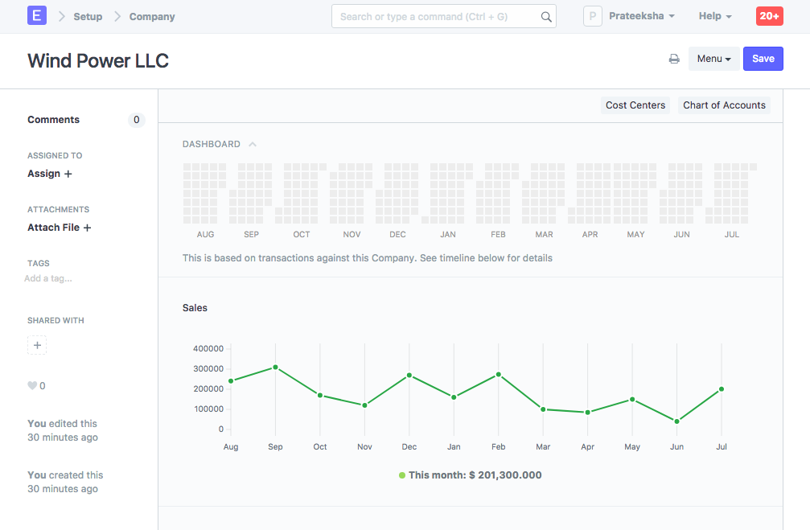
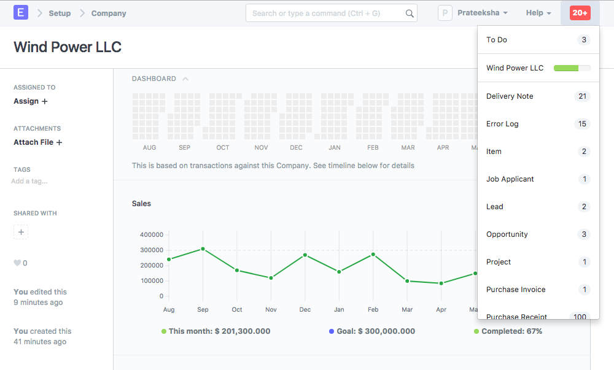

# Setting Company Sales Goal

[ Edit ](https://docs.frappe.io/wiki/spaces/24hrpr6es9/page/0sdt4jcllv)

Open in ChatGPT  Ask ChatGPT about this page Open in Claude  Ask Claude about this page

# Setting Company Sales Goal 

[ Edit ](https://docs.frappe.io/wiki/spaces/24hrpr6es9/page/0sdt4jcllv)

Open in ChatGPT  Ask ChatGPT about this page Open in Claude  Ask Claude about this page

**Defining and achieving sales goals/targets can help your company reach new goals and increase revenue.**

  1. Monthly sales targets can be set for a Company via the Company master under the Sales Settings section. By default, the Company master dashboard displays month-wise past sales stats.

  1. You can set the **Sales Target** field to track progress against the graph:

  1. The target progress is also shown in notifications:

### Related Topics

  1. [Company Setup](company-setup.md)
  2. [Sales Order](sales-order.md)
  3. [Sales Partner](sales-partner.md)

[ Previous Page Sales Person Target Allocation  ](sales-person-target-allocation.md) [ Next Page Sales Commission ](how-to-give-commission-to-sales-partner.md)

Last updated 1 week ago 

Was this helpful?
