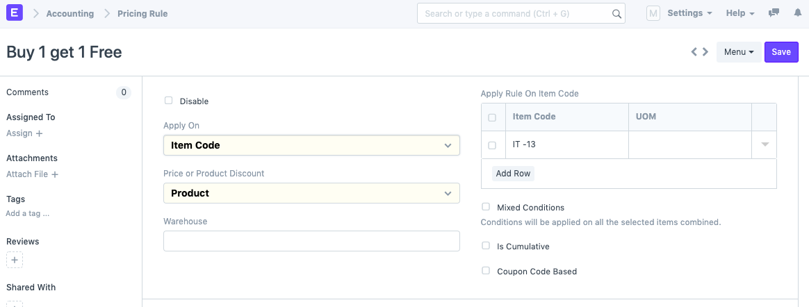
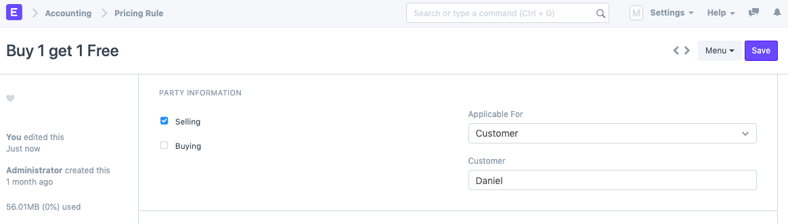
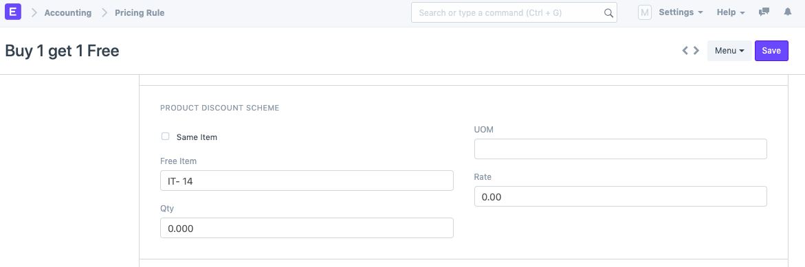
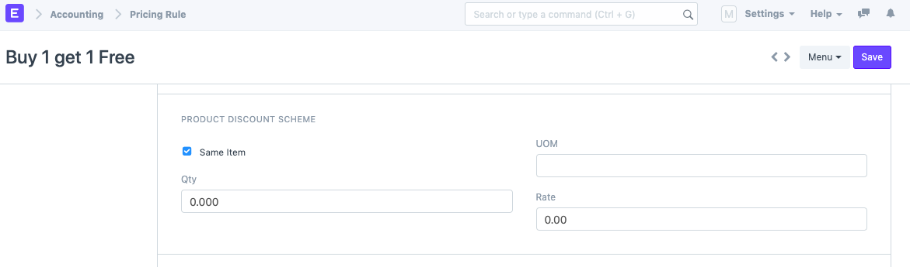
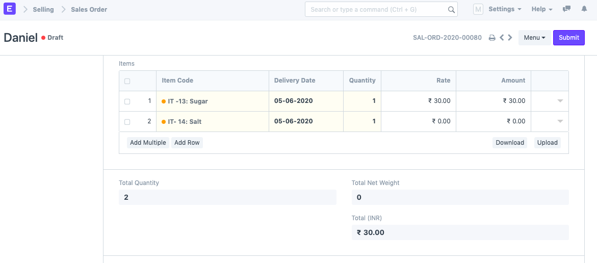
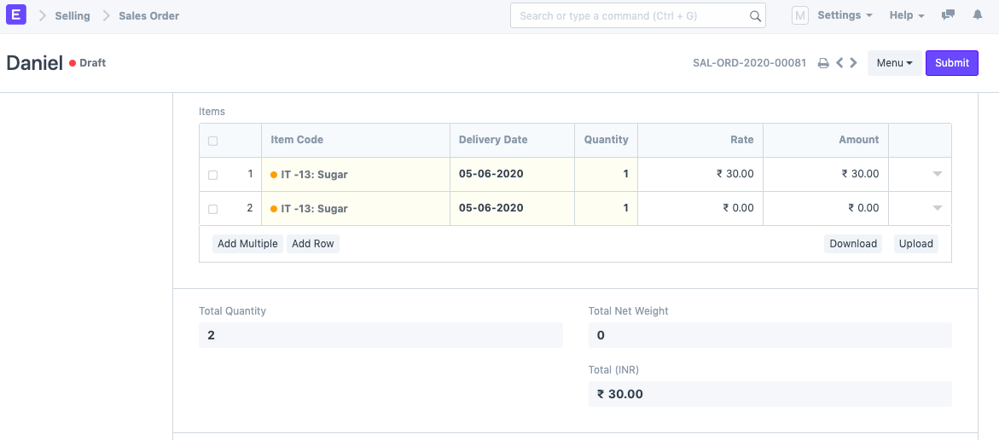
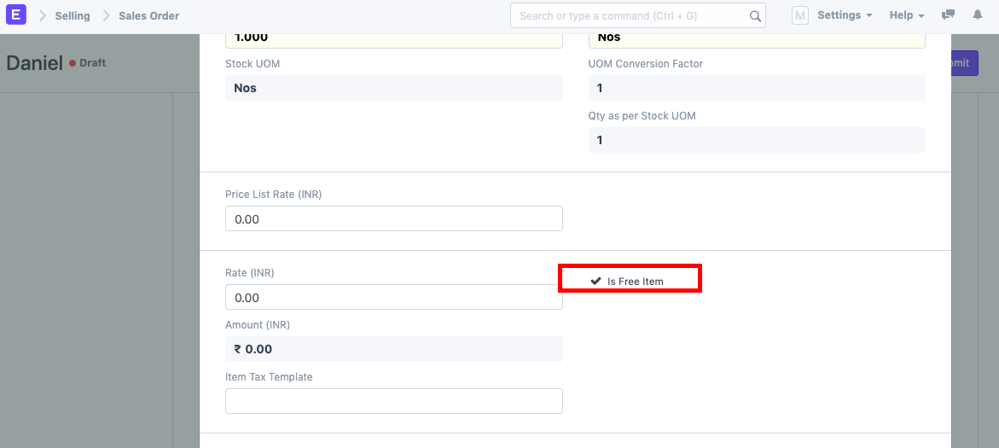

# Setting up "Buy 1 Get 1 Free" Pricing Rule

[ Edit ](https://docs.frappe.io/wiki/spaces/24hrpr6es9/page/0sffi0eva6)

Open in ChatGPT  Ask ChatGPT about this page Open in Claude  Ask Claude about this page

# Setting up "Buy 1 Get 1 Free" Pricing Rule

[ Edit ](https://docs.frappe.io/wiki/spaces/24hrpr6es9/page/0sffi0eva6)

Open in ChatGPT  Ask ChatGPT about this page Open in Claude  Ask Claude about this page

**A Pricing Rule defines the discount rules that applied on items based on set conditions.**  
To set up a Pricing Rule for "Buy 1 Get 1 Free" scheme, follow the below steps:

  1. Go to Pricing Rule List > Click on New.

  2. Select the Item Code of the Item in the "Apply Rule on Item Code" table on whose purchase a free item will be given. Also, select Product discount as shown.  

  3. Select the Party Information (if needed). You can leave this blank as well, but make sure to select either "Selling", "Buying" or both depending on the requirement.  

  4. Next, the free item information needs to be set up under the "Product Discount Scheme" section. There are two scenarios in this case:  
a) Free item is a different item. For example, on purchase of a packet of Sugar, you get a packet of Salt free. In this case, select the item code of the free item, Salt in this case.  
  
b) Free item is the same item. For example, on purchase of a packet of Sugar, you get another packet of Sugar free. In this case, select the "Same Item" checkbox.  

Additionally, you can set the Qty, Rate and UOM if needed.  
5) Save the Pricing Rule.  
6) Create a Sales Order/Purchase Order (depending on the rule). On selection of the first item, the second item is automatically fetched with rate 0.  
a) "Buy 1 Get 1 Free" of two different items.  

b) "Buy 1 Get 1 Free" on the same item.  

Note: If you expand the free item row in the Sales Order/Invoice, you will see the "Is Free Item" checkbox checked.  

[ Previous Page Sales Commission ](how-to-give-commission-to-sales-partner.md) [ Next Page Selling in Different UoM ](Selling-in-different-UOM.md)

Last updated 1 week ago 

Was this helpful?
