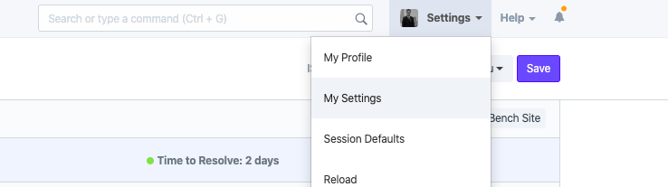
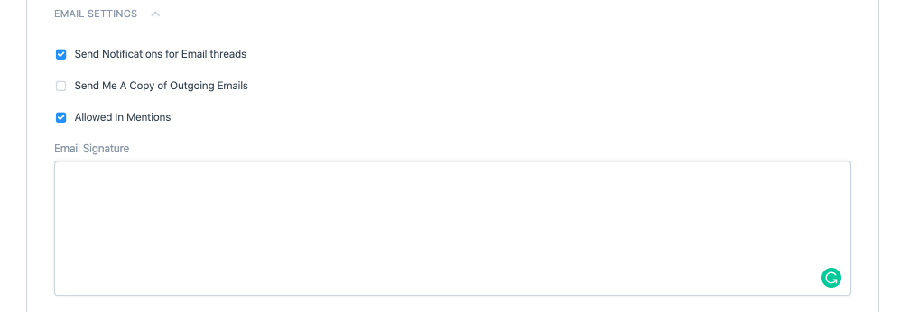

# Setting Up Email Signature in ERPNext

[ Edit ](https://docs.frappe.io/wiki/spaces/24hrpr6es9/page/0scjv6e9ve)

Open in ChatGPT  Ask ChatGPT about this page Open in Claude  Ask Claude about this page

# Setting Up Email Signature in ERPNext

[ Edit ](https://docs.frappe.io/wiki/spaces/24hrpr6es9/page/0scjv6e9ve)

Open in ChatGPT  Ask ChatGPT about this page Open in Claude  Ask Claude about this page

To add your signature, go to your User Profile under **Settings > My Settings**

Scroll down to the **Email Settings** section where you can add your signature in HTML:

[ Previous Page Difference Between System User and Website User ](difference-between-system-user-and-website-user.md) [ Next Page Edit Export/Print permissions for reports ](https://docs.frappe.io/erpnext/how-to-grant-permissions-for-reports)

Last updated 1 week ago 

Was this helpful?
