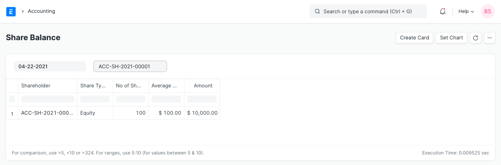
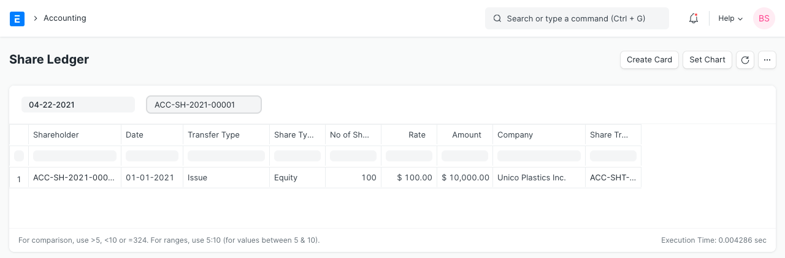

# Share Reports

[ Edit ](https://docs.frappe.io/wiki/spaces/24hrpr6es9/page/0t6i2dn020)

Open in ChatGPT  Ask ChatGPT about this page Open in Claude  Ask Claude about this page

# Share Reports 

[ Edit ](https://docs.frappe.io/wiki/spaces/24hrpr6es9/page/0t6i2dn020)

Open in ChatGPT  Ask ChatGPT about this page Open in Claude  Ask Claude about this page

There are two types of reports in ERPNext for shares. Share Balance and Share ledger.

## 1\. Share Balance

This is a report view which gives the list of all the shares held by a given Shareholder and its value.

To access the Share Balance report, go to:

> Home > Accounting > Share Management > Share Balance

## 2\. Share Ledger

This is a report view which gives the list of all the transactions made by a given Shareholder.

To access the Share Ledger report, go to:

> Home > Accounting > Share Management > Share Ledger

[ Previous Page Share Transfer  ](share-transfer.md) [ Next Page Budget ](budget.md)

Last updated 2 weeks ago 

Was this helpful?
