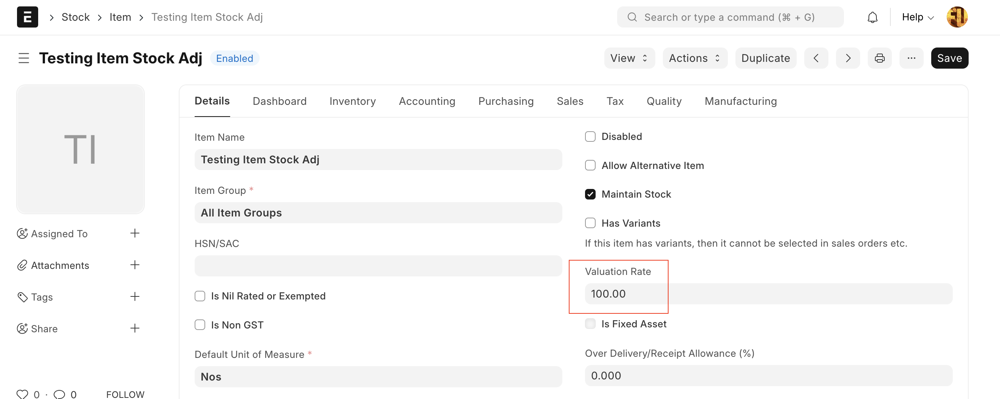
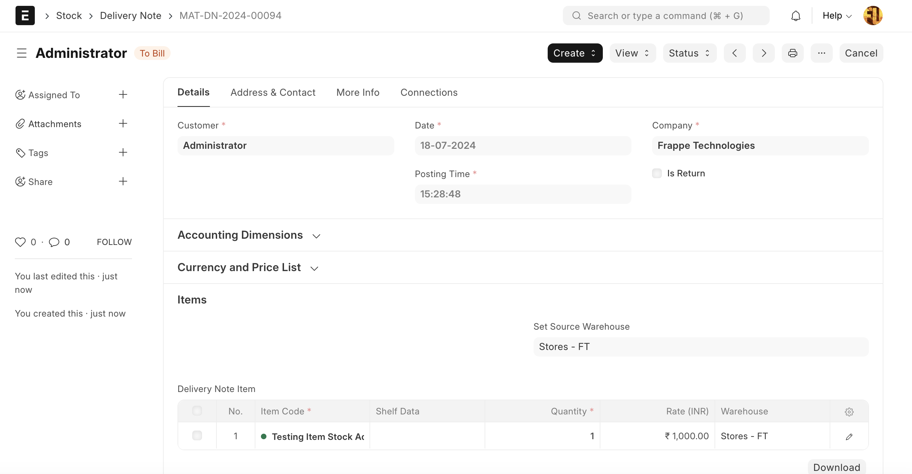
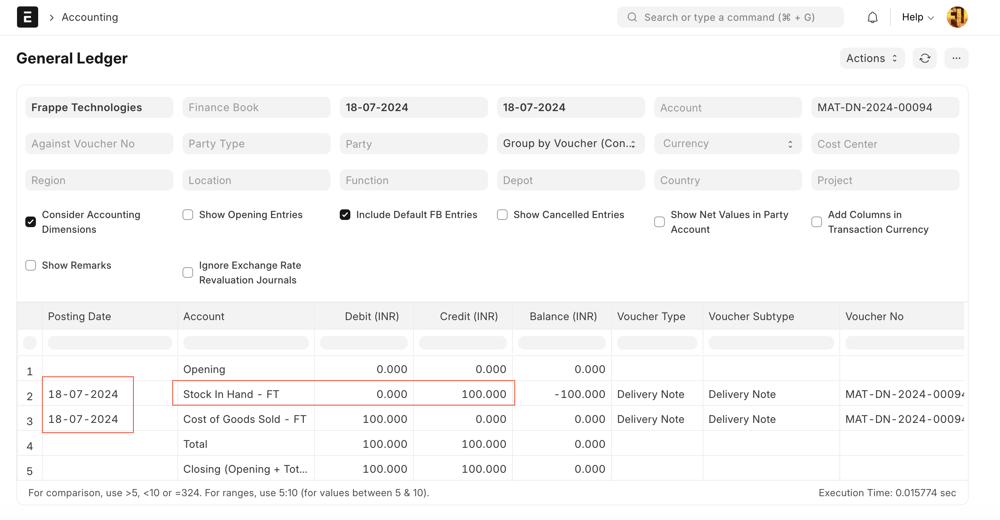
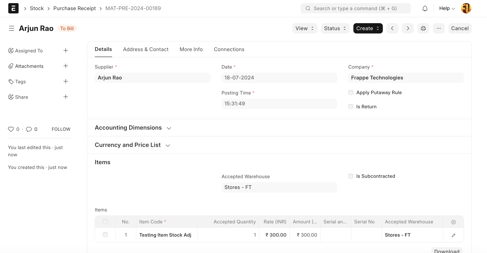
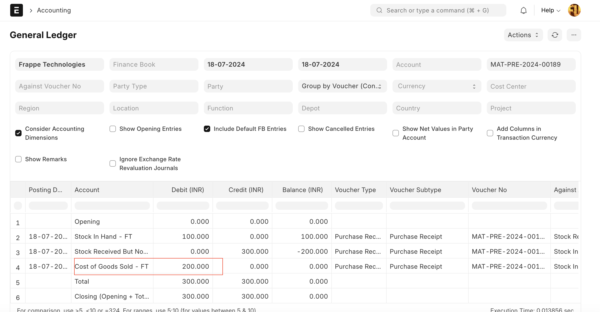
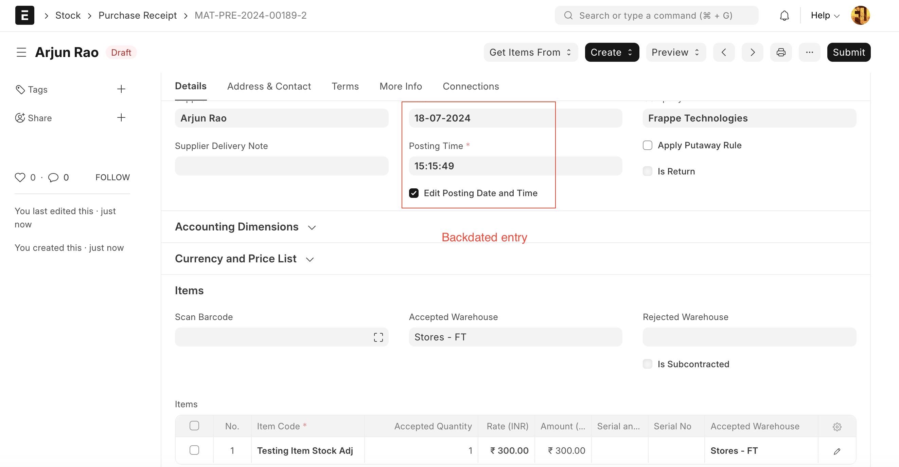
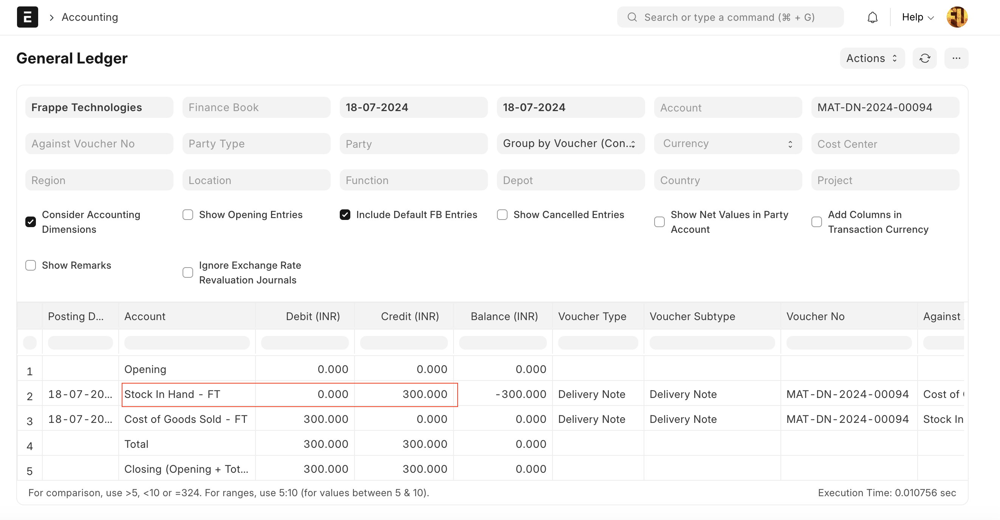

# Stock Adjustment / COGS with Negative Stock

[ Edit ](https://docs.frappe.io/wiki/spaces/24hrpr6es9/page/0rrpss90i1)

Open in ChatGPT  Ask ChatGPT about this page Open in Claude  Ask Claude about this page

# Stock Adjustment / COGS with Negative Stock

[ Edit ](https://docs.frappe.io/wiki/spaces/24hrpr6es9/page/0rrpss90i1)

Open in ChatGPT  Ask ChatGPT about this page Open in Claude  Ask Claude about this page

In this, we will see how negative stock causes stock adjustments. Many users make negative stock entries in the system. For example, they create delivery notes without stock in the system by enabling the 'allow negative stock' in Stock Settings. They do this because they have to dispatch materials to their customers with the delivery receipt. To fix the negative stock, they then make a purchase receipt entry or a material receipt stock entry. Most users make the purchase entry after the delivery note date, which causes the stock adjustment entry. To understand the case take a below example

Suppose there is an item 'Testing Item Stock Adj' for which stock doesn't exist. Now, the user has created the delivery note, but while making the delivery note, the user received an error that the valuation rate is mandatory. So, the user has set the random value as 100 in the valuation rate field for the item 'Testing Item Stock Adj'.

**Delivery Note**

Since the stock was not exists, system has used the valuation rate as 100 and booked the stock in hand as below

Now, since the stock is in negative, we need to make a purchase entry to adjust it. So, we'll create a purchase receipt entry with a purchase rate of 300.

Now the purchase receipt entry is created, but it is made after the delivery note (check the posting date and posting time of both entries). The delivery note has a valuation rate of 100, and the purchase receipt should have a valuation rate of 300 (based on the purchase cost). Since the stock was negative, the system uses the valuation rate of 100 (based on previous entry which was delivery note) for the purchase receipt entry. If the system used a valuation rate of 300, then the stock balance quantity would be zero, but the stock balance value would be 200, which is incorrect. Therefore, the system used a valuation rate of 100, and the difference of 200 is booked in the stock expense account (Stock Adjustment/COGS) as follows:.

## How to Solve the Problem

Either don't use the negative stock feature or make the purchase entry (backdated) before the dispatch entry, so the system will fix the valuation rate of the delivery note and no adjustment entry will be needed for the purchase receipt.

On submission of the above back-dated purchase entry, the system will create a reposting entry that will fix the valuation rate of the delivery note. After the reposting, the delivery note's valuation rate has changed from 100 to 300, and therefore the 'Stock In Hand' has changed to 300.

[ Previous Page Quality Inspection ](quality-inspection.md) [ Next Page Stock Closing Entry ](stock-closing-entry.md)

Last updated 2 weeks ago 

Was this helpful?
