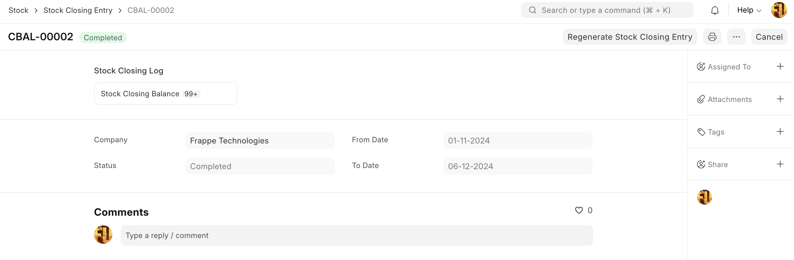

# Stock Closing Entry

[ Edit ](https://docs.frappe.io/wiki/spaces/24hrpr6es9/page/0rr9q3uf7g)

Open in ChatGPT  Ask ChatGPT about this page Open in Claude  Ask Claude about this page

# Stock Closing Entry

[ Edit ](https://docs.frappe.io/wiki/spaces/24hrpr6es9/page/0rr9q3uf7g)

Open in ChatGPT  Ask ChatGPT about this page Open in Claude  Ask Claude about this page

The purpose of the stock closing entry is to generate the stock closing balance, which includes the consolidated stock quantity and consolidated stock value for the selected period. This information will be used to generate the stock reports such as Stock Balance and Batch-Wise Balance History in a short span of time.

## How it Works

The user is required to create a stock closing entry for the desired period, which can span one month, half a month, or an entire year. Upon submission of the stock closing entry, the system generates the stock closing balance for the selected period, including item, batch, inventory dimensions and warehouse wise consolidated closing stock quantities and stock values.

Stock Closing Entry

Stock reports, such as Stock Balance and Batch-Wise Balance History, use the Stock Closing Balance data to calculate the opening stock, which is significantly faster than calculating the closing stock using the Stock Ledger Entry.

Note: Will be available in v16

[ Previous Page Stock Adjustment / COGS with Negative Stock ](stock-adjustment-cogs-with-negative-stock.md) [ Next Page Disassembly Order ](https://docs.frappe.io/erpnext/disassembly-order)

Last updated 2 weeks ago 

Was this helpful?
