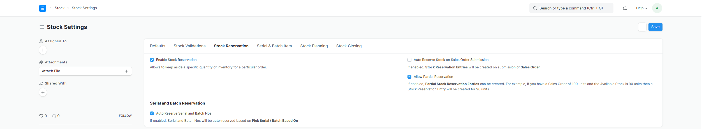
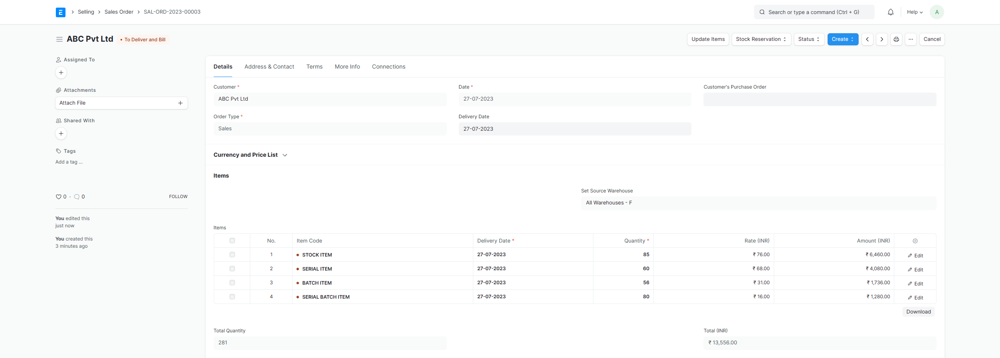
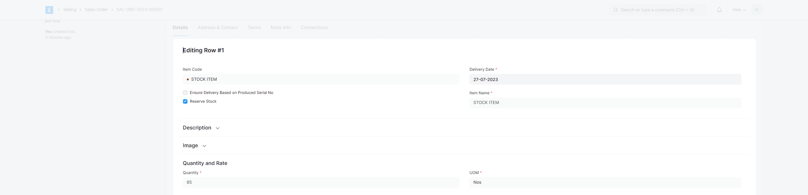
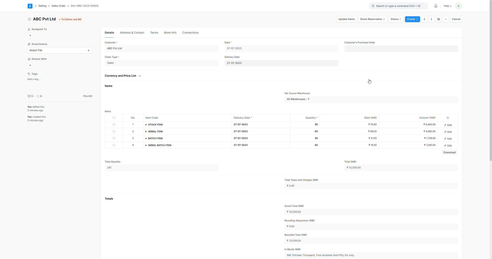
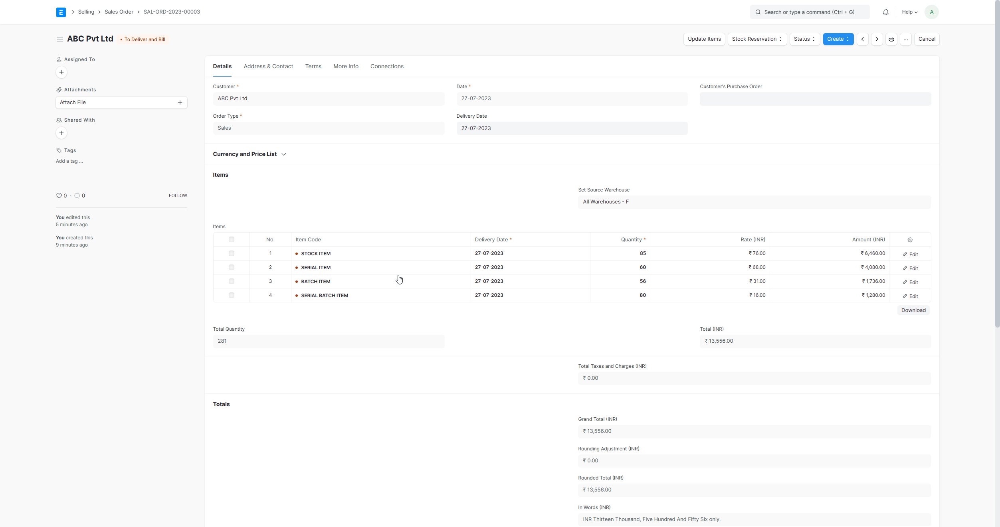
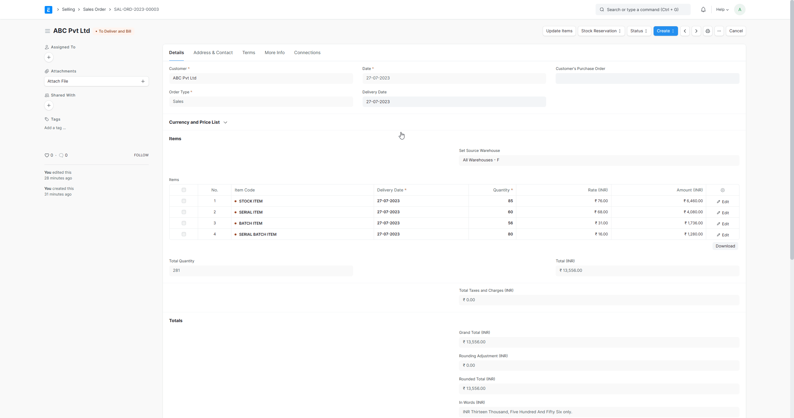
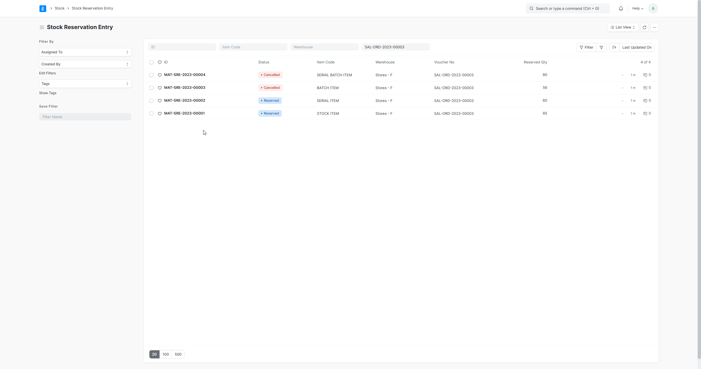
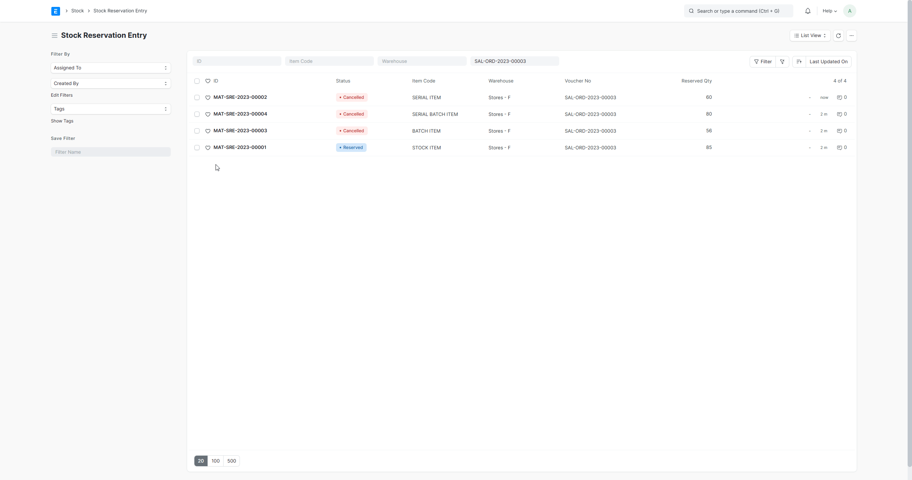

# Stock Reservation

[ Edit ](https://docs.frappe.io/wiki/spaces/24hrpr6es9/page/0rs9mfpuug)

Open in ChatGPT  Ask ChatGPT about this page Open in Claude  Ask Claude about this page

# Stock Reservation

[ Edit ](https://docs.frappe.io/wiki/spaces/24hrpr6es9/page/0rs9mfpuug)

Open in ChatGPT  Ask ChatGPT about this page Open in Claude  Ask Claude about this page

> Introduced in Version 15

Stock reservation, also known as inventory reservation, refers to the practice of setting aside a specific quantity of stock or inventory for a particular purpose or customer.

### 1\. Prerequisites

  * Enable Stock Reservation in Stock Settings. 

### 2\. Stock Reservation against Sales Order

  * Create a Sales Order. 
  * Check the reserve stock for items you want to reserve. 
  * Click on **Stock Reservation** , then select **Reserve**. Choose the warehouse and quantity, then click on the **Reserve Stock** button. 
  * Stock reservation entries are created against the sales order items. 

### 3\. Stock Reservation from Pick List

  * Create a Sales Order.
  * Create a Pick List for the Sales Order.
  * In Pick List click on **Stock Reservation** , then select **Reserve** , the Stock Reservation Entries will be created against the Pick List. 

### 4\. Auto Reserve Stock on Purchase

  * Navigate to Stock Settings and enable **Auto Reserve Stock for Sales Order on Purchase**.
  * Create a Sales Order.
  * Create a Material Request from the Sales Order.
  * Create Purchase Order from Material Request.
  * Complete the process by creating a Purchase Receipt for the Purchase Order. The stock will be automatically reserved upon submission of the Purchase Receipt.

### 5\. Stock Unreservation

There are two ways to unreserve the stock.

  1. Stock Unreservation from Sales Order or Pick List:

     * Open a document and click on **Stock Reservation > Unreserve** button, the listed Stock Reservation Entries get cancelled. 
  2. Unreserve the stock from the Stock Reservation Entry DocType:

     * 2.1 Open a Stock Reservation Entry and cancel it by clicking the **Cancel** button. 
     * 2.2 Go to the Stock Reservation Entry List, select the entries you wish to cancel, and then click on **Actions > Cancel**. 

### 6\. Related Topics

  1. [Sales Order](sales-order.md)
  2. [Pick List](pick-list.md)

[ Previous Page Stock Reconciliation ](stock-reconciliation.md) [ Next Page Pricing Rule  ](pricing-rule.md)

Last updated 1 week ago 

Was this helpful?
