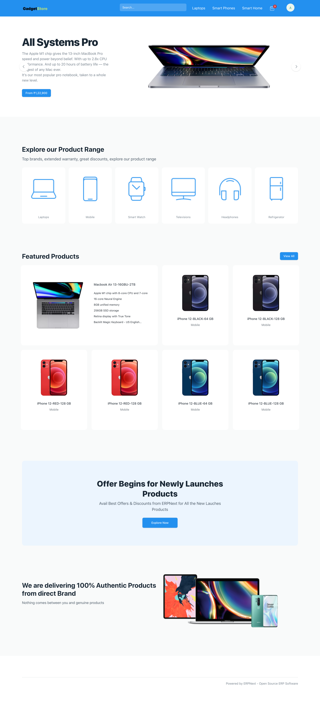
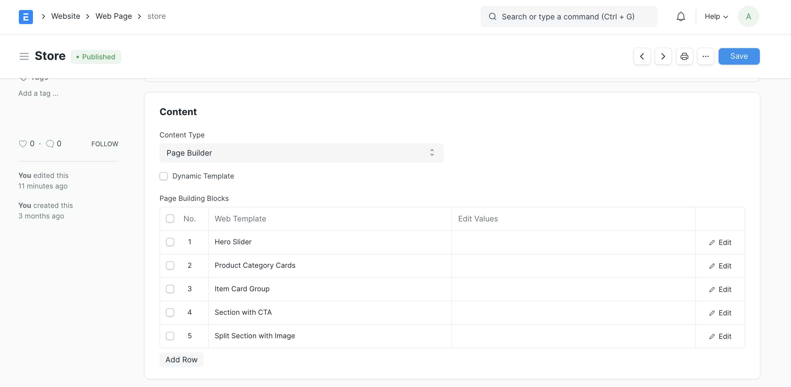
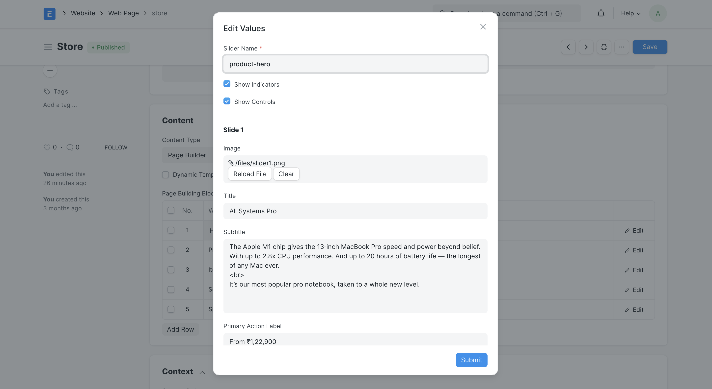
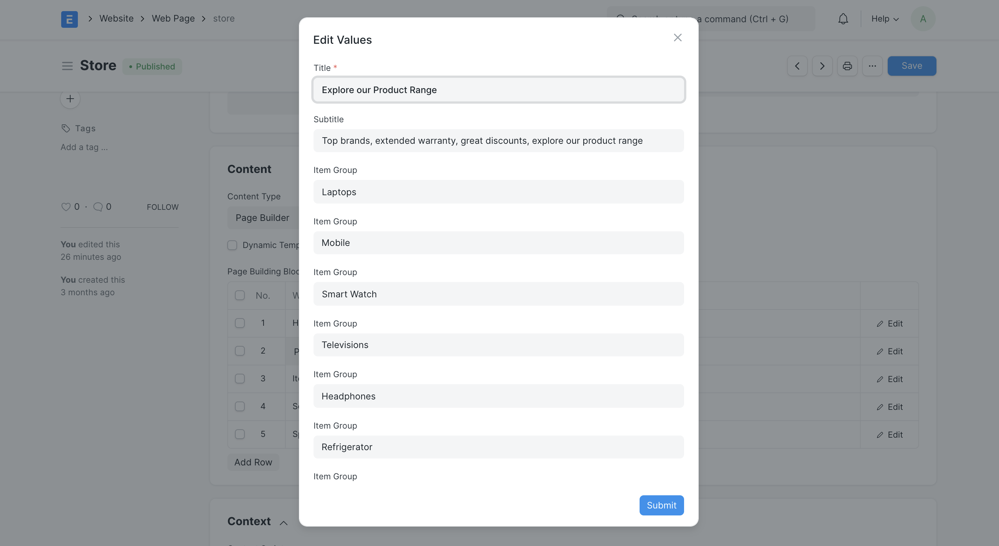
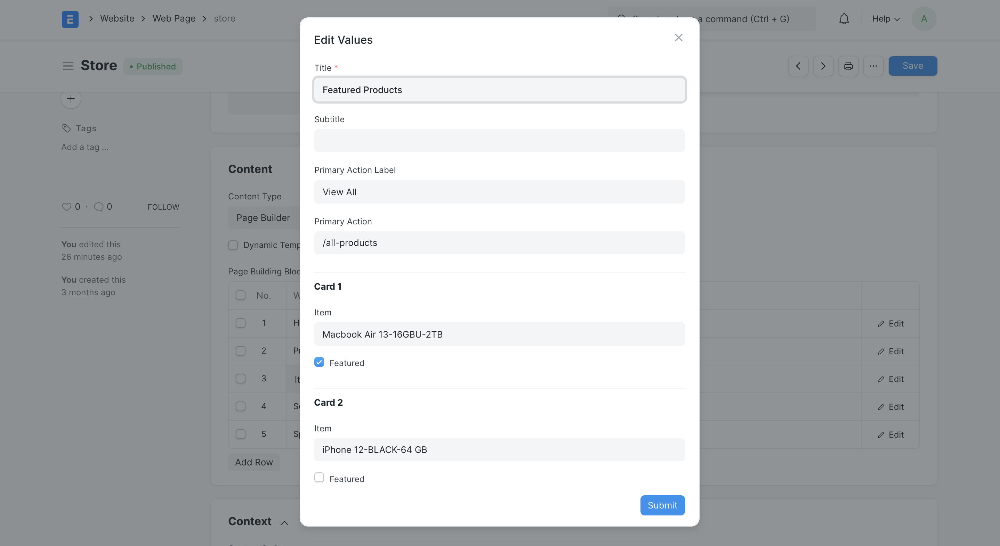
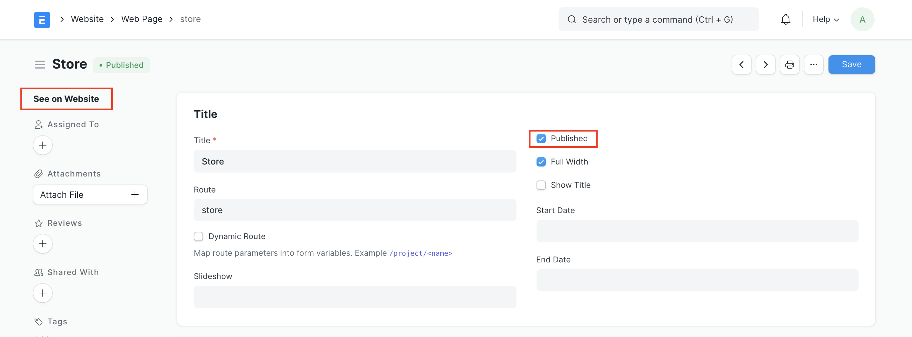

# Store Landing Page

[ Edit ](https://docs.frappe.io/wiki/spaces/24hrpr6es9/page/0t5nduscgh)

Open in ChatGPT  Ask ChatGPT about this page Open in Claude  Ask Claude about this page

# Store Landing Page 

[ Edit ](https://docs.frappe.io/wiki/spaces/24hrpr6es9/page/0t5nduscgh)

Open in ChatGPT  Ask ChatGPT about this page Open in Claude  Ask Claude about this page

After enabling Shopping Cart for your app you can create a custom landing page for your store using the [Web Page Builder](web-page-builder.md).

 _Custom Store Landing Page_

## 1\. How to create a Custom Store Landing Page

  1. Follow the steps mentioned here to [create a Web Page](web-page.md).
  2. Set a Route for your page (eg. _/store_).
  3. Select Content Type as **Page Builder**.
  4. Click on Add Row in the Page Building Blocks Table.
  5. Select a Web Template.

ERPNext comes with a great set of standard web templates that can be used to create your Web Page.

The configuration for the page in the screenshot above looks like this:

 _Store Page Building Blocks_

  1. Add Values.

Click on the Edit Values button on the right of each block, and enter the values in the dialog to set the content for each section.

The Web Templates that will be useful for building your store landing page are:

  * **Hero Slider:** Up to 5 slides can be created. The image, title, primary action, alignment, theme for each slide is configurable.  _Hero Slider Configuration_

  * **Product Category Cards:** Up to 8 product category cards can be configured. Each product categories will link to an [Item Group](item-group.md). Ensure that the **Show in Website** option is ticked in the Item Group form so that the route for the product category is generated.

 _Product Categories Configuration_

  * **Item Card Group:** This section can be used to showcase your featured items. Up to 12 cards can be configured. Each card will link to an [Item](item.md). If **featured** is checked, the item will take up 2 columns of space.

 _Item Cards Configuration_

  1. Publish your Web Page.

The web page will be published only when the Published option is checked. Once the page is published, click on **See on Website** on the sidebar or visit the configured route and check out the page!

 _Publish your Web Page_

  1. Set as your Home Page.

Follow the steps [here](website-home-page.md) to set this page as your Website home page.

[ Previous Page Installing RediSearch to enable fast E-commerce Search ](installing_redisearch_to_enable_super_fast_e_commerce_search.md) [ Next Page Website Setup ](website.md)

Last updated 1 week ago 

Was this helpful?
