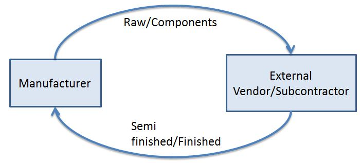

# Introduction

[ Edit ](https://docs.frappe.io/wiki/spaces/24hrpr6es9/page/0rvvvsminj)

Open in ChatGPT  Ask ChatGPT about this page Open in Claude  Ask Claude about this page

# Introduction

[ Edit ](https://docs.frappe.io/wiki/spaces/24hrpr6es9/page/0rvvvsminj)

Open in ChatGPT  Ask ChatGPT about this page Open in Claude  Ask Claude about this page

## Subcontracting

Subcontracting is a type of job contract that seeks to **outsource** certain types of work to other companies. It allows work on more than one phase of the project to be done at once, often leading to quicker completion. It is practiced by various industries.

For example, manufacturers who make a number of products from complex components subcontract certain components and package them at their facilities.

If your business involves outsourcing certain processes to a third party Supplier where you supply the raw materials and the third party does the labor/production, you can track this by using the [subcontracting feature](https://docs.frappe.io/erpnext/user/manual/en/subcontracting.md) of ERPNext.

## Subcontracting Inward

ERPNext also supports **[Subcontracting Inward](https://docs.frappe.io/erpnext/user/manual/en/subcontracting-inward.md)** , where your company acts as the subcontractor. In this case, a customer provides materials to you for processing or manufacturing. ERPNext enables you to track customer-supplied materials, manage production activities, and bill for the services performed.

[ Previous Page Quality Meeting ](quality_meeting.md) [ Next Page Subcontracting ](subcontracting.md)

Last updated 2 weeks ago 

Was this helpful?
