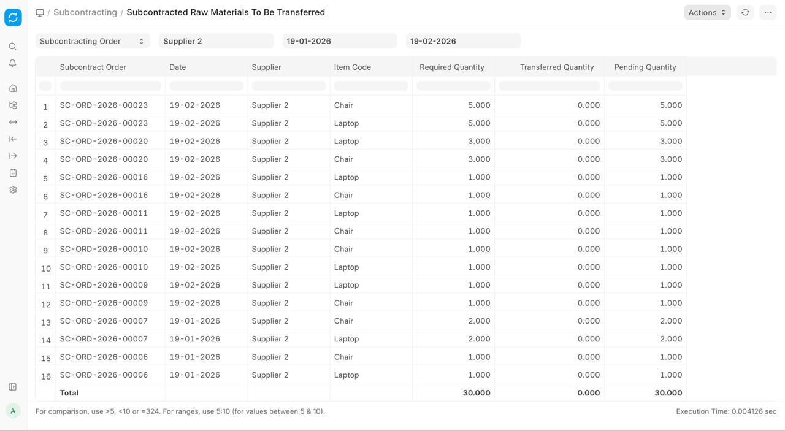
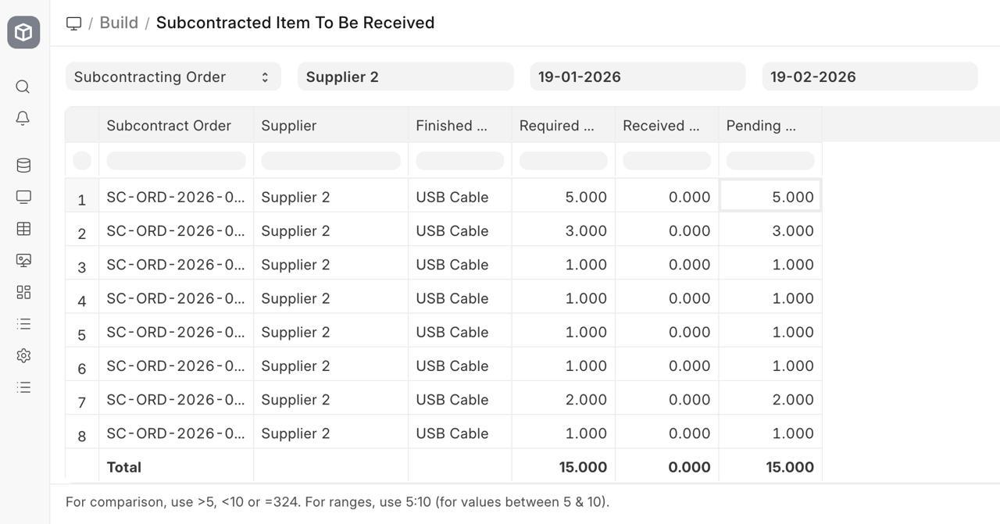
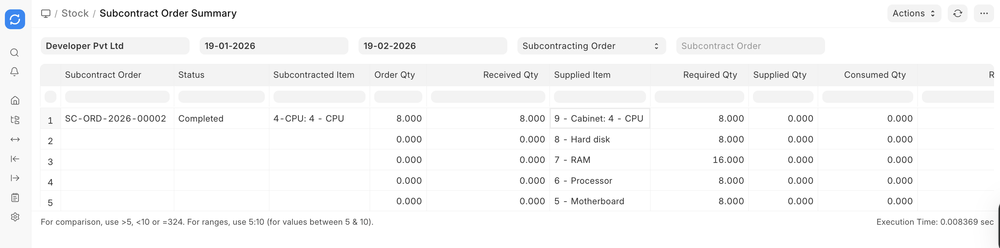

# Reports

[ Edit ](https://docs.frappe.io/wiki/spaces/24hrpr6es9/page/dh2i2bns1g)

Open in ChatGPT  Ask ChatGPT about this page Open in Claude  Ask Claude about this page

# Reports

[ Edit ](https://docs.frappe.io/wiki/spaces/24hrpr6es9/page/dh2i2bns1g)

Open in ChatGPT  Ask ChatGPT about this page Open in Claude  Ask Claude about this page

# Subcontracting Reports in ERPNext

ERPNext provides dedicated reports to help monitor materials sent to subcontractors, track pending receipts, and review the overall status of subcontracting orders. These reports improve visibility, prevent material loss, and ensure accurate production and costing control.

## Subcontracted Raw Materials to be Transferred

This report shows the raw materials that need to be sent to subcontractors against open subcontracting Purchase Orders. It helps identify pending material transfers so that suppliers receive the required inputs on time and production is not delayed.

 _Subcontracted raw materials to be transferred report_

## Subcontracted Item to be Received

This report lists subcontracted finished goods that are yet to be received from suppliers. It provides visibility into pending receipts and helps teams follow up on delayed deliveries and plan inventory accordingly.

 _Subcontracted Item to be received_

## Subcontract Order Summary

This report provides an overall view of subcontracting Purchase Orders, including material transfer status and receipt progress. It is useful for monitoring order completion and tracking the end-to-end subcontracting cycle.

[ Previous Page Subcontracting Inward ](https://docs.frappe.io/erpnext/subcontracting-inward) [ Next Page Project Overview ](https://docs.frappe.io/erpnext/projects-introduction)

Last updated 3 weeks ago 

Was this helpful?
