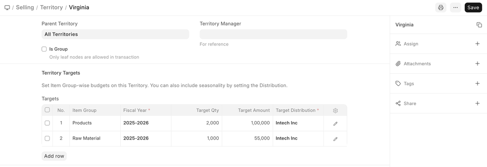

# Territory

[ Edit ](https://docs.frappe.io/wiki/spaces/24hrpr6es9/page/0riumibkq4)

Open in ChatGPT  Ask ChatGPT about this page Open in Claude  Ask Claude about this page

# Territory 

[ Edit ](https://docs.frappe.io/wiki/spaces/24hrpr6es9/page/0riumibkq4)

Open in ChatGPT  Ask ChatGPT about this page Open in Claude  Ask Claude about this page

**A Territory is a geographical region you do business in.**

In ERPNext, a Territory is used to classify Customers, Addresses, in accounting report, and to allocated sales targets.

To access the Territory list, go to:

> Home > Selling > Settings > Territory

## How to create a Territory

  1. Go to the Territory list, click on New.
  2. Tick 'Group Node' if there'll be sub-territories under this Territory. For example, France is a group Territory and Paris is a sub-territory.
  3. Save. Territory List

You can add multiple sub-territories under a parent territory. On saving, a territory can be selected in transactions and reports.

## Features

### Assigning a Territory manager

You can assign a Territory Manager who looks after the Sales of of this region. This isa

### Setting Sales Targets

Here you can set specific sales targets based on the following fields:

  * Item Group
  * Fiscal Year
  * Target Qty
  * Target Amount
  * Target Distribution

To know more about setting sales targets, visit the Sales Person Target Allocation page

## Related Topics

  1. Customer
  2. Address

[ Previous Page Customer Group  ](customer-group.md) [ Next Page Contact  ](contact.md)

Last updated 2 weeks ago 

Was this helpful?
