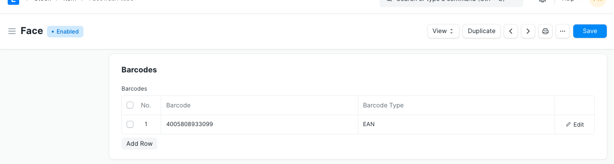
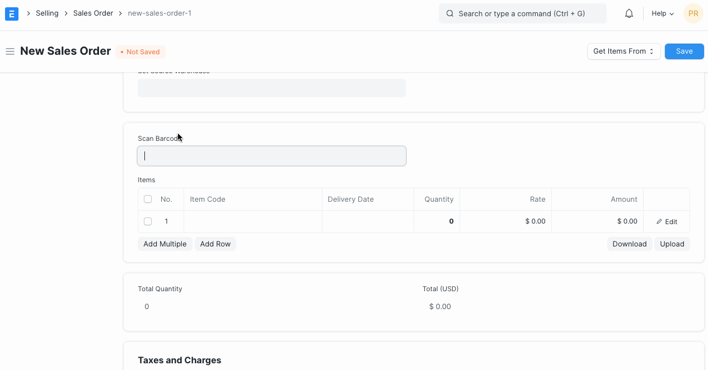
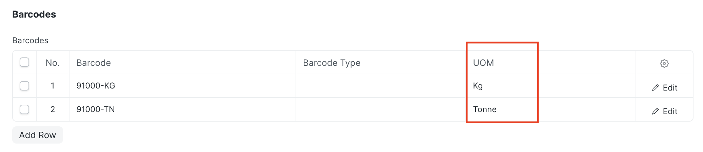
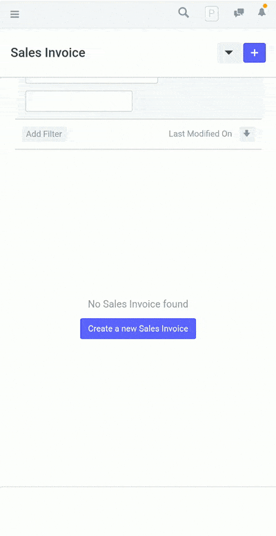

# Track Items Using Barcode

[ Edit ](https://docs.frappe.io/wiki/spaces/24hrpr6es9/page/0shu51inb8)

Open in ChatGPT  Ask ChatGPT about this page Open in Claude  Ask Claude about this page

# Track Items Using Barcode 

[ Edit ](https://docs.frappe.io/wiki/spaces/24hrpr6es9/page/0shu51inb8)

Open in ChatGPT  Ask ChatGPT about this page Open in Claude  Ask Claude about this page

A barcode is a value decoded into vertical spaced lines. Barcode scanners are the input medium, like Keyboard. When it scans a barcode, the data appears in the computer screens at the point of a cursor.

## Item Master

To set the barcode of a particular item, you will have to open the Item record. You can also enter barcode while creating a new item.

Once barcode field is updated in item master, items can be fetched using barcode. This feature will be available in Delivery Note, Sales Invoice, Purchase Receipt, and Stock Reconciliation transactions only.

### UOM specific barcode

You can also specify different barcode for different type of packaging of same item like unit and box. Select the UOM in Item Barcode table to get it auto selected when scanning items.

## Using mobile phone / smartphone to scan and add items

Log in to your ERPNext account, go to the Item master and you'll be able to scan barcodes and add Items right from your smartphone!

[ Previous Page Item Codification  ](item-codification.md) [ Next Page Item Valuation Setup and Transactions ](item-valuation-transactions.md)

Last updated 1 week ago 

Was this helpful?
