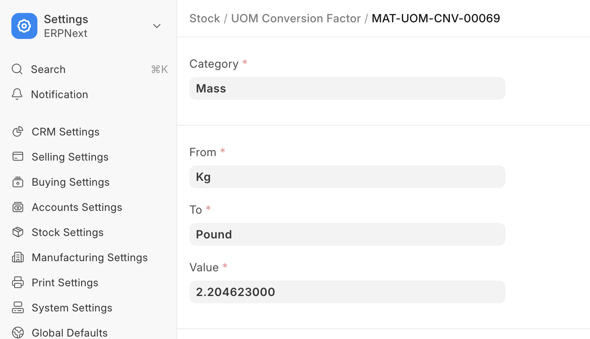

# Unit of Measure (UoM)

[ Edit ](https://docs.frappe.io/wiki/spaces/24hrpr6es9/page/0rs0mlfeha)

Open in ChatGPT  Ask ChatGPT about this page Open in Claude  Ask Claude about this page

# Unit of Measure (UoM) 

[ Edit ](https://docs.frappe.io/wiki/spaces/24hrpr6es9/page/0rs0mlfeha)

Open in ChatGPT  Ask ChatGPT about this page Open in Claude  Ask Claude about this page

**A UoM is a unit using which an Item is measured.**

By default, there are many UoMs created in ERPNext. However, more can be added depending on your business use case.  
In the UoM there is an option 'Must be Whole Number'. If this is checked, you cannot use fraction numbers in this UoM. To know more about fractions and UoMs, check out [this page](managing-fractions-in-uom.md).

The UoM list by itself only stores the name. The actual conversion rates are stored in a document called 'UoM Conversion Factor'. If you add new UoMs and plan to use it in transactions where it'll be converted to other UoMs, it is advised that you add it to this list.

For example, here 1 Kg is approximately 2.2 Pounds and the exact conversion factor is stored:

[ Previous Page Item Group ](item-group.md) [ Next Page Serial and Batch ](serial-and-batch.md)

Last updated 1 week ago 

Was this helpful?
