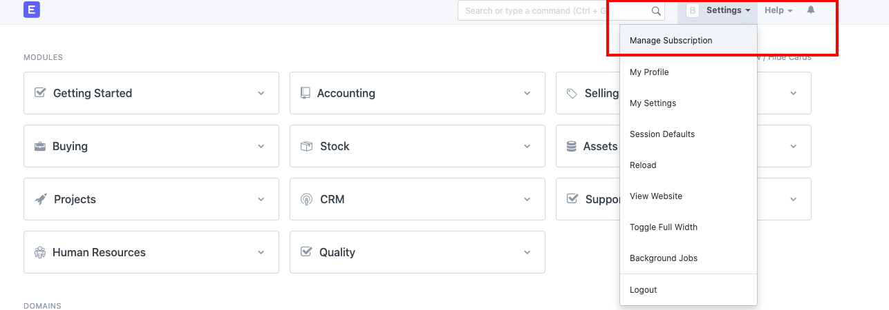
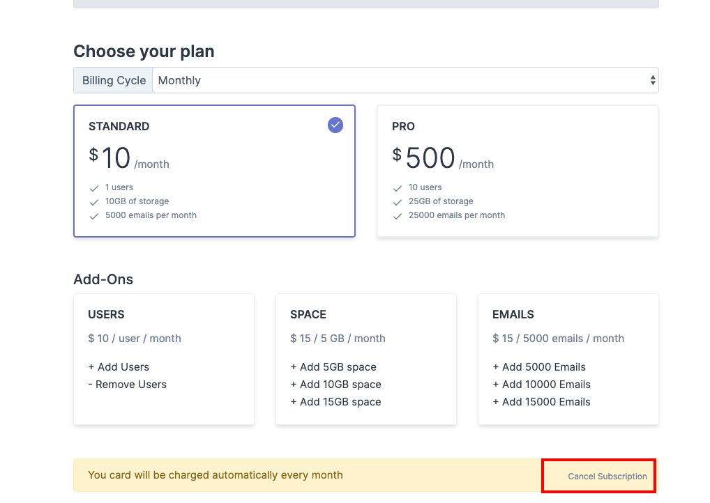
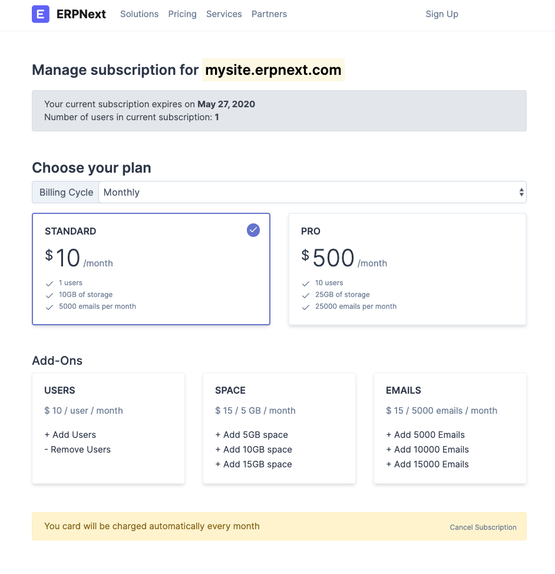

# Update Subscription Payment Method

[ Edit ](https://docs.frappe.io/wiki/spaces/24hrpr6es9/page/0rni4tr76t)

Open in ChatGPT  Ask ChatGPT about this page Open in Claude  Ask Claude about this page

# Update Subscription Payment Method

[ Edit ](https://docs.frappe.io/wiki/spaces/24hrpr6es9/page/0rni4tr76t)

Open in ChatGPT  Ask ChatGPT about this page Open in Claude  Ask Claude about this page

On [erpnext.com](http://erpnext.com/), you can subscribe for a monthly plan either by using Paypal or using your credit card. Once subscribed, the amount is deducted monthly from your card.  
If, for any reason you need to change the Credit Card you are paying from, you will first need to cancel the existing subscription. After the current site expires, you can re-subscribe again with a new card.  
To cancel the current subscription, click on **Settings > Manage Subscription.**  
  
After this on the checkout screen, scroll down and cancel the subscription.  
  
When the current subscription expires, you can start the subscription again with a new card. Your account expiry date can be checked via the **Manage** **Subscription** option seen earlier:  

[ Previous Page Upgrade Subscription Plan and Buy Add-ons ](how-to-upgrade-subscription-plan-and-buy-add-ons.md) [ Next Page Advance Payment Entry ](advance-payment-entry.md)

Last updated 2 weeks ago 

Was this helpful?
