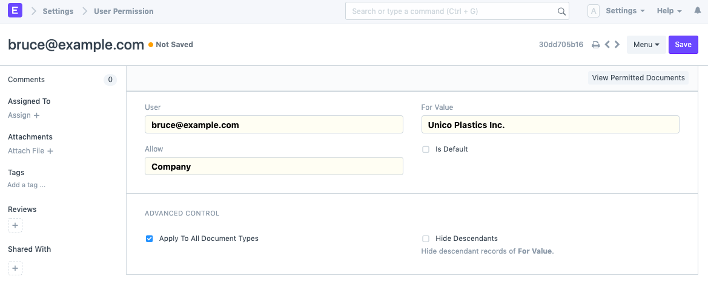
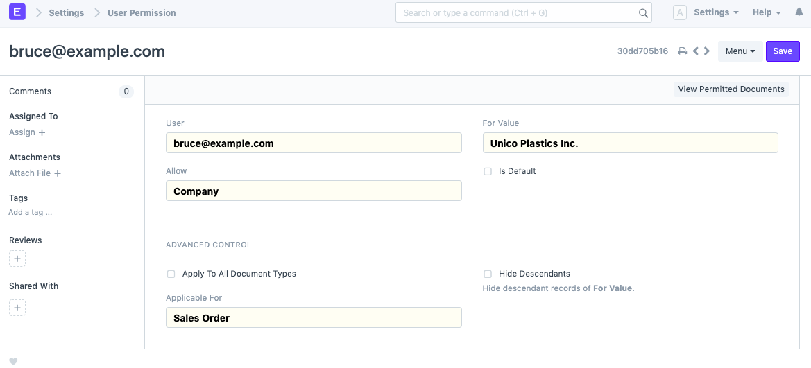
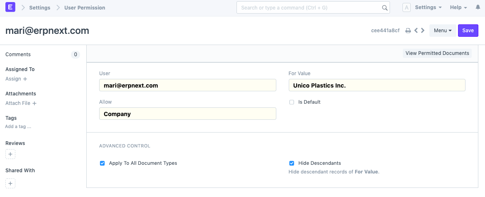
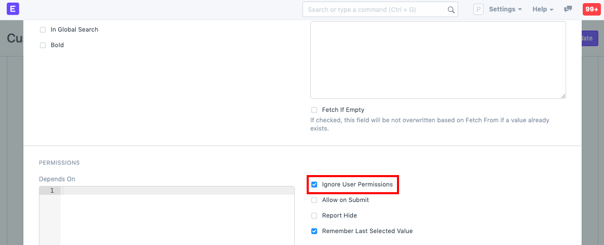
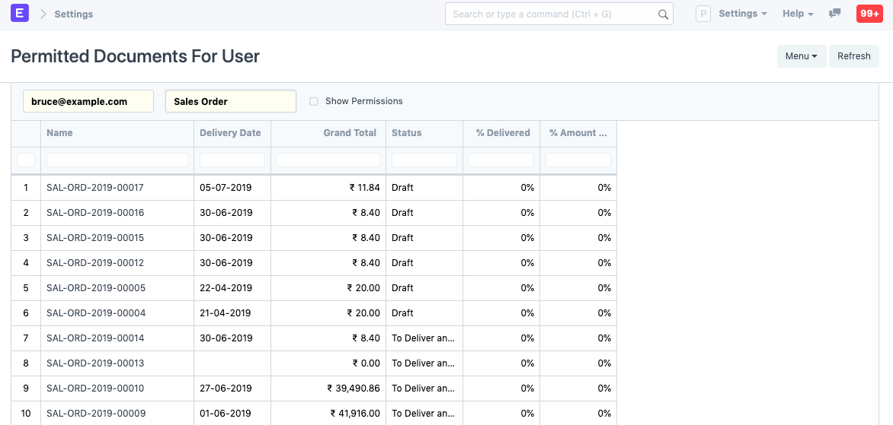
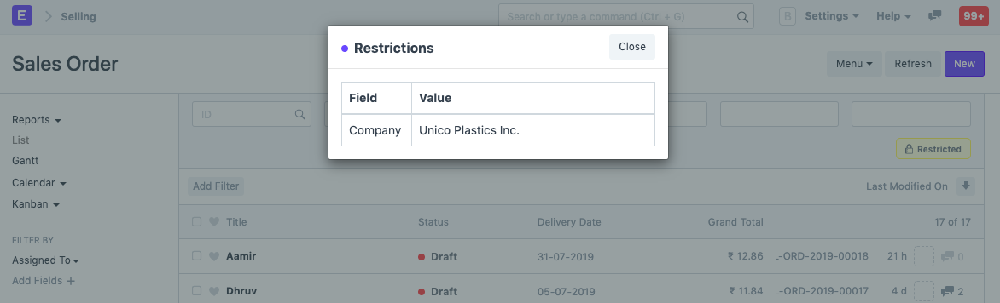

# User Permissions

[ Edit ](https://docs.frappe.io/wiki/spaces/24hrpr6es9/page/0sc6d24jvi)

Open in ChatGPT  Ask ChatGPT about this page Open in Claude  Ask Claude about this page

# User Permissions

[ Edit ](https://docs.frappe.io/wiki/spaces/24hrpr6es9/page/0sc6d24jvi)

Open in ChatGPT  Ask ChatGPT about this page Open in Claude  Ask Claude about this page

**User permissions is a way of restricting user access to particular documents.**

Role based permissions allow setting complete (by default) access to a document type (doctype) like Sales Invoice, Orders, Quotation, etc. This means that when you assign a Sales User role to a user, they can access all the Sales Orders and Quotations.

User Permissions can be used to restrict access to select documents based on the link fields in the document. For example, consider that you do business with multiple territories and you want to restrict access of certain Sales Users to Quotations/Sales Order belonging to a particular territory. This can be done via User Permissions. The restrictions can be set on Customer, Supplier, Customer Group, Supplier Group, etc.

Setting User Permissions are particularly useful when you want to restrict based on:

  1. Allowing user to access data belonging to one Company
  2. Allowing user to access data related to a specific Customer or Territory

To access User Permissions, go to: > Home > User and Permissions > User Permissions

  1. How to create User Permissions

* * *

  1. Go to the User Permissions list, click on New.
  2. Select the user for which the rule has to be applied.
  3. Select the type of document to be allowed (for example "Company").
  4. Under For Value, select the specific item that you want to allow (the name of the "Company).
  5. If you check 'Is Default', the value selected in 'For Value' will be used by default for any future transactions by this user. That is if company 'Unico Plastics Inc.' is selected as 'For Value', this Company will be set as default for all future transactions by this user.

> Note: Only a single user permission can be set as default for a particular document type for a specific user.

  2. More User Permission actions

* * *

### 2.1 Advanced Control

In Advanced Control, you can have better command over where the User Permission is applied.

### 2.1.1. Applicable For

You can optionally apply user permissions only for specific document type by setting the Document Type after unchecking the Apply To All Document Types checkbox. Setting **Applicable For** option will make the current user permission applicable only under the selected Document Type master.

In the above User Permission, the user will be able to access only Sales Orders of the selected company.

**Note:** If **Applicable For** is not set, User Permission will apply across all related Document Types.

### 2.1.2. Hide Descendants

The value of **Allow** could be a DocType with a Tree View, which will have records with a parent-child or ancestor-descendant relationship.

Let's assume **For Value** , 'Unico Plastics Inc.', has a child company 'Unico Toys'. When a User Permission is created for 'Unico Plastics Inc.', permissions for its descendants are granted as well.

**Hide Descendants** is visible only on selecting a Tree View DocType. By enabling this checkbox, permissions for descendants of **For Value** will not be granted.

A user that can view records of 'Unico Plastics Inc.' will not be able to view those of 'Unico Toys'.

### 2.2 Ignoring User Permissions on Certain Fields

Another way of allowing documents to be seen by everyone that have been restricted by User Permissions is to tick "Ignore User Permissions" on a particular field by going to **Customize Form**.

For example, you don't want Assets to be restricted for any user, then select **Asset** in form type. Under the fields table, expand the Company field and tick on "Ignore User Permissions".

### 2.3 Strict Permissions

When user permissions are defined, for a particular role - the role permissions are only applied when the user permission are defined. When there are no user permissions for a particular user, there could be two interpretations:

  1. Show everything (nothing is restricted)
  2. Show nothing (nothing is permitted)

You can choose how to interpret this the way you want by checking "Apply strict permissions" on the System Settings page.

To know more, go to the [System Settings page](system-settings.md).

### 2.4 Checking How User Permissions are Applied

Finally, once you have created your air-tight permission model, and you want to check how it applies to various users. You can see it via the **Permitted Documents for User** report. Using this report, you can select the **User** and document type and view which documents a particular user can access.

Ticking on the Show Permissions checkbox will show the read/write/submit and other access levels.

Note: If you cannot access Sales Order or any other document type in this list, make sure you've set the [roles](role-based-permissions.md) correctly.

For example, the user, Bruce is restricted to Company 'Unico Plastics Inc.' 

### 3\. Related Topics

  1. [Adding Users](adding-users.md)
  2. [Role and Role Profile](role-and-role-profile.md)
  3. [Role Based Permissions](role-based-permissions.md)
  4. [Role Permission For Page And Report](https://docs.frappe.io/erpnext/role-permission-for-page-and-report)

[ Previous Page Role Based Permissions ](role-based-permissions.md) [ Next Page Administrator ](https://docs.frappe.io/erpnext/administrator)

Last updated 2 weeks ago 

Was this helpful?
