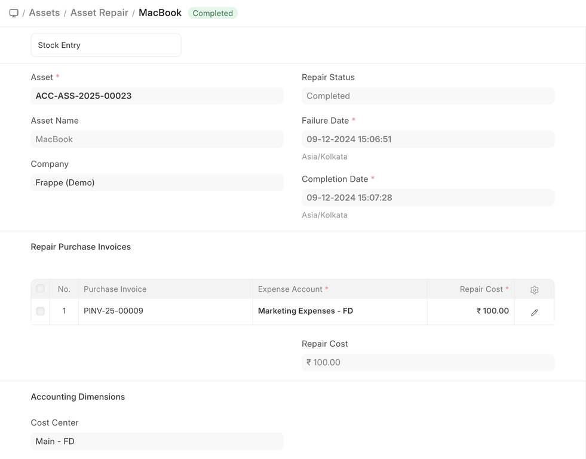
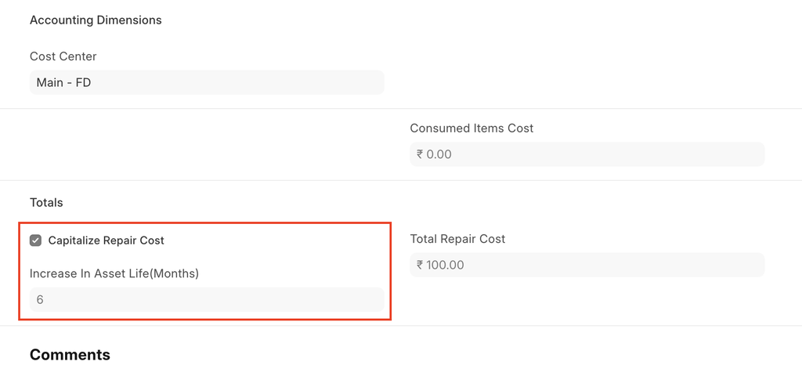
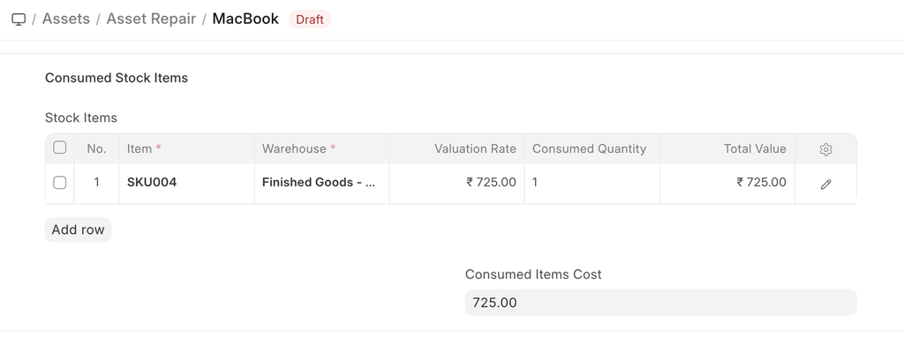
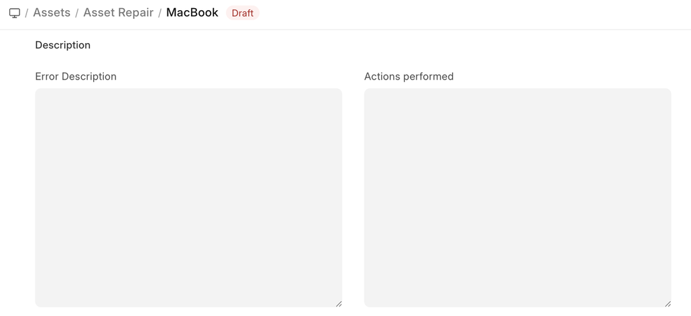
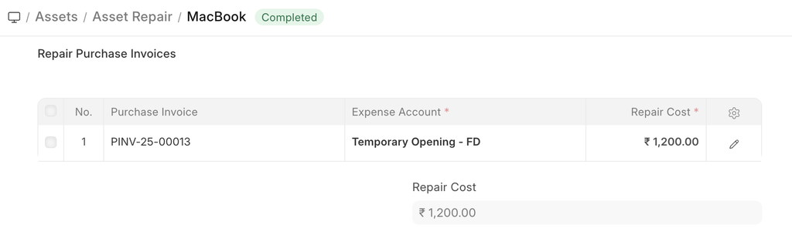
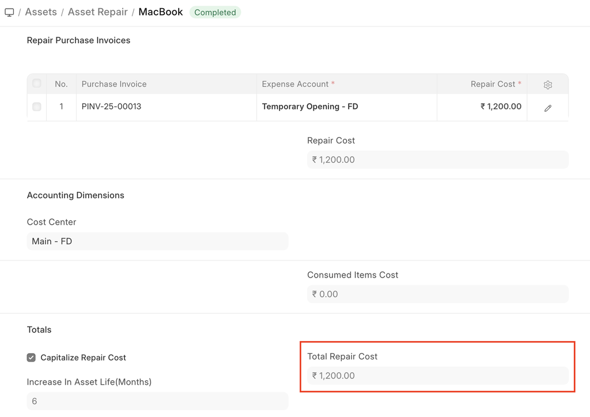

# Asset Repair

[ Edit ](https://docs.frappe.io/wiki/spaces/24hrpr6es9/page/0s383jvchp)

Open in ChatGPT  Ask ChatGPT about this page Open in Claude  Ask Claude about this page

# Asset Repair 

[ Edit ](https://docs.frappe.io/wiki/spaces/24hrpr6es9/page/0s383jvchp)

Open in ChatGPT  Ask ChatGPT about this page Open in Claude  Ask Claude about this page

**Asset Repair refers to any activity carried to repair a broken Asset to restore full functionality.**

You can also maintain the records of Repair/Failures of Assets which are not listed in Asset Maintenance.

To access the Asset Repair list, go to:

> Home > Assets > Maintenance > Asset Repair

## 1\. Prerequisites

* * *

Before creating an Asset Repair, ensure:

  * [Asset](../../../asset.md)

## 2\. How to create an Asset Repair

* * *

  1. Go to the Asset Repair list, click on New.
  2. Select the Asset.
  3. Select the Failure Date.
  4. Enter the Repair Cost.
  5. Change the Repair Status from 'Pending' to 'Completed', or 'Canceled'.
  6. Select a Purchase Invoice if Repair Cost is greater than zero.
  7. Save and Submit.

> Note: Alternatively, you could open the record for the Asset in question and click on the **Repair Asset** button under **Manage** , and then follow steps 3-8.

## 3\. Features

* * *

### 3.1 Capitalize Repair Cost

If checked, the Repair Cost will be added to the Asset's value. This could also allow you to increase the Asset's life.

### 3.2 Increase In Asset Life(Months)

The number of months by which the Asset's life might be extended by the repair can be added here. This will modify the Depreciation Schedule of the Asset. This field will only be visible if Capitalize Repair Cost is checked.

### 3.3 Consumed Stock Items

Entering Stock Items consumed during the repair here will create a Stock Entry record of type Material Issue for them, thereby decreasing their quantity. GL Entries will also be created for each Item in the table. In case of Serialized Items, the Item row can be expanded to reveal the Add Serial No button.

  * **Error Description** : A detailed descripton of the problem can be entered here.
  * **Actions Performed** : A sequence of actions performed to carry out the repair can be noted down here.

### 3.4 Accounting Dimensions

Accounting Dimensions let you tag transactions based on a specific Territory, Branch, Customer, etc. This helps in viewing accounting statements separately based on the selected dimension(s). To know more, check help on Accounting Dimensions feature.

> Note: Project and Cost Center are treated as dimensions by default.

### 3.5 Purchase Invoice

A Purchase Invoice can be linked with the Asset Repair, to account for any Items that need to be purchased to carry out the repair or the repair service offered.

### 3.6 Total Repair Cost

If Stock Consumed During Repair is checked, the Total Repair Cost will be computed based on the value of the consumed Stock Items and the Repair Cost entered.

[ Previous Page Asset Movement ](../../../asset-movement.md) [ Next Page Asset Value Adjustment  ](../../../asset-value-adjustment.md)

Last updated 1 week ago 

Was this helpful?
