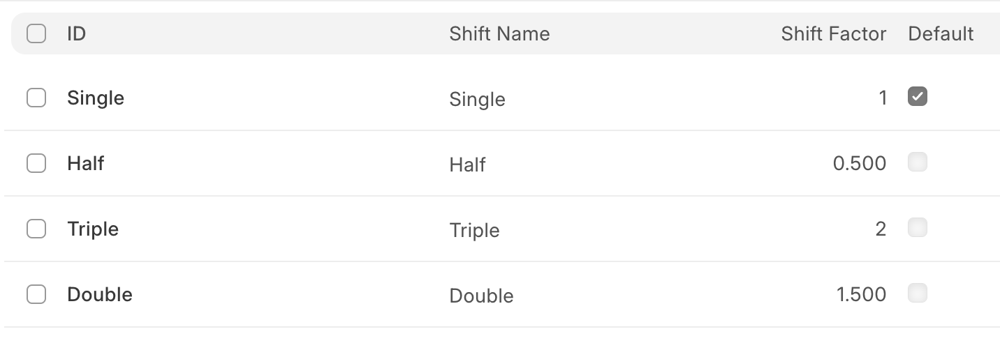
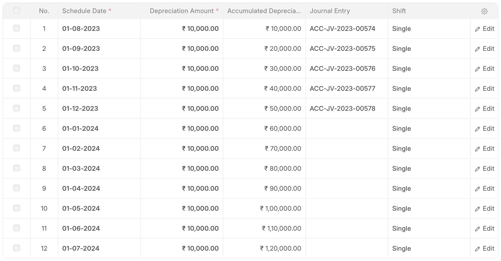
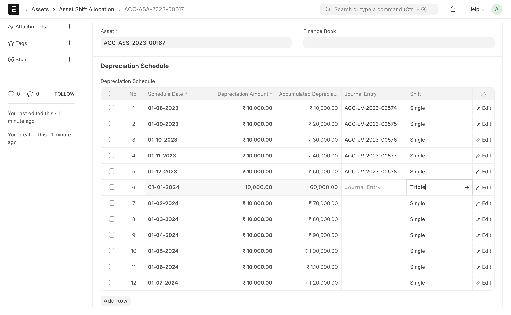
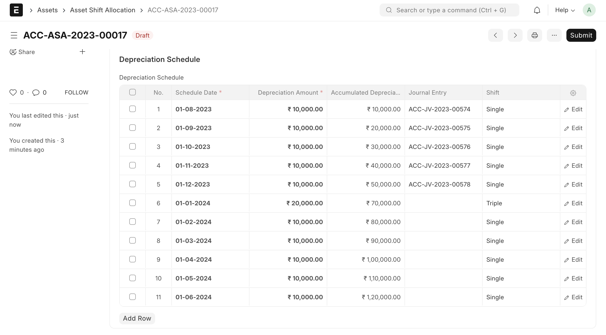

# Asset Shift Allocation

[ Edit ](https://docs.frappe.io/wiki/spaces/24hrpr6es9/page/0s497eiki5)

Open in ChatGPT  Ask ChatGPT about this page Open in Claude  Ask Claude about this page

# Asset Shift Allocation

[ Edit ](https://docs.frappe.io/wiki/spaces/24hrpr6es9/page/0s497eiki5)

Open in ChatGPT  Ask ChatGPT about this page Open in Claude  Ask Claude about this page

**Asset Shift Allocation is a transaction that allows you to modify the shifts of an asset (with shift-based depreciation enabled) for a specific period while automatically adjusting the remaining depreciation schedule.**

This feature is useful when an asset operates in more or fewer shifts than originally planned. Instead of manually recalculating depreciation, the system redistributes the remaining shifts automatically to maintain consistency in total depreciation.

For example, if a production machine runs additional shifts during peak season, you can adjust the shift for that period and let ERPNext recalculate the remaining schedule.

To access Asset Shift Allocation, go to:

> Home > Assets > Asset > Asset Shift Allocation

## 1\. Prerequisites

* * *

Before creating an Asset Shift Allocation, ensure:

  * An Asset is created.
  * Shift Depreciation is enabled for the asset.
  * A depreciation schedule has already been generated.

## 2\. How to Create an Asset Shift Allocation

* * *

  1. Go to the Asset Shift Allocation list.
  2. Click on New.
  3. Select the Asset.
  4. Click Save.

Upon saving, the system automatically fetches the current depreciation schedule so you can edit the shift values.

Only after reviewing and confirming the updated schedule should you click **Submit**.

> Note: Asset Shift Allocation is a transaction and must be **submitted** to apply changes.

## 3\. What Happens Automatically?

When you save:

  * The system recalculates the total shift distribution.
  * To preserve the total planned depreciation:
    * The last row may be removed, or
    * The shift in the last row may be adjusted.

#### Example Outcomes:

  * If you change the any row to **Triple** , the last row is automatically removed to maintain the total shift count.
  * If you change the any row to **Double** , the last row’s shift is adjusted to **Half**.

This ensures:

  * Total shifts remain consistent
  * Total depreciation amount does not change
  * No manual recalculation is required

## 4\. Submitting the Allocation

* * *

After reviewing the recalculated schedule:

  1. Click **Submit**.
  2. A **new depreciation schedule** is generated.
  3. Future depreciation entries follow the updated shift allocation.
  4. Past booked depreciation entries remain unchanged.

## 5\. Key Features

* * *

### 5.1 Automatic Rebalancing

The system automatically adjusts remaining shifts to ensure the total shift factor across the asset’s life remains intact.

### 5.2 Preservation of Total Depreciation

Even if individual period shifts change, the total depreciation amount over the asset’s lifetime remains unchanged.

### 5.3 Controlled Period Adjustment

You can modify shifts for specific rows without manually recalculating the entire depreciation schedule.

## 6\. Related Topics

* * *

  * [Asset](../../../asset.md)
  * [Depreciation Methods](../../../asset-depreciation.md)

[ Previous Page Daily Depreciation Calculation ](../../../daily-depreciation.md) [ Next Page Asset Maintenance ](../../../asset-maintenance.md)

Last updated 1 week ago 

Was this helpful?
