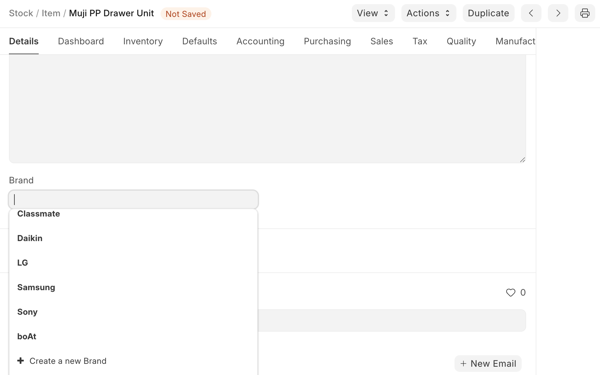
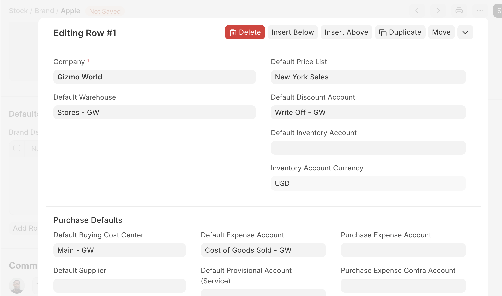

# Brand

[ Edit ](https://docs.frappe.io/wiki/spaces/24hrpr6es9/page/0ru3uqch7o)

Open in ChatGPT  Ask ChatGPT about this page Open in Claude  Ask Claude about this page

# Brand 

[ Edit ](https://docs.frappe.io/wiki/spaces/24hrpr6es9/page/0ru3uqch7o)

Open in ChatGPT  Ask ChatGPT about this page Open in Claude  Ask Claude about this page

**A Brand identifies items with a specific name.**

Usually, a Brand is the manufacturer or packer of a specific product. For example, Apple is a brand that manufactures laptops. A Brand is not necessarily the [Manufacturer](../../../manufacturer.md) of an Item, it's only the name under which a product is sold. For example, if you manufacture plastic cups, you may license them to a big brand so that they sell them under their Brand.

In ERPNext, Brands can be assigned to Items for identifying and assigning certain defaults.

To access the Brand list, go to:

> Home > Selling > Sales > Brand

## 1\. How to Create a Brand

  1. Go to the Brand list and click on New.
  2. Enter a Brand name and enter a description if needed.
  3. Save. [Brand](https://docs.frappe.io/files/brand.png)

Now this Brand can be associated with different Items.

## 2\. Features

### 2.1 Setting defaults for Items of this Brand

The following defaults can be set for a Brand. On assigning this brand to an Item, the set defaults will be fetched when performing Sales/Purchase transactions with Item of this Brand.

  * **Default Warehouse** : The Warehouse from which the Item will be sourced/stored depending on the transaction.
  * **Default Price List** : The Price List set here will be fetched in Purchase/Sales transactions.

#### Purchase Defaults

When performing Purchase transactions like Purchase Order, Purchase Receipt, or Purchase Invoice, the defaults set here will be fetched on selecting Item of this Brand.

  * Default Buying Cost Center
  * Default Supplier
  * Default Expense Account

#### Sales Defaults

When performing Sales transactions like Sales Order, Delivery Note, or Sales Invoice, the defaults set here will be fetched on selecting Item of this Brand.

  * Default Selling Cost Center
  * Default Income Account

## 3\. Related Topics

  1. [Purchase Order](../../../purchase-order.md)
  2. [Sales Order](../../../sales-order.md)
  3. [Purchase Receipt](../../../purchase-receipt.md)
  4. [Delivery Note](../../../delivery-note.md)
  5. [Sales Invoice](../../../sales-invoice.md)
  6. [Purchase Invoice](../../../purchase-invoice.md)

[ Previous Page Item Attribute ](../../../item-attribute.md) [ Next Page Manufacturer  ](../../../manufacturer.md)

Last updated 1 week ago 

Was this helpful?
