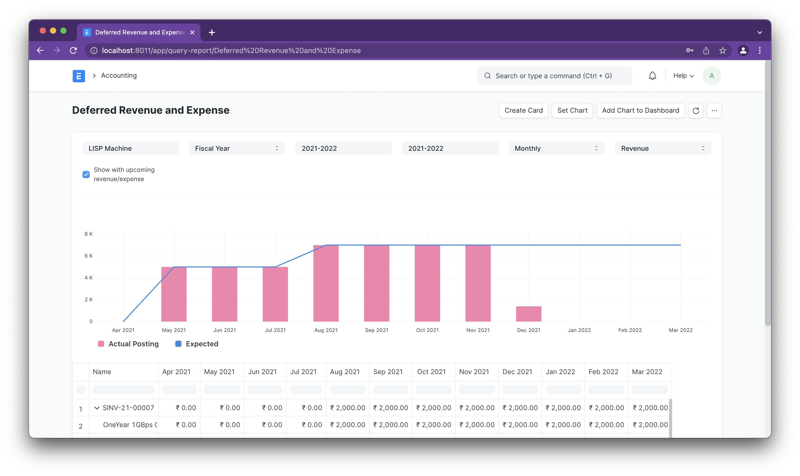
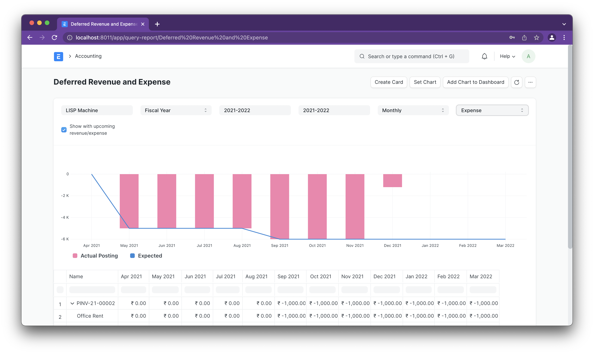

# Deferred Revenue/Expense Report

[ Edit ](https://docs.frappe.io/wiki/spaces/24hrpr6es9/page/0ro23f15n3)

Open in ChatGPT  Ask ChatGPT about this page Open in Claude  Ask Claude about this page

# Deferred Revenue/Expense Report

[ Edit ](https://docs.frappe.io/wiki/spaces/24hrpr6es9/page/0ro23f15n3)

Open in ChatGPT  Ask ChatGPT about this page Open in Claude  Ask Claude about this page

Calculating the actual income/expense from a Sales/Purchase Invoice with deferred items can be tricky. This report aims to simplify that process.

Report can calculate the actual and expected/upcoming posting for a deferred item at the item and invoice level.

### Deferred Revenue

### Deferred Expense

[ Previous Page Financial Report Template ](https://docs.frappe.io/erpnext/financial-report-template) [ Next Page Payment Terms Status Report ](https://docs.frappe.io/erpnext/payment_terms_status_report)

Last updated 2 weeks ago 

Was this helpful?
