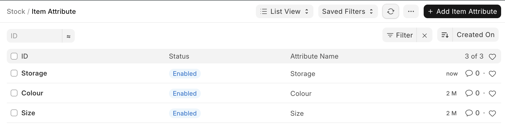
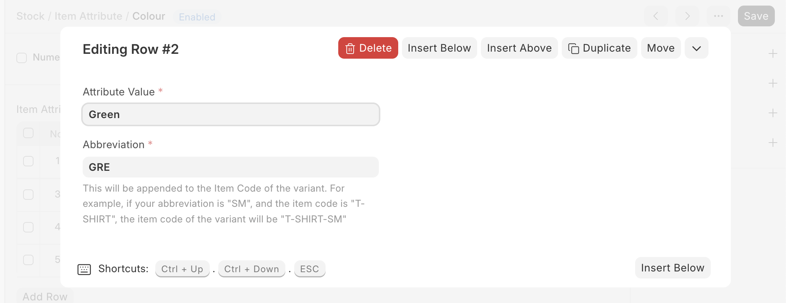
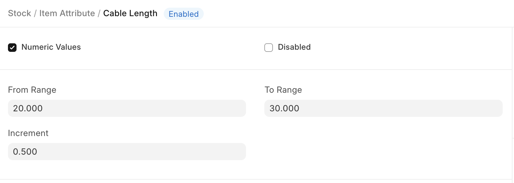

# Item Attribute

[ Edit ](https://docs.frappe.io/wiki/spaces/24hrpr6es9/page/0ru3hsbbqi)

Open in ChatGPT  Ask ChatGPT about this page Open in Claude  Ask Claude about this page

# Item Attribute

[ Edit ](https://docs.frappe.io/wiki/spaces/24hrpr6es9/page/0ru3hsbbqi)

Open in ChatGPT  Ask ChatGPT about this page Open in Claude  Ask Claude about this page

### **'Item Attributes' are the characteristics based on which Item Variants are created.**

The attributes can be defined based on item's physical appearance and capabilities. Defining item attributes properly will be helpful in creating item variants as a combination of multiple attributes.

To access the Item Attribute list, go to:

> Home > Stock > Settings > Item Attribute

## How to create an Item Attribute?

  1. Go to the Item Attribute list, click on 'Add Item Attribute'.
  2. Enter a name for the Attribute.
  3. Enter the attribute values in the table.
  4. Save.

The attribute values can be numeric or non-numeric.

##### Non-Numeric Attributes

For Non-numeric attributes, specify attribute values along with their abbreviations in the Attribute Values table.

##### Numeric Attribute

If your attribute is 'Numeric', then specify the range and increment so that the system can generate respective variants.

In the following example, the cable length is of range 1 to 5 and the increment is 1. Hence, the variants will be 1,2,3,4,5.

[ Previous Page Item Variants  ](../../../item-variants.md) [ Next Page Brand  ](../../../brand.md)

Last updated 1 week ago 

Was this helpful?
