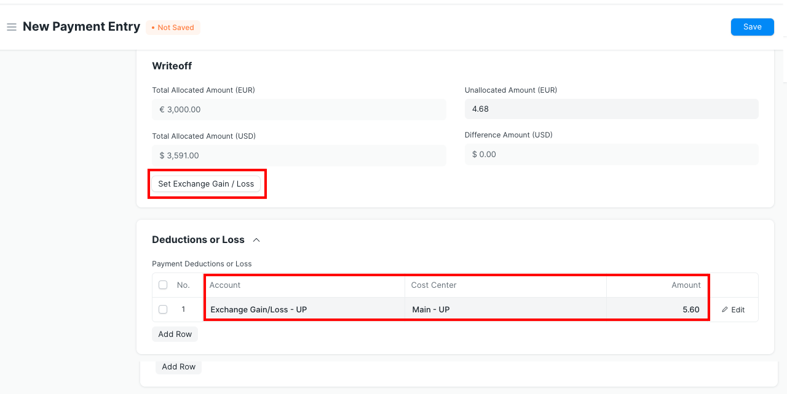
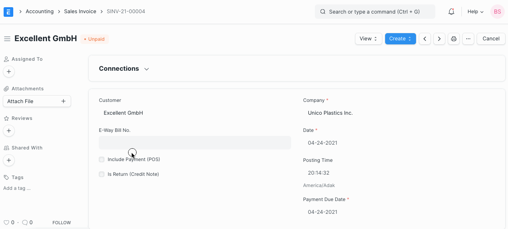

# Manage Foreign Exchange Difference

[ Edit ](https://docs.frappe.io/wiki/spaces/24hrpr6es9/page/0rmma2fdsl)

Open in ChatGPT  Ask ChatGPT about this page Open in Claude  Ask Claude about this page

# Manage Foreign Exchange Difference 

[ Edit ](https://docs.frappe.io/wiki/spaces/24hrpr6es9/page/0rmma2fdsl)

Open in ChatGPT  Ask ChatGPT about this page Open in Claude  Ask Claude about this page

In ERPNext, you can create transactions in the foriegn currency as well. When creating transaction in the foreign currency, system updates current exchanage rate with respect to customer/supplier's currency and base currency on your Company. Since Exchange Rate is always fluctuating, one might receive payment from the client on exchange rate different from one mentioned in the Sales/Purchase Invoice. Following is the instruction on how to manage different amount, availed in payment entry, due to exchange rate change.

## Add Expense Account

To manage currency difference, create Account **Exchange Gain/Loss**. This account is generally created on the Expense side of P&L statement. However, you can place it under another group as per your accounting requirement.

## Book Payment Entry

[ Previous Page Tax Inclusive Accounting ](https://docs.frappe.io/erpnext/tax-inclusive-accounting) [ Next Page Apply Tax on Another Tax or Charge ](https://docs.frappe.io/erpnext/how-to-apply-tax-on-tax)

Last updated 2 weeks ago 

Was this helpful?
