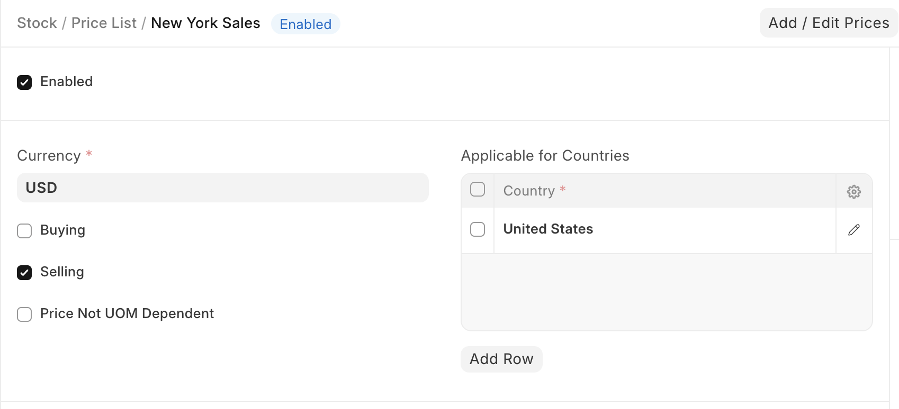

# Price Lists

[ Edit ](https://docs.frappe.io/wiki/spaces/24hrpr6es9/page/0ru3k2eo8k)

Open in ChatGPT  Ask ChatGPT about this page Open in Claude  Ask Claude about this page

# Price Lists

[ Edit ](https://docs.frappe.io/wiki/spaces/24hrpr6es9/page/0ru3k2eo8k)

Open in ChatGPT  Ask ChatGPT about this page Open in Claude  Ask Claude about this page

**A Price List is a collection of Item Prices either Selling, Buying, or both.**

ERPNext lets you maintain multiple Selling and Buying [Item Prices](../../../item-price.md) using Price Lists.

Price Lists can be used in scenarios where you have different prices for different zones (based on the shipping costs), for different currencies, etc. An Item can have multiple prices based on customer, currency, region, shipping cost, etc, which can be stored as different rate plans.

In ERPNext, all the Item Prices are stored separately. Buying Price for an item is different from Selling Price and thus they're stored separately.

To access a Price List go to:

> Home > Selling/Buying/Stock > Items and Pricing > Price List

  1. How to use a Price List

* * *

  * Price Lists will be used when creating item prices to track the selling or buying price of an item.
  * Specific countries can be assigned in the Price List.
  * To disable a specific Price List, untick the 'Enabled' checkbox. The Disabled Price List will not be available for selection in the Sales and Purchase transactions.
  * **Price Not UOM Dependent** : Consider an item, Tomatoes, which you buy in Boxes and sell in Kilos. 1 Box = 10 Kilos, and 1 Kilo buying price is 10rs. If this Box is unchecked and you select 1 Box in your transaction, the price will show up only for a Kilo since that's the only Item Price saved.

Now, if you tick this checkbox and make a transaction with a Box of Tomatoes, then the price will be automatically set as 100 since the price of 1 Box (10 Kilos) is 100.

  * Standard Buying and Selling Price Lists are created by default.

**Note** : If you have multiple Price Lists, you can select a Price List or tag it to a Customer (so that it is auto-selected). Your Item Prices will automatically be updated from the Price List.

### Related Topics

  1. [Item Price](../../../item-price.md)

[ Previous Page Pricing ](../../../pricing.md) [ Next Page Item Price ](../../../item-price.md)

Last updated 1 week ago 

Was this helpful?
