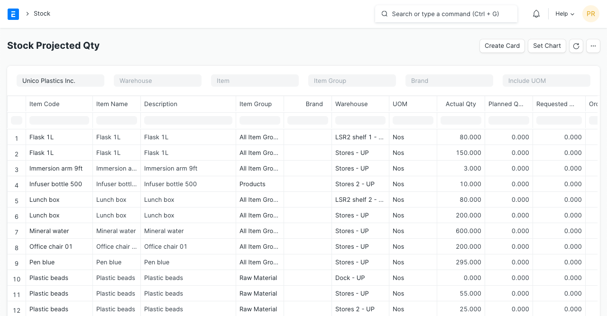

# Projected Quantity

[ Edit ](https://docs.frappe.io/wiki/spaces/24hrpr6es9/page/0sjgs0phst)

Open in ChatGPT  Ask ChatGPT about this page Open in Claude  Ask Claude about this page

# Projected Quantity 

[ Edit ](https://docs.frappe.io/wiki/spaces/24hrpr6es9/page/0sjgs0phst)

Open in ChatGPT  Ask ChatGPT about this page Open in Claude  Ask Claude about this page

**Projected Quantity is the level of stock that is predicted for a particular Item based on the current stock levels and other requirements.**

It is the quantity of gross inventory that includes supply and demand in the past which is done as part of the planning process.

The projected inventory is used by the planning system to monitor the reorder point and to determine the reorder quantity. The projected Quantity is used by the planning engine to monitor the safety stock levels. These levels are maintained to serve unexpected demands.

Having tight control of the projected inventory is crucial to determine shortages and to calculate the right order quantity.

The formula to calculate projected quantity is as follows:

_Projected Qty = Actual Qty + Planned Qty + Requested Qty + Ordered Qty - Reserved Qty - Reserved Qty for Production - Reserved Qty for Subcontracting - Reserved Qty for Production Plan_

  * **Actual Qty** : Quantity available in the Warehouse. This is the actual physical stock you have.
  * **Planned Qty** : Quantity, for which, Work Order has been raised, but is pending to be manufactured.
  * **Requested Qty** : Quantity requested via a [Material Request](../../../material-request.md). It is added on submission of Material Request and subtracted when Purchase Order/Work Order/Stock Entry is created against it based on the Material Request type.
  * **Ordered Qty** : Quantity ordered for purchase ([Purchase Order](../../../purchase-order.md)), but not received (via a [Purchase Receipt](../../../purchase-receipt.md) or a [Purchase Invoice](../../../purchase-invoice.md).
  * **Reserved Qty** : Quantity ordered for sale by your Customer ([Sales Order](../../../sales-order.md)), but not delivered (via a [Delivery Note](../../../delivery-note.md)). This quantity increases when a Sales Order is submitted and decreases when a Delivery Note or Sales Invoice is created against that Sales Order is submitted.
  * **Reserved Qty for Production** : Raw materials are reserved on submission of [Work Order](../../../work-order.md) and is reduced when raw materials are transfered to Work in Progress warehouse via a Stock Entry.
  * **Reserved Qty for Subcontracting** : Raw materials reserved when a subcontracting Purchase Order is submitted. When raw materials are transfered to Supplier Warehouse via a Stock Entry, this quantity reduces. To know more about subcontracting [click here](../../../subcontracting.md).
  * **Reserved Qty for Production Plan** : Raw materials are reserved when a Production Plan is submitted. When materials are reserved for the production against the work order then the system will reduce the "Reserved Qty for Production Plan" in the respective BIN. The system reduces the quantity if the work order was made against the production plan.

#### Related Topics

  1. [Warehouse](../../../warehouse.md)
  2. [Material Request](../../../material-request.md)

[ Previous Page Rules ](../../../rules.md) [ Next Page Stock Reposting Settings ](../../../stock-reposting-settings.md)

Last updated 1 week ago 

Was this helpful?
