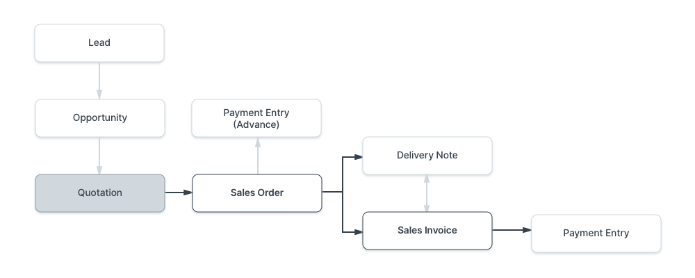
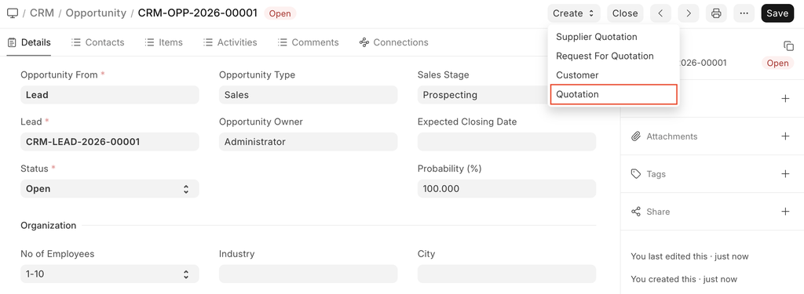
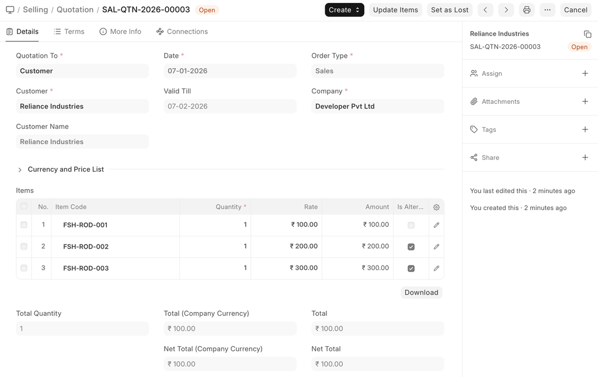
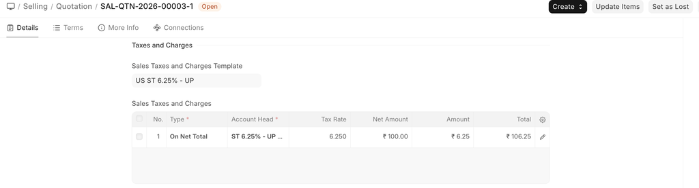
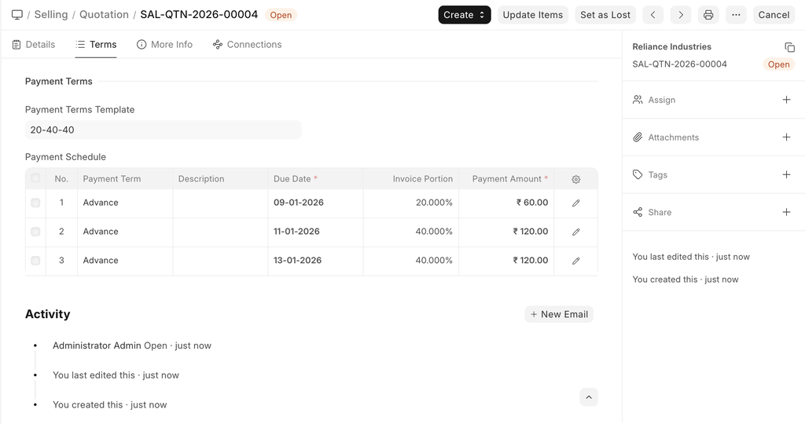
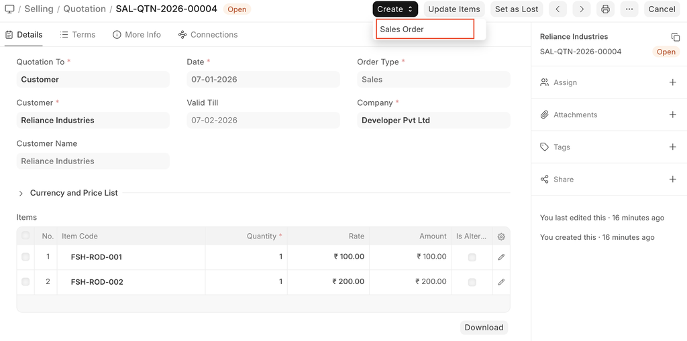
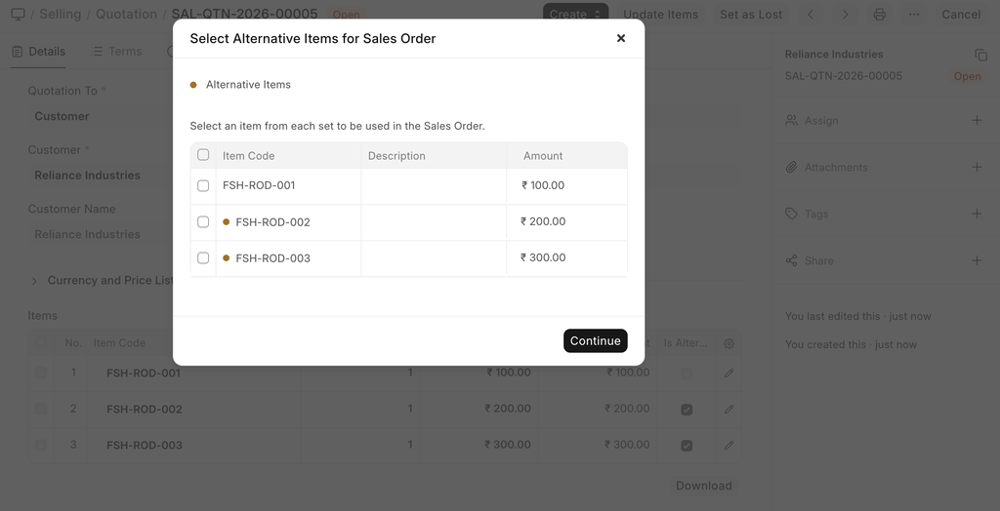

# Quotation

[ Edit ](https://docs.frappe.io/wiki/spaces/24hrpr6es9/page/0rhloboba3)

Open in ChatGPT  Ask ChatGPT about this page Open in Claude  Ask Claude about this page

# Quotation 

[ Edit ](https://docs.frappe.io/wiki/spaces/24hrpr6es9/page/0rhloboba3)

Open in ChatGPT  Ask ChatGPT about this page Open in Claude  Ask Claude about this page

**A quotation is an estimated cost of the products/services you're selling to your future/present customer.**

During a sale, a customer may request for a note about the products or services you are planning to offer along with the prices and other terms of engagement. This has many names like "Proposal", Estimate", "Pro Forma Invoice" or a **Quotation**.

To access the Quotation list, go to:

> Home > Selling > Sales > Quotation

A typical sales flow looks like:

A Quotation contains details about:

  * The recipient of the Quotation
  * The Items and quantities you are offering.
  * The rates at which they are offered.
  * The taxes applicable.
  * Other charges (like shipping, insurance) if applicable.
  * The validity of contract.
  * The time of delivery.
  * Other conditions.

> Tip: Images look great on Quotations. Make sure your items have an image attached.

## Prerequisites

Before creating and using a Quotation, it is advised that you create the following first:

  * Customer
  * Lead
  * Item

## How to create a Quotation

  1. Go to the Quotation list, click on New.
  2. Select if the Quotation is to a Customer or a Lead from the 'Quotation To' field.
  3. Enter Customer/Lead name.
  4. Enter a Valid till date after which the quoted amount will be considered invalid.
  5. Order Type can be Sales, Maintenance, or Shopping Cart. Shopping Cart is for website shopping cart and is not intended to be created from here.
  6. Add the Items and their quantities in the items table, the prices will be fetched automatically from Item Price. You can also fetch items from an Opportunity by clicking on Get Items from > Opportunity.
  7. Add additional taxes and charges as applicable.
  8. Save.

You can also create a Quotation from an Opportunity shown as follows.

## Features

### Address and Contact

In this section there are four fields:

  * **Customer Address:** This is the Billing address of the customer.
  * **Shipping Address:** Address where the items will be shipped to.
  * **Contact Person:** If your customer is an organization, then you can add the person to contact in this field.
  * **Territory:** Region where the customer belongs to. Default is All Territories.

### Currency and Price List

You can set the currency in which the quotation/sales order is to be sent. If you set a Pricing List, then the item prices will be fetched from that list. Ticking on Ignore Pricing Rule will ignore the Pricing Rules set in Accounts > Pricing Rule.

Read about Price Lists and Multi-Currency Transactions to know more.

### The Items Table

This table can be expanded by clicking on the inverted triangle present rightmost of the table.

  * On selecting Item Code, the following will be fetched automatically: item name, description, any image if set, quantity default as 1, the rates. You can add discounts in the Discounts and Margin section.
  * **Under Discount and Margin** you can add extra margin for profit or give a discount. Both can be set based on either amount or percentage. The final rate will be shown below in the Rate section. You can assign an Item Tax Template created specifically for an item.
  * **Item weights** will be fetched if set in the Item master.
  * In **Warehouse and Reference** , the warehouse will be fetched from the Item master, this is the warehouse where your stock is present.
  * Under **Planning** you can see the Projected quantity and the actual quantity present. To know more about these fields, click here. If you click on the 'Stock Balance' button, it'll take you to a doctype where you can generate a stock report for the item.
  * **Shopping cart** , additional notes is for website transactions. Notes about the item will be fetched here when added via a shopping cart. For example: make food extra spicy. _Introduced in v12_
  * **Page Break** Will create a page break just before this item when printing.
  * You can insert rows below/above, duplicate, move, or delete rows in this table.
  * Tip: You can also Download the items table in CSV format and Upload it to another transaction.

The total quantity, rate, and net weight of all items will be shown below the item table. The rate shown here is pre-tax.

#### Alternative Items

You can manually add Items and mark them as alternatives by checking the **Is Alternative** checkbox in the Items Table row. These items will not be counted towards the taxes and totals of the Quotation.

> It is important to maintain the right order i.e. alternative item rows must follow a non-alternative item row (the item that they are alternatives to). Grouping will be done on this basis.

FSH-ROD-001, FSH-ROD-002 and FSH-ROD-003 are treated as a group to select from. In this way you can provide alternatives to your Customer/Lead and they can select from among those.

Selection of items to proceed with occurs after the Quotation is submitted. Visit the Selecting Alternatives section of this page to know more.

### Taxes and Charges

To add taxes to your Quotation, you can select a Sales Taxes and Charges Template or add the taxes manually in the Sales Taxes and Charges table.

The total taxes and charges will be displayed below the table. Clicking on Tax Breakup will show all the components and amounts.

To add taxes automatically via a Tax Category, visit this page.

#### Shipping Rule

A Shipping Rule helps set the cost of shipping an Item. The cost will usually increase with the distance of shipping. To know more, visit the Shipping Rule page.

### Additional Discount

Other than offering discount per item, you can add a discount to the whole quotation in this section. This discount could be based on the Grand Total i.e., post tax/charges or Net total i.e., pre tax/charges. The additional discount can be applied as a percentage or an amount.

Read Applying Discount for more details.

### Payment Terms

Sometimes payment is not done all at once. Depending on the agreement, half of the payment may be made before shipment and the other half after receiving the goods/services. You can add a Payment Terms template or add the terms manually in this section.

Read Payment Terms to know more.

### Terms and Conditions

In Sales/Purchase transactions there might be certain Terms and Conditions based on which the Supplier provides goods or services to the Customer. You can apply the Terms and Conditions to transactions to transactions and they will appear when printing the document. To know about Terms and Conditions, click here

### Print Settings

#### Letterhead

You can print your quotation/sales order on your company's letterhead. Know more here.

'Group same items' will group the same items added multiple times in the items table. This can be seen when your print.

#### Print Headings

Quotations can also be titled as “Proforma Invoice” or “Proposal”. You can do this by selecting a **Print Heading**. To create new Print Headings go to: Home > Settings > Printing > Print Heading. Know more here.

### More Information

  * **Campaign:** A Sales campaign can be associated with the quotation. A set of quotations can be part of a sales campaign.
  * **Source:** A Lead Source type can be linked if quoting to a lead, whether from a campaign, from a supplier, an exhibition etc,. Select Existing Customer if quoting to a customer.
  * **Supplier Quotation:** A Supplier Quotation can be linked for comparing with your current quotation to a buyer. You can get an idea of profit/loss by comparing the two.

### Submitting the Quotation

Quotation is a “Submittable” transaction. When you click on Save, a draft is saved, on submitting, it is submitted permanently. Since you send this Quotation to your Customer or Lead, you must freeze it so that changes are not made after you send the Quotation.

On submitting, you can create a Sales Order from the Quotation using the Create button. In the Dashboard present on the top, you can go to the Sales Order linked with this Quotation. In case it didn't work out, you can set the Quotation as lost by clicking on the 'Set as Lost button'.

#### Selecting Alternatives

If the Quotation contains alternative items, you will be prompted to select from among alternatives while creating a Sales Order from the Quotation.

As you can see, FSH-ROD-002 and FSH-ROD-003 are alternatives to FSH-ROD-001 that are offered to the Customer.

One of these will be agreed upon and selected, following which the selected item will be mapped.

If simple items are involved (without alternatives), they will mapped as usual.

> Provision to select alternative items before mapping is only available while creating Sales Orders from **individual Quotations**. If 'Get Items From' is used in a Sales Order or Sales Invoice to fetch Quotation items, only non-alternative items will be fetched and no item selection will be prompted.

### Related Topics

  1. Applying Discount

[ Previous Page Selling Transactions ](../../../selling-transactions.md) [ Next Page Sales Order  ](../../../sales-order.md)

Last updated 2 weeks ago 

Was this helpful?
