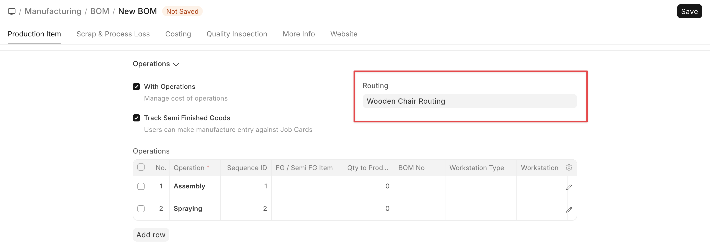
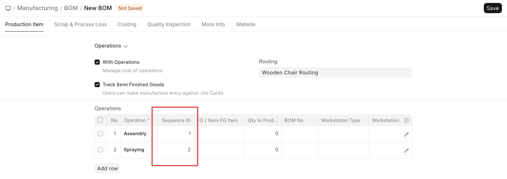

# Routing

[ Edit ](https://docs.frappe.io/wiki/spaces/24hrpr6es9/page/0s0j72jrlm)

Open in ChatGPT  Ask ChatGPT about this page Open in Claude  Ask Claude about this page

# Routing 

[ Edit ](https://docs.frappe.io/wiki/spaces/24hrpr6es9/page/0s0j72jrlm)

Open in ChatGPT  Ask ChatGPT about this page Open in Claude  Ask Claude about this page

**Routing is a template of BOM Operations.**

A Routing stores all Operations along with the description, hourly rate, operation time, batch size, etc. Creating a Routing for your BOM Operations is useful when similar Operations are used for manufacturing different items.

* * *

### Prerequisites

  * [Operation](../../../operation.md)
  * [Workstation](../../../workstation.md)

* * *

## How to Create a Routing

  1. Go to the Routing list, click on New.
  2. Enter a name for the Routing.
  3. Enter the Operations in the BOM Operation table:
  4. Select the Operation.
  5. The default Workstation will be fetched.
  6. Enter the Hourly Rate for running this Operation.
  7. Enter the Operation Time in minutes.
  8. Enter the Batch Size, i.e. the number of units processed in this Operation.
  9. The Operating Cost will be calculated based on the Hourly Rate and the Operation Time.
  10. Save.

Once created, a Routing can be selected in a BOM to fetch the Operations stored in the Routing.

* * *

## Sequence ID in Routing

Sequence ID enforces the users to complete the operations sequentially via Job Card. In case a user tries to complete an operation before completing any of its precedent operations as per the Sequence ID, the system throws a validation error.

* * *

### Related Topics

  1. [Work Order](../../../work-order.md)
  2. [Bill Of Materials](../../../bill-of-materials.md)

[ Previous Page Workstation ](../../../workstation.md) [ Next Page Production and Material Planning ](../../../production-and-material-planning.md)

Last updated 2 weeks ago 

Was this helpful?
