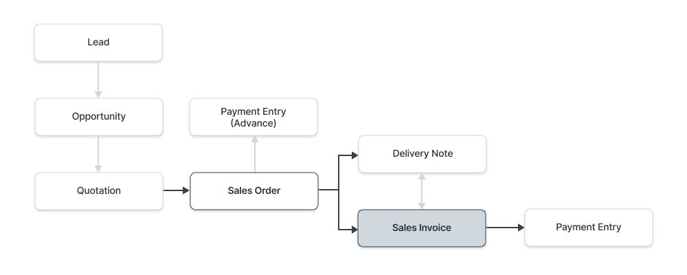
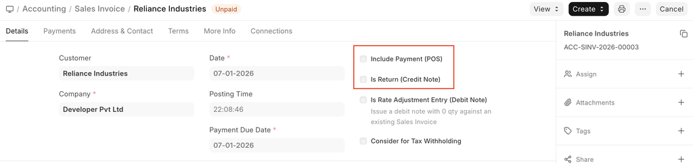
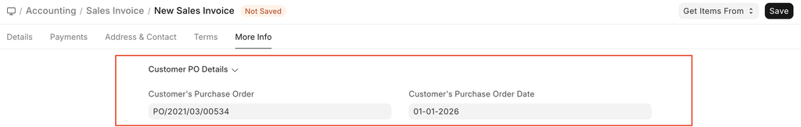
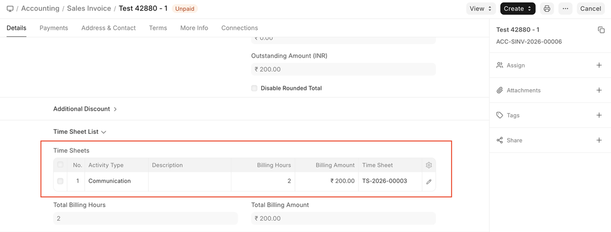
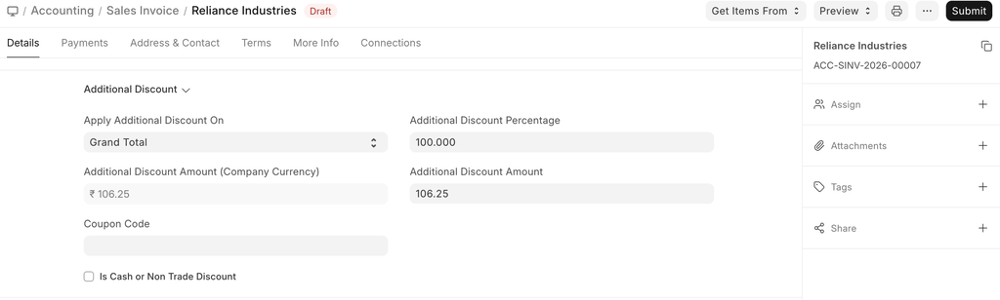
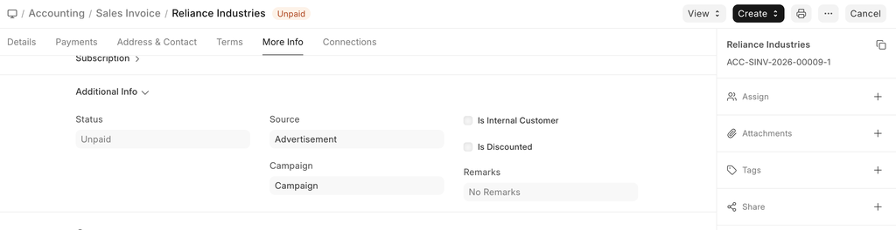
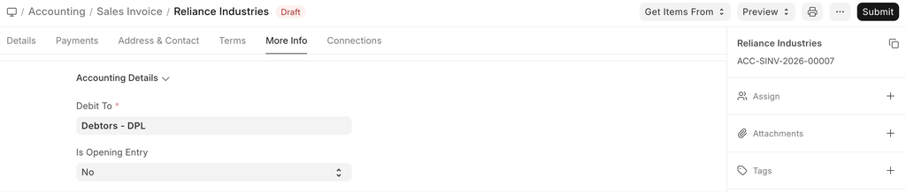
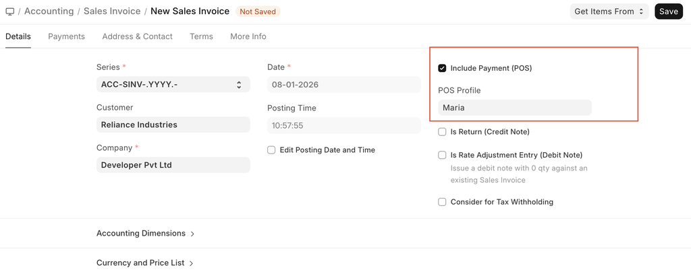
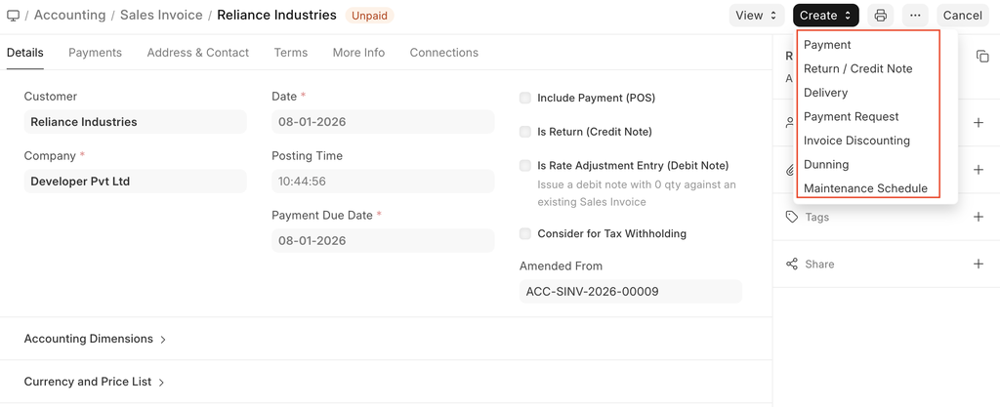
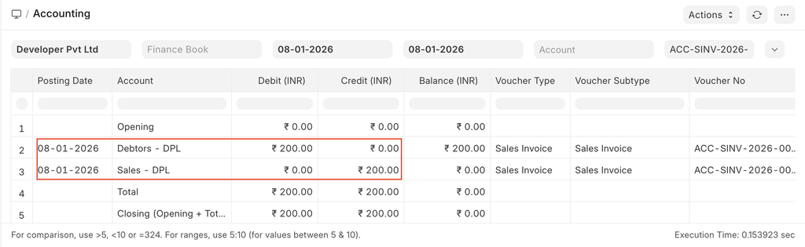

# Sales Invoice

[ Edit ](https://docs.frappe.io/wiki/spaces/24hrpr6es9/page/0rmboa4n04)

Open in ChatGPT  Ask ChatGPT about this page Open in Claude  Ask Claude about this page

# Sales Invoice

[ Edit ](https://docs.frappe.io/wiki/spaces/24hrpr6es9/page/0rmboa4n04)

Open in ChatGPT  Ask ChatGPT about this page Open in Claude  Ask Claude about this page

**A Sales Invoice is a bill that you send to your Customers against which the Customer makes the payment.**

Sales Invoice is an accounting transaction. On submission of Sales Invoice, the system updates the receivable and books income against a Customer Account.

To access the Sales Invoice list, go to: > Home > Accounting > Accounts Receivable > Sales Invoice

## Prerequisites

* * *

Before creating and using a Sales Invoice, it is advised to create the following first:

  * Item
  * Customer
  * Optional:
    * Sales Order
    * Delivery Note

### How to create a Sales Invoice

* * *

A Sales Invoice is usually created from a Sales Order or a Delivery Note. The Customer's Item details will be fetched into the Sales Invoice. However, you can also create a Sales Invoice directly, for example, a POS invoice.

To fetch the details automatically in a Sales Invoice, click on the **Get Items from**. The details can be fetched from a Sales Order, Delivery Note, or a Quotation.

For manual creation, follow these steps:

  1. Go to the Sales Invoice list and click on New.
  2. Select the Customer.
  3. Set the Payment Due Date.
  4. In the Items table, select the Items and set the quantities.
  5. The prices will be fetched automatically if Item Price is added, else add a price in the table.
  6. The posting date and time will be set to current, you can edit after you tick the checkbox below Posting Time to make a backdated entry.
  7. Save and Submit.

### Additional options when creating a Sales Invoice

  * **Include Payment (POS)** : If this invoice is for retail sales / Point of Sale. Know more here.
  * **Is Return Credit Note** : Tick this if the customer has returned the Items. To know more details, visit the Credit Note page.

For India: **e-Way Bill No** : According to GST rules, transporters need to carry an e-Way Bill. To know how to generate an e-Way Bill, visit this page.

### Statuses

These are the statuses that are auto-assigned to Sales Invoice.

  * **Draft** : A draft is saved but yet to be submitted.
  * **Submitted** : The invoice is submitted to the system and the general ledger has been updated.
  * **Paid** : Customer has made the payment and a Payment Entry has been submitted.
  * **Unpaid** : Invoice is generated but payment is pending but within the payment due date.
  * **Overdue** : Payment is pending beyond the payment due date.
  * **Canceled** : The Sales Invoice is canceled due to any reason. Once an invoice is canceled, it's impact on Account and Stock is undone.
  * **Credit Note Issued** : The Item is returned by the Customer and a Credit Note is created against this invoice.
  * **Return** : It is assigned to Credit Note created against the original Sales Invoice. Though you can also create a standalone Credit Note.
  * **Unpaid and Discounted** : Payment is pending and any ongoing subscription has been discounted using Invoice Discounting.
  * **Overdue and Discounted** : Payment is pending beyond the payment due date and any ongoing subscription has been discounted using Invoice Discounting.

### Features

* * *

### Dates

  * **Posting Date** : The date on which the Sales Invoice will affect your books of accounts i.e. your General Ledger. This will affect all your balances in that accounting period.
  * **Due Date** : The date on which the payment is due (if you have sold on credit). The credit limit can be set from the Customer master.

### Accounting Dimensions

Accounting Dimensions lets you tag transactions based on a specific Territory, Branch, Customer, etc. This helps in viewing accounting statements separately based on the selected dimension(s). To know more, check help on Accounting Dimensions feature.

> Note: Project and Cost Center are treated as dimensions by default.

### Customer PO Details

  * **Customer's Purchase Order** : Track customer's PO No. received, primarily to prevent the creation of duplicate Sales Order or Invoice for the same PO received from the Customer. You can do more configuration related to customer's PO No. validation in Selling Settings
  * **Customer's Purchase Order Date** : The date on which the Customer placed the Purchase Order. 

### Address and Contact

  * **Customer Address:** This is the Billing Address of the Customer.
  * **Contact Person** : If the Customer is a company, the person to be contacted is fetched in this field if set in the Customer form.
  * **Territory:** A Territory is the region where the Customer belongs to, fetched from the Customer form. The default value is All Territories.
  * **Shipping Address:** Address where the items will be shipped to.

For India, the following details can be recorded for GST purposes. You can capture these details in the Address and Customer master, which would be fetched in the Sales Invoice.

  * Billing Address GSTIN
  * Customer GSTIN
  * Place of Supply
  * Company GSTIN

### Currency

You can set the currency in which the Sales Invoice order is to be sent. This can be fetched from the Customer master or preceding transactions like Sales Order.

  * Wish to select Customer's currency just for the reference of the Customer, whereas accounts posting will be done in the Company's base currency only. Learn more here.
  * Maintain separate receivable account in the Customer's currency. The Receivable for this invoice should be posted in that currency itself. Read Multi Currency Accounting to learn more.

### Price list

If you select a Price List, then the item prices will be fetched from that list. Ticking on 'Ignore Pricing Rule' will ignore the Pricing Rules set in Accounts > Pricing Rule.

Read Price List documentation to know more.

### The Items table

> Note: From version-13 onwards we have introduced immutable ledger which changes the rules for cancellation of stock entries and posting backdated stock transactions in ERPNext. Learn more here.

  * **Update Stock** Ticking this checkbox will update the Stock Ledger on submitting the Sales Invoice. If you've created a Delivery Note, the Stock Ledger will be changed. If you're **skipping** the creation of Delivery Note, tick this checkbox.
  * **Scan Barcode** : You can add Items in the Items table by scanning their barcodes if you have a barcode scanner. Read documentation for tracking items using barcode to know more.
  * **Grant Commission** : Grant a commission to Sales Person and Sales Partner on the net amount of this line item. If disabled, this line item will be ignored in the calculation of commission.
  * The Item Code, name, description, Image, and Manufacturer will be fetched from the Item master.
  * **Discount and Margin** : You can apply a discount on individual Items percentage-wise or on the total amount of the Item. Read Applying Discount for more details.
  * **Rate** : The Rate is fetched if set in the Price List and the total Amount is calculated.
  * **Drop Ship** : Drop Shipping is when you make the sales transaction, but the Item is delivered by the Supplier. To know more, visit the Drop Shipping page.
  * **Accounting Details** : The Income and Expense accounts can be changed here you you wish to. If this Item is an Asset, it can be linked here. This is useful when you're selling an Asset.
  * **Deferred Revenue** : If the income for this Item will be billed over the coming months in parts, then tick on 'Enable Deferred Revenue'. To know more, visit the Deferred Revenue page.
  * **Item Weight** : The Item Weight details per unit and Weight UOM are fetched if set in the Item master.
  * **Stock Details** : The following details will be fetched from the Item master:
    * **Warehouse** : The Warehouse from where the stock will be sent.
    * **Available Qty at Warehouse** : The quantity available in the selected Warehouse.
  * **Batch No and Serial No** : If your Item is serialized or batched, you will have to enter Serial Number and Batch in the Items table. You are allowed to enter multiple Serial Numbers in one row (each on a separate line) and you must enter the same number of Serial Numbers as the quantity.
  * **Item Tax Template** : You can set an Item Tax Template to apply a specific Tax amount to this particular Item. To know more, visit this page.
  * References: If this Sales Invoice was created from a Sales Order/Delivery Note, it'll be referred here. Also, the Delivered Quantity will be shown.
  * **Page Break** will create a page break just before this Item when printing.

### Timesheet

If you want to bill Employees working on Projects on an hourly basis (contract based), they can fill out Timesheets which consists of their billing rate. When you make a new Sales Invoice, select the Project for which the billing is to be made, and the corresponding Timesheet entries for that Project will be fetched.

If your Company's Employees are working at a location and it needs to be billed, you can create an Invoice based on the Timesheet.

To know more, visit this page.

### Taxes and Charges

The Taxes and Charges will be fetched from the Sales Order or Delivery Note.

Visit the Sales Taxes and Charges Template page to know more about taxes.

The total taxes and charges will be displayed below the table.

To add taxes automatically via a Tax Category, visit this page.

Make sure to mark all your taxes in the Taxes and Charges table correctly for an accurate valuation.

#### Shipping Rule

A Shipping Rule helps set the cost of shipping an Item. The cost will usually increase with the distance of shipping. To know more, visit the Shipping Rule page.

### Loyalty Points Redemption

If the Customer is enrolled in a Loyalty Program, they can choose to redeem it. To know more, visit the Loyalty Program page.

### Additional Discount

Any additional discounts to the whole Invoice can be set in this section. This discount could be based on the Grand Total i.e., post tax/charges or Net total i.e., pre tax/charges. The additional discount can be applied as a percentage or an amount. Visit the Applying Discount page for more details.

### Advance Payment

For high-value Items, the seller can request an advance payment before processing the order. The **Get Advances Received** button opens a popup from where you can fetch the orders where the advance payment was made. To know more, visit the Advance Payment Entry page.

### Payment Terms

The payment for an invoice may be made in parts depending on your understanding with the Supplier. This is fetched if set in the Sales Order. To know more, visit the Payment Terms page.

### Write Off

Write off happens when the Customer pays an amount less than the invoice amount. This may be a small difference like 0.50. Over several orders, this might add up to a big number. For accounting accuracy, this difference amount is 'written off'. To know more, visit the Payment Terms page.

### Terms and Conditions

There may be certain terms and conditions on the Item you're selling, these can be applied here. Read Terms and Condition documentation to know how to add them.

### Printing Settings

#### Letterhead

You can print your Sales Invoice on your Company's letterhead. Know more here.

'Group same items' will group the same items added multiple times in the Items table. This can be seen when your print.

#### Print Headings

Sales Invoice headings can also be changed when printing the document. You can do this by selecting a **Print Heading**. To create new Print Headings go to: Home > Settings > Printing > Print Heading. Know more here.

There are additional checkboxes for printing the Sales Invoice without the amount, this might be useful when the Item is of high value. You can also group the same Items in one row when printing.

### GST Details (for India)

The following details can be set for GST:

  * GST Category
  * Invoice Copy
  * Reverse Charge
  * E-commerce GSTIN
  * Print Heading

### Additional Information

The following Sales details can be recorded:

  * **Campaign** : If this invoice is a part of on ongoing sales Campaign, it can be linked. To know more, visit the Campaign page.
  * **Source** : A Lead Source can be tagged here to know the source of sales. To know more, visit the Lead Source page.

### Accounting Details

  * **Debit To** : The account against which receivable will be booked for this Customer.
  * **Is Opening Entry** : If this is an opening entry to affect your accounts select 'Yes'. i.e. if you're migrating from another ERP to ERPNext mid year, you might want to use an Opening Entry to update account balances in ERPNext.
  * **Remarks** : Any additional remarks about the Sales Invoice can be added here.

### Commission

If the sale took place via one of your Sales Partners, you can add their commission details here. This is usually fetched from the Sales Order/Delivery Note.

### Sales Team

**Sales Persons:** ERPNext allows you to add multiple Sales Persons who may have worked on this deal. This is also fetched from the Sales Order/Delivery Note.

### Automatically Fetching Item Batch Numbers

If you are selling an Item from a Batch, ERPNext will automatically fetch a batch number for you if "Update Stock" is checked. The batch number will be fetched on a First Expiring First Out (FEFO) basis. This is a variant of First In First Out (FIFO) that gives the highest priority to the soonest to expire Items.

Note that if the first batch in the queue cannot satisfy the order on the invoice, the next batch in the queue that can satisfy the order will be selected. If no batch can satisfy the order, ERPNext will cancel its attempt to automatically fetch a suitable batch number.

### POS Invoices

Consider a scenario where the retail transaction is carried out. For e.g: A retail shop. If you check the **Is POS** checkbox, then all your **POS Profile** data is fetched into the Sales Invoice and you can easily make payments.

Also, if you check the **Update Stock** the stock will also update automatically, without the need for a Delivery Note.

### After Submitting

On submitting a Sales Invoice, the following documents can be created against it:

  1. Journal Entry
  2. Payment Entry
  3. Payment Request
  4. Invoice Discounting
  5. Delivery Note 

### More

* * *

### Accounting Impact

All Sales must be booked against an “Income Account”. This refers to an Account in the “Income” section of your Chart of Accounts. It is a good practice to classify your income by type (like product income, service income, etc). The Income Account must be set for each row of the Items table.

> Tip: To set default Income Accounts for Items, you can set it in the Item or Item Group.

The other account that is affected is the Account of the Customer. That is automatically set from “Debit To” in the heading section.

You can also mention the Cost Centers in which your Income must be booked. Remember that your Cost Centers tell you the profitability of the different lines of business or product. You can also set a default Cost Center in the Item master. See also: Accounting Dimensions.

### Accounting entries (GL Entry) for a typical double entry “Sale”:

When booking a sale (accrual):

  * **Debit:** Customer (grand total)
  * **Credit:** Income (net total, minus taxes for each Item)
  * **Credit:** Taxes (liabilities to be paid to the government) 

> To see entries in your Sales Invoice after you “Submit”, click on “View Ledger”.

### Related Topics

* * *

  1. Cost Center
  2. Journal Entry
  3. Payment Entry
  4. Purchase Invoice
  5. Purchase Receipt
  6. Item Wise Taxation
  7. Sales Order
  8. Quotation
  9. Delivery Note

[ Previous Page Tax Withholding Category ](../../../tax-withholding-category.md) [ Next Page Credit Note  ](../../../credit-note.md)

Last updated 2 weeks ago 

Was this helpful?
