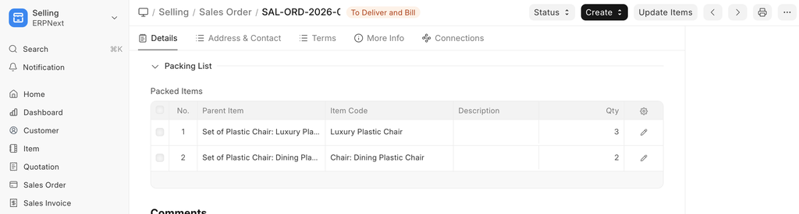
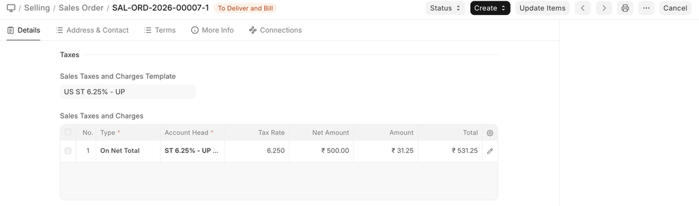
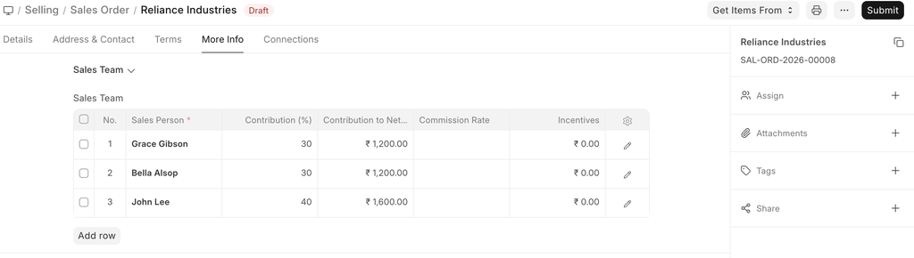
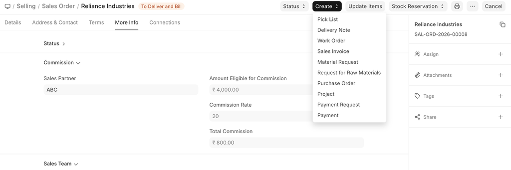

# Sales Order

[ Edit ](https://docs.frappe.io/wiki/spaces/24hrpr6es9/page/0rh1milsmm)

Open in ChatGPT  Ask ChatGPT about this page Open in Claude  Ask Claude about this page

# Sales Order 

[ Edit ](https://docs.frappe.io/wiki/spaces/24hrpr6es9/page/0rh1milsmm)

Open in ChatGPT  Ask ChatGPT about this page Open in Claude  Ask Claude about this page

**A Sales Order is a confirmation of an order from your customer.**

It is usually a binding Contract with your Customer. Once your customer confirms the Quotation you can convert your Quotation into a Sales Order.

To access Sales Order, go to:

> Home > Selling > Sales > Sales Order

## Prerequisites

Before creating and using a Sales Order, it is advised that you create the following first:

  * Customer
  * Item

## How to create a Sales Order

  1. Go to the Sales Order list, click on New.
  2. Select the Customer.
  3. Set the 'Delivery Date' - applied to the whole order.
  4. With Order Type, you can set whether it's a Sales order, Maintenance order, or from the online Shopping Cart of your website. By default, this value is set to "Sales".
  5. In the "Customer's Purchase Order" you can enter the Customers Purchase Order No. or other details which may be useful as a reference.
  6. Enter the items and quantities to be delivered in the Item table. If Item Prices are set for the items, the Rate field will be populated automatically. If not, enter the item Rate manually. You can also overwrite the auto-populated Item Rate in case you want to change that value.
  7. Click "Save" to save a draft of the Sales Order.
  8. "Submit" to submit the Sales Order to the System.

### Other ways to create a Sales Order

  1. You can also create a Sales Order from a submitted Quotation via the Create button on the top right. Make Sales Order from Quotation
  2. Or you can create a new Sales Order and pull details from a Quotation. Make Sales Order from Quotation

To allow for per-Customer, per-Item Pricing Rules, ("Customer A" pays $1.00 for "Item 1" but "Customer B" pays $1.25 for "Item 1"), there's a check box called 'Allow User to Edit Price List Rate in Transaction' in Selling Settings. This enables saving the specific item price per customer when you change a price in the Sales Order.

## Features

### Currency and Price List

You can set the currency in which the quotation/sales order is to be sent. If you set a Pricing List, then the item prices will be fetched from that list. Ticking on 'Ignore Pricing Rule' will ignore the Pricing Rules set in Accounts > Pricing Rule.

Read about Price Lists and Multi-Currency Transactions to know more.

### Set Source Warehouse

If you have the same stock in multiple warehouses, setting a warehouse here will cause all the items from the item table to be fetched from this warehouse. You need to have stock available in this 'source warehouse' you're setting. Note that this option will override the 'Default Warehouse' you've set in the Item master.

### The Items Table

  * **Delivery Date against each item** : If there are multiple items and if you enter a delivery date in the first row, the date will be copied to other rows as well where it is blank. You'll have to set these if not set globally at the top of the Sales Order.

A Sales Order displays the billed amount, valuation rate, and gross profit in the items table when you click on the inverted triangle to expand a row.

You can also add Items in the Items table by scanning their barcodes if you have a barcode scanner. Read documentation for tracking items using barcode to know more.

  * **Delivery Warehouse** : This is the warehouse from where the stock will be picked to be delivered to your customer.
  * **Drop Ship** : This is a situation where you do not keep items in stock in your own Warehouse but deliver items directly to a customer from a distributor. To enable drop shipping for an item tick on the 'Supplier delivers to Customer'. When you tick on this, the Delivery Warehouse option will disappear since you're not shipping the item. Select your supplier in the 'Supplier' field.

Further, if you create a purchase order from this sales order, it'll be created for the supplier you selected here and only the items which are valid for drop shipping.

  * **Planning** : Read Projected Quantity to know about the fields under planning.

The other fields in the item table are similar as explained in Quotation.

### Packing List

This is linked to the Product Bundle and appears only when the transaction involves a product bundle.

The “Packing List” table will be automatically updated when you “Save” the Sales Order. If any Items in your table are Product Bundle (packets), then the “Packing List” will contain the exploded (detailed) list of your Items.

You will be asked to select a Delivery Warehouse even for a product bundle item, this warehouse will be then updated in the Packing List items. You can change the warehouse, serial number, and batch in the packing list items in case items in your product bundle come from different warehouses.

Here is what a Packing List looks like:

### Taxes and Charges

To add taxes to your Sales Order, you can select a Sales Taxes and Charges Template or add the taxes manually in the Sales Taxes and Charges table.

The total taxes and charges will be displayed below the table. Clicking on Tax Breakup will show all the components and amounts.

#### Shipping Rule

A Shipping Rule helps set the cost of shipping an Item. The cost will usually increase with the distance of shipping. To know more, visit the Shipping Rule page.

If a Tax Category is selected, the template and tax table will be automatically populated. To know more, visit this page.

### Additional Discount

Other than offering discount per item, you can add a discount to the whole sales order in this section. This discount could be based on the Grand Total i.e., post tax/charges or Net total i.e., pre tax/charges. The additional discount can be applied as a percentage or an amount.

Read Applying Discount for more details.

### Payment Terms

Sometimes payment is not done all at once. Depending on the agreement, half of the payment may be made before shipment and the other half after receiving the goods/services. You can add a Payment Terms template or add the terms manually in this section.

Read Payment Terms to know more.

### Terms and Conditions

In Sales/Purchase transactions there might be certain Terms and Conditions based on which the Supplier provides goods or services to the Customer. You can apply the Terms and Conditions to transactions to transactions and they will appear when printing the document. To know about Terms and Conditions, click here

### Print Settings

#### Letterhead

You can print your quotation/sales order on your company's letterhead. Know more here.

'Group same items' will group the same items added multiple times in the items table. This can be seen when your print.

#### Print Headings

Quotations can also be titled as “Proforma Invoice” or “Proposal”. You can do this by selecting a **Print Heading**. To create new Print Headings go to: Home > Settings > Printing > Print Heading. Know more here.

### More Information

  * **Campaign:** A Sales campaign can be associated with the quotation. A set of quotations can be part of a sales campaign.
  * **Source:** A Lead Source type can be linked if quoting to a lead, whether from a campaign, from a supplier, an exhibition etc,. Select Existing Customer if quoting to a customer.
  * **Inter Company Order Reference** : If two of your companies are part of the same organization or have a parent-child relationship, you can link a Purchase Order to this Sales Order. Know more about inter-company invoicing here.
  * **Project** : If your Sales Order is part of a project, you can link it here and the Project progress will be updated.

### Billing and Delivery Status

  * **Status** : The status of the Sales Order whether a Draft, On Hold, To Deliver and Bill, To Bill, To Deliver, Completed, Cancelled, or Closed.
  * **Amount Billed and Delivered percent** : The percentage of amount billed and the items delivered from the Sales Order.

### Commission

If the sale took place via one of your Sales Partners, you can add their commission details here. Enter the commission rate and the commission amount will be displayed below.

### Sales Team

**Sales Persons:** ERPNext allows you to add multiple Sales Persons who may have worked on this deal. You can change the contribution percentage of the Sales Persons and track how much incentives they earned on this deal.

### Auto Repeat Section

Auto repeating Sales Orders is like a subscription. Set a start and end date for the auto-repeat. Select the Auto Repeat created. To know more about auto repeat click here.

### After Submitting

Sales Order is a “Submittable” transaction. You will be able to execute further steps (like making a Delivery Note) only after “Submitting” a Sales Order.

Once you “Submit” your Sales Order, you can trigger actions from the Sales Order:

  * You can Add, Update, Delete items in the Sales Order by clicking on the **Update Items** button. However you cannot delete items which has already been delivered or has work order assigned to it.
  * Status: Once submitted, you can hold a Sales Order or Close it.
  * Create: From a submitted Sales Order, you can create the following:
  * Delivery Note - To make a shipment entry. You can also make Delivery Note for selected items based on the delivery date.
  * Work Order - To start a Work Order with the raw materials.
  * Sales Invoice - To bill the Order.
  * Material Request - To request re-stocking materials if out of stock.
  * Request for Raw Materials - To request raw materials required for manufacturing.
  * Project - To create a project based on the Sales Order.
  * Subscription - To auto repeat the Sales Order, i.e., make it a subscription.
  * Payment Request - To make a Payment Request.
  * Payment - To record payment against the Sales Order.

These actions can also be seen at the top of the Dashboard. You can also make an accounting Journal Entry based on the Sales Order from the dashboard.

### Sales Order with Order type 'Maintenance'

When the 'Order Type' of the Sales Order is 'Maintenance' follow these steps:

  1. Enter Currency, Price list, and Item details.
  2. Mention taxes and other information.
  3. Save and Submit the form.
  4. Once the form is submitted, the Create button will provide these choices specific to the maintenance Order Type. ) Maintenance Visit i) Maintenance Schedule. Sales Order Maintenance Type

> **Note 1:** By clicking on the Action button and selecting 'Maintenance Visit' you can directly fill the visit form. The Sales Order details will be fetched directly.

> **Note 2:** By clicking on the Action button and selecting 'Maintenance Schedule' you can fill the schedule details. The Sales Order details will be fetched directly.

> **Note 3:** By clicking on the Invoice button you can make an Invoice for your services. The sales orders details will be fetched directly.

### Related Topics

  1. Quotation
  2. Close Sales Order
  3. Amending Sales Order After Submit
  4. Pick List

[ Previous Page Quotation  ](../../../quotation.md) [ Next Page Blanket Order ](../../../blanket-order.md)

Last updated 2 weeks ago 

Was this helpful?
