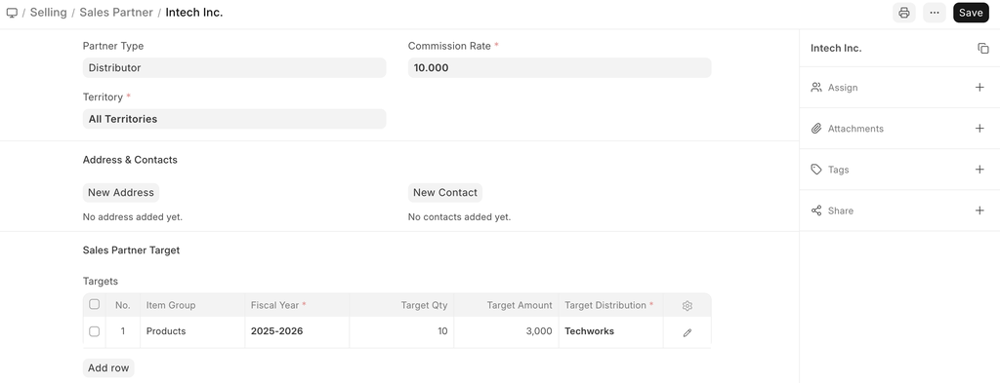
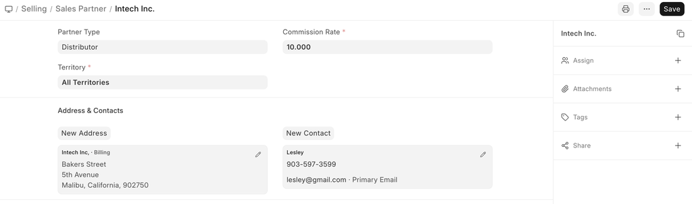
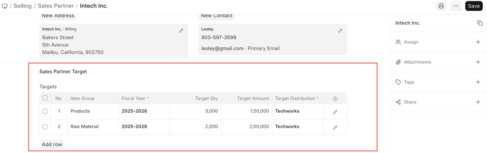
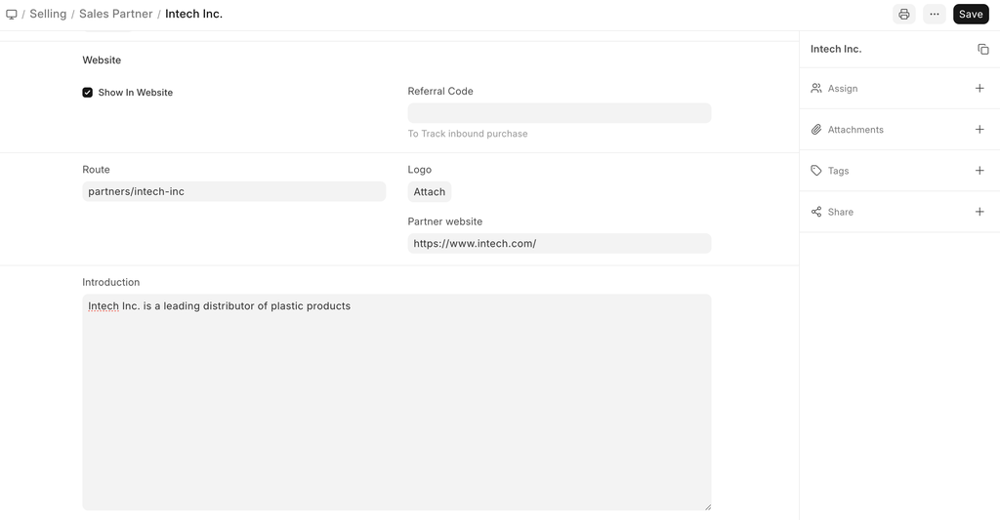
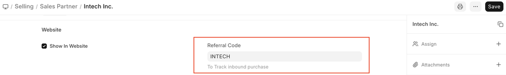
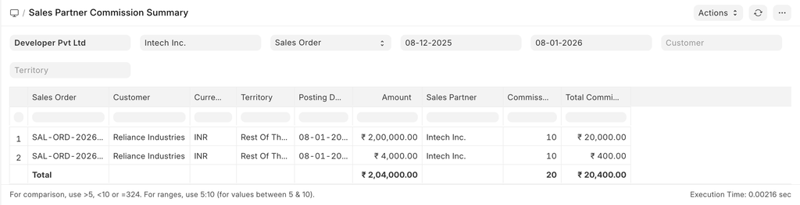
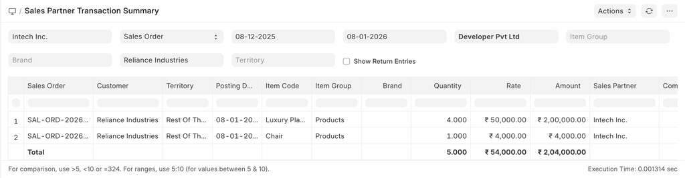
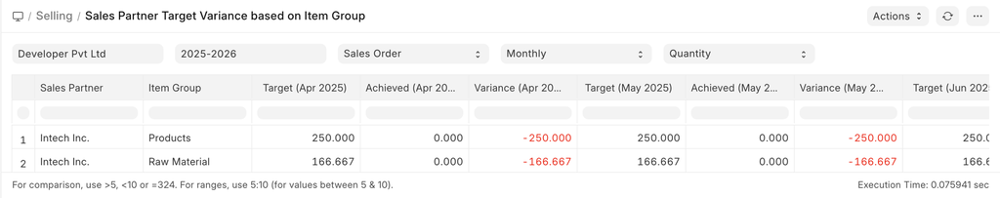

# Sales Partner

[ Edit ](https://docs.frappe.io/wiki/spaces/24hrpr6es9/page/0ri3k1haph)

Open in ChatGPT  Ask ChatGPT about this page Open in Claude  Ask Claude about this page

# Sales Partner 

[ Edit ](https://docs.frappe.io/wiki/spaces/24hrpr6es9/page/0ri3k1haph)

Open in ChatGPT  Ask ChatGPT about this page Open in Claude  Ask Claude about this page

**Sales Partners are people or companies that assist you in getting business.**

Sales Partners can be represented by different names in ERPNext. You can call them Channel Partner, Distributor, Dealer, Agent, Retailer, Implementation Partner, Reseller, etc.

For each Sales Partner, you can define a commission rate. When a Sales Partner is selected in transactions, their commission is calculated over Net Total of Sales Order/Invoice or Delivery Note.

To access Sales Partner, go to:

> Home > Selling > Sales Partner

## How to Create a Sales Partner

  1. Go to the Sales Partner list, click on New.
  2. Enter the Sales Partner name and the Commission Rate.
  3. You can also select the type of Sales Partner you're creating to identify if they're a Reseller or Retailer, and so on.
  4. Save.

## Features

### Address and Contact

You can add and track a Sales Partner's Addresses and Contact details. These can be added in the Address & Contacts section in a Sales Partner:

### Sales Partner Target

You can allocate Targets for each Item Group and Territory, based on Qty and Amount. You can allocate targets Territory- or Month-wise, to know more see _Related Topics_.

### Including Sales Partners in Your Website

To include the name of your Partner on your website, tick the "Show in Website" checkbox. When you click on "Show in Website", you will see a field where you can attach the logo of your partner's company and enter a brief introduction of the partner, and optionally add a description for internal purposes/references.

To see the listing of partners, go to:

https://yourCompanyName.erpnext.com/partners

### Track Sales via Sales Partner

Sales Partner can actively generates leads for your company products/ services. To track the performance of each sales partner use Referral Code and their URL as below

URL as shown below should be sent to the sales partner to use in their website/campaign.

e.g. A URL having "sp" as parameter like this http://xyz.erpnext.com?sp=speed will capture the Sales Partner Information in the Sales Order generated via Shopping Cart.

## Sales Partner Reports

### Sales Partner Commission Summary

To get Sales Order wise Sales Partner commission data.

### Sales Partner Transaction Summary

To get Sales Order item-wise Sales Partner commission data.

### Sales Partner Target Variance

This report will provide you variance between target and actual performance of the Sales Partner based on the Sales Order / Sales Invoice / Delivery Note data. User can view this report period wise like Monthly, Quarterly, Half-Yearly, or Yearly.

## Related Topics

  1. Sales Person Target Allocation
  2. How to record Commission to Sales Partner in ERPNext?

[ Previous Page Credit Limit  ](../../../credit-limit.md) [ Next Page Sales Return  ](../../../sales-return.md)

Last updated 2 weeks ago 

Was this helpful?
