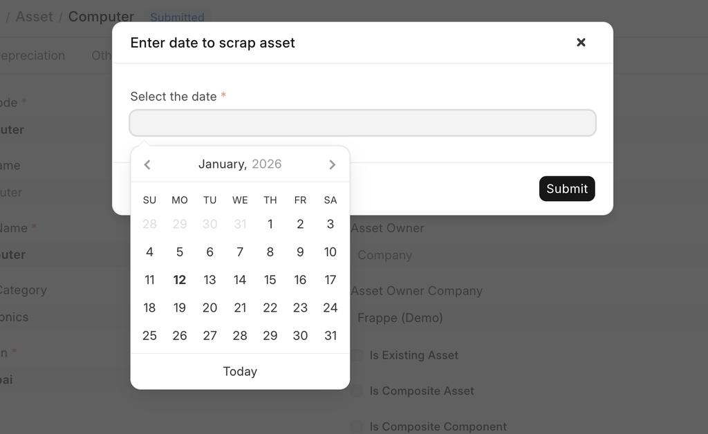
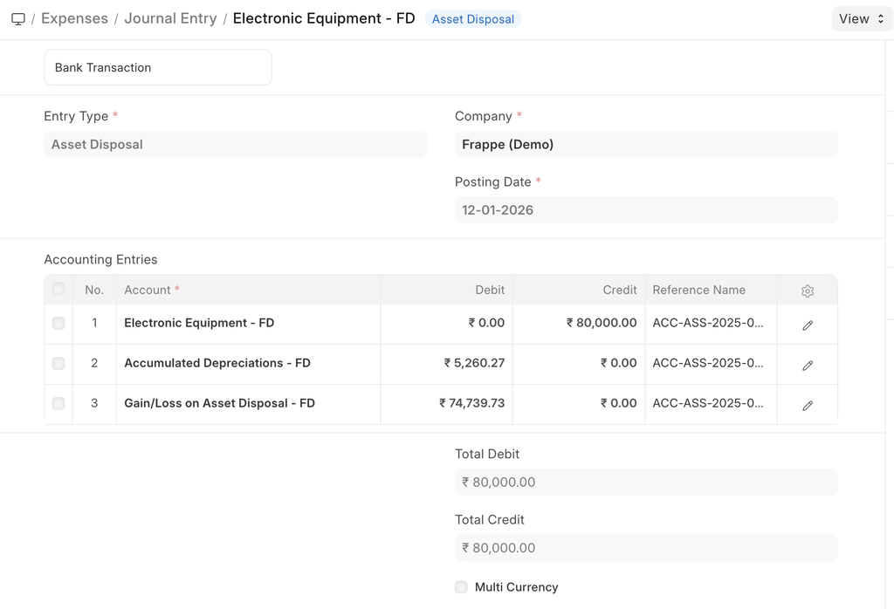

# Scrapping an Asset

[ Edit ](https://docs.frappe.io/wiki/spaces/24hrpr6es9/page/0s4s5ge3c1)

Open in ChatGPT  Ask ChatGPT about this page Open in Claude  Ask Claude about this page

# Scrapping an Asset

[ Edit ](https://docs.frappe.io/wiki/spaces/24hrpr6es9/page/0s4s5ge3c1)

Open in ChatGPT  Ask ChatGPT about this page Open in Claude  Ask Claude about this page

**When an asset is no longer usable, it is scrapped.**

You can scrap an asset anytime using the "Scrap Asset" button in the Asset record. The system will ask for a scrapping date.Then the asset will be scrapped on that date with back dated effect.

The scrapping date cannot be before the purchase date or it cannot be after the current date. Also, If the depreciation entries are passed, asset can only be scrap after the last depreciation date and not before it. In such cases depreciation entry needs to be manually cancelled first and then scrapping can be possible.

The "Gain/Loss Account on Asset Disposal" account mentioned in the Company is debited by the Current Value (After Depreciation) of the asset.

A Journal Entry will be created if you scrap an asset:

After scrapping, you can also restore the asset using "Restore Asset" button from the asset master.

[ Previous Page Selling an Asset ](https://docs.frappe.io/erpnext/selling-an-asset) [ Next Page Asset Reports ](https://docs.frappe.io/erpnext/asset-reports)

Last updated 1 week ago 

Was this helpful?
