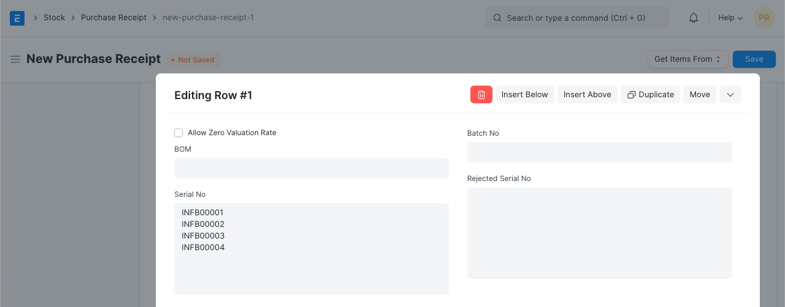
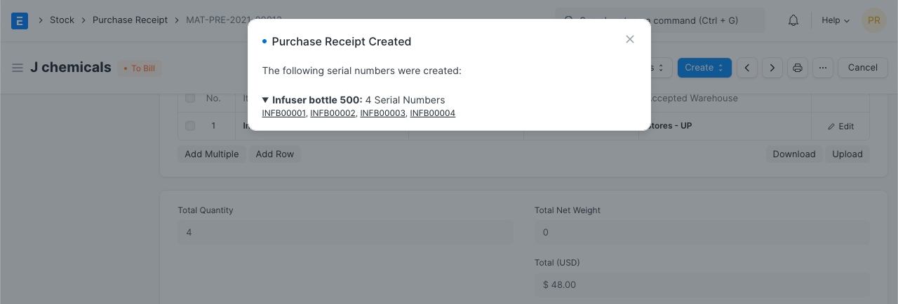
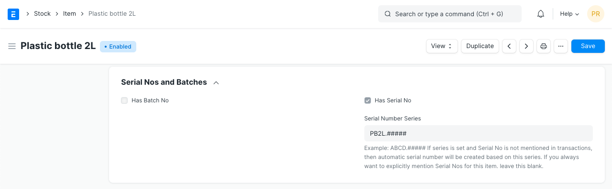
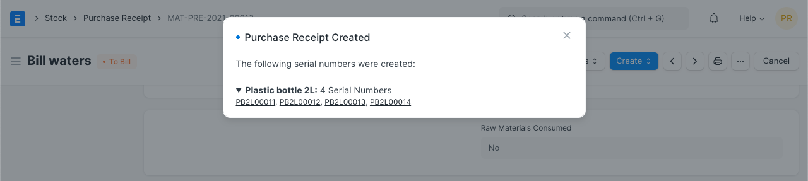

# Serial Number Naming

[ Edit ](https://docs.frappe.io/wiki/spaces/24hrpr6es9/page/0rrs156bfn)

Open in ChatGPT  Ask ChatGPT about this page Open in Claude  Ask Claude about this page

# Serial Number Naming

[ Edit ](https://docs.frappe.io/wiki/spaces/24hrpr6es9/page/0rrs156bfn)

Open in ChatGPT  Ask ChatGPT about this page Open in Claude  Ask Claude about this page

Serial Nos. is unique value assigned on each unit of an item. Serial no. helps in tracking item's warranty and expiry details. Generally high value items like machines, computers, costly equipments are serialized.

To make item Serialized, in the Item master, check **Has Serial No**.

There are two ways Serial no. can be generated in ERPNext.

###1. Serializing Purchase Items

If purchased items are received with Serial Nos. applied by OEM (original equipment manufacturer), you can follow same Serial No in ERPNext as well. While creating Purchase Receipt, you shall scan or manually enter Serial nos. for an item. On submitting Purchase Receipt, Serial Nos. will be created in the backend as per Serial Nos. provided for an item. If using OEM' Serial No., then in the Item master, Prefix should not be mentioned for serializalization. As per this scenaio, Prefix field should be left blank.

If received items already has its Serial No. barcoded, you can simply scan that barcode for entering Serial No. in the Purchase Receipt. Click [here](https://frappe.io/blog/management/using-barcodes-to-ease-data-entry) to learn more about it.

On submission of Purchase Receipt or Stock entry for the serialized item, Serial Nos. will be auto-generated.

Generated Serial numbers will be updated for each item.

###2. Serializing Manufacturing Item

To Serialize Manufacturing Item, you can define Series for Serial No. Generation in the Item master itself. Following that series, system will create Serial Nos. for Item when its Production entry is made.

####2.1 Serial No. Series

When Item is set as serialized, it will allow you to mentioned Series for it.

####2.2 Production Entry for Serialized Item

On submission of production entry for manufacturing item, system will automatically generate Serial Nos. following Series as specified in the Item master.

[ Previous Page Managing Fractions in UOM  ](../../../managing-fractions-in-uom.md) [ Next Page Delivery Note Negative Stock Error  ](../../../delivery-note-stock-error.md)

Last updated 2 weeks ago 

Was this helpful?
