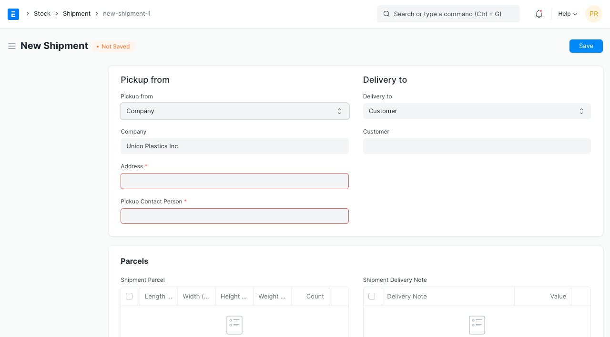
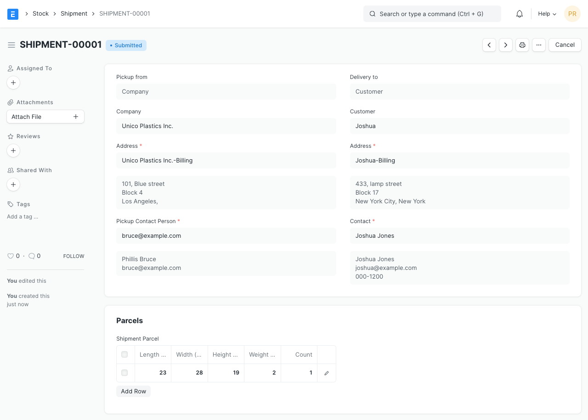
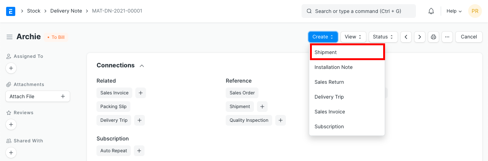
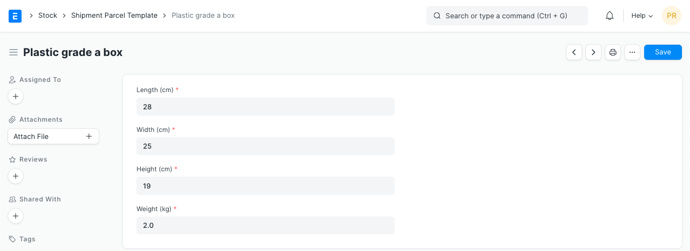

# Shipment

[ Edit ](https://docs.frappe.io/wiki/spaces/24hrpr6es9/page/0rtnvs64jt)

Open in ChatGPT  Ask ChatGPT about this page Open in Claude  Ask Claude about this page

# Shipment 

[ Edit ](https://docs.frappe.io/wiki/spaces/24hrpr6es9/page/0rtnvs64jt)

Open in ChatGPT  Ask ChatGPT about this page Open in Claude  Ask Claude about this page

**A Shipment is a document that keeps track of real-world Shipments created against a Delivery Note or independently.**

> Introduced in version 13

Shipments are particularly useful for shippers who want to track all their Shipment information such as AWB Number, Shipment Status, Carrier, etc. within ERPNext.

To access the Shipment list, go to:

> Home > Stock > Stock Transactions > Shipment

## 1\. Prerequisites

Before creating and using a Shipment, it is advised that you create the following first:

  * Company and Customer [Address](../../../address.md) with Postal Code, Email Address and Phone Number set.
  * Customer [Contact](../../../contact.md).

## 2\. How to create a Shipment

A Shipment can be created manually or from a Delivery Note:

### 2.1. Manual Shipment

To create a Shipment manually, follow these steps:

  1. Go to the Shipment list, click on New.

  1. Select an option in the **Pickup from** field. On selecting one of the three options, you will be prompted to select a Company/Supplier/Customer based on your selection.
  2. If you select 'Company' in the **Pickup from** field, along with the Address you must also select a **Pickup Contact Person** who will be a user from your organization, in ERPNext. Make sure the Last Name, Email Address and Phone Number are set for this user.
  3. You can similarly fill the **Delivery To** section.
  4. Add Shipment Parcel Information in the **Shipment Parcel** table.
  5. Fill in the Value of Goods.
  6. Select a Pickup Date.
  7. Add a Description of Contents in this Shipment.
  8. You can optionally fill the Shipment Information section if you are tracking Shipments manually.
  9. Save and Submit.

### 2.1. Shipment from Delivery Note

To create a Shipment from a Delivery Note:

  1. Click on **Create** > **Shipment** in the Delivery Note.

  1. Fill the form as mentioned in the previous section.

## 3\. Features

### 3.1. Shipment Parcel

You can specify the length, width, height and, weight of a parcel in the Shipment. If there are multiple parcels with identical dimensions, the **count** field can be set accordingly.

To automatically fetch frequently used parcel dimensions, a Parcel Template can be created and set in the **Parcel Template** field. After adding the template, click on the **Add template** button.

### 3.2. Shipment Information / Details

The Shipment Information section is an **optional** section where a user can manually track Shipment information. Here are some of the fields:

  1. **Service Provider** (optional): A Service Provider can be a third-party service that provides shipping services from various carriers.
  2. **Shipment ID** : The unique Shipment ID on your Shipping platform.
  3. **Shipment Amount** : Total cost incurred on Shipment
  4. **Carrier** : The Carrier that handles your Shipment and delivers it.
  5. **Carrier Service** (optional): The type/category of service provided by the carrier. E.g. some carriers have categories such as Economy, Express, etc.
  6. **AWB Number** : An air waybill (AWB) accompanies **international** air cargo. It usually has a unique **AWB Number** , that makes it easy to identify and track an air courier.
  7. **Incoterm** : They are a set of internationally recognized rules which define the responsibilities of sellers and buyers. [Know more about it here.](https://iccwbo.org/resources-for-business/incoterms-rules/incoterms-2020/)

### 3.3 Automation

You can also automate rate comparison, label generation, tracking, etc. using our [Shipping Integration](../../../erpnext_shipping.md).

### 4\. Related Topics

  1. [Delivery Note](../../../delivery-note.md)
  2. [Packing Slip](../../../packing-slip.md)

[ Previous Page Item Alternative  ](../../../item-alternative.md) [ Next Page Installation Note  ](../../../installation-note.md)

Last updated 2 weeks ago 

Was this helpful?
