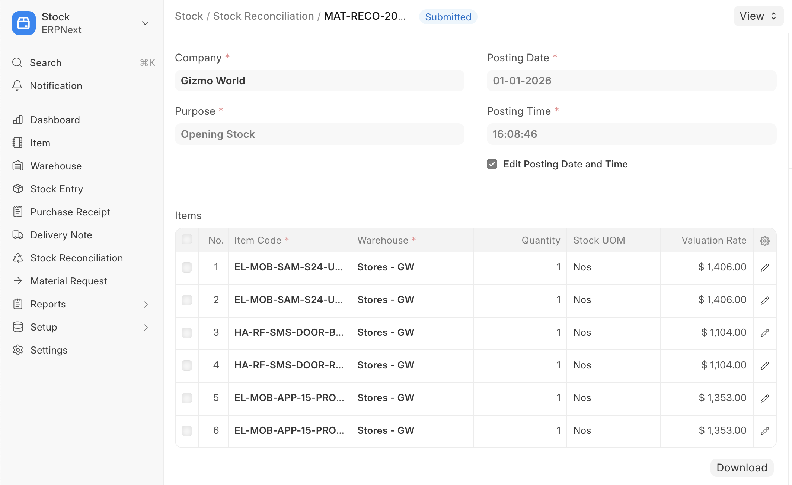
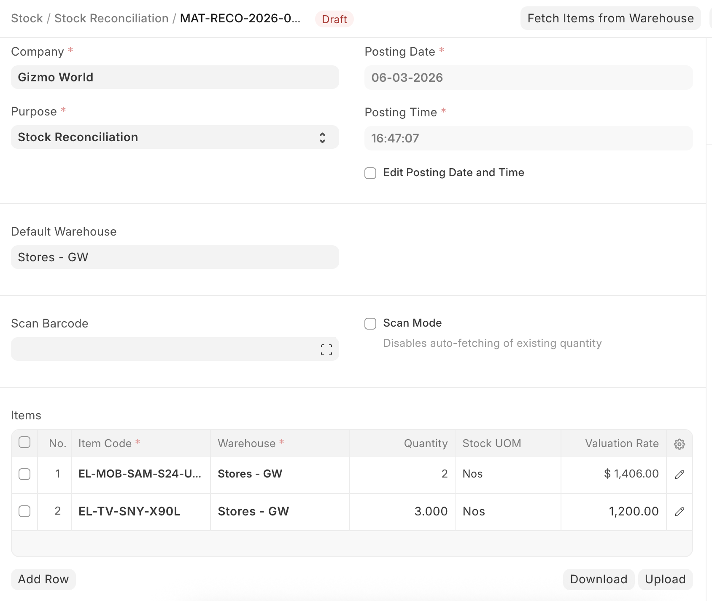
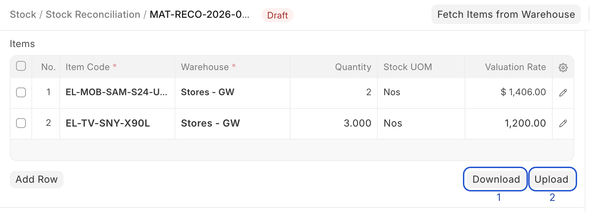
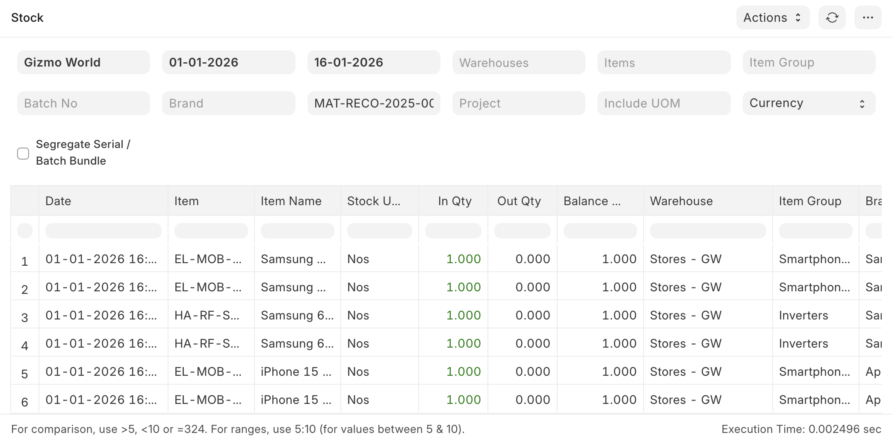
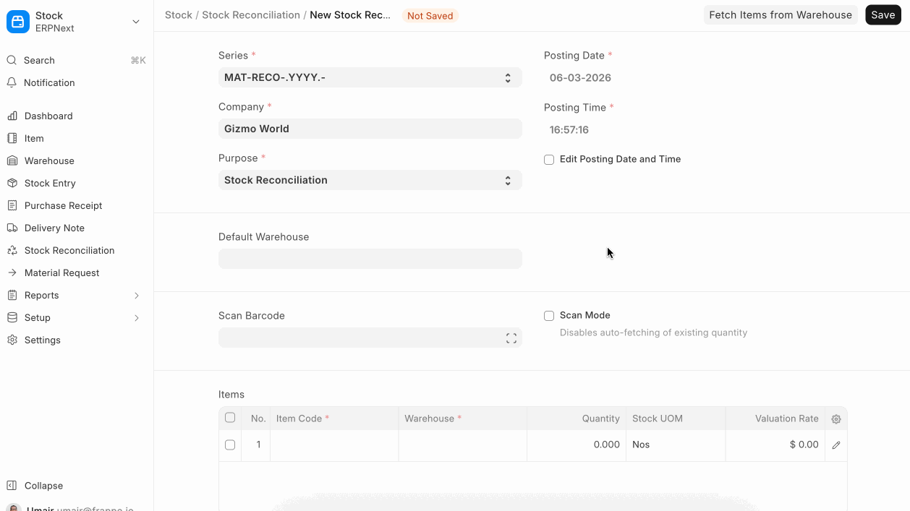

# Stock Reconciliation

[ Edit ](https://docs.frappe.io/wiki/spaces/24hrpr6es9/page/0rt310u2ut)

Open in ChatGPT  Ask ChatGPT about this page Open in Claude  Ask Claude about this page

# Stock Reconciliation

[ Edit ](https://docs.frappe.io/wiki/spaces/24hrpr6es9/page/0rt310u2ut)

Open in ChatGPT  Ask ChatGPT about this page Open in Claude  Ask Claude about this page

**Stock Reconciliation is the process of counting and evaluating material/products, periodically at the year-end.**

This is done in order to:

  * Keep the actual physical stock count and book stock count in sync
  * Value the stock for the preparation of the accounting statements

The Stock Reconciliation feature in ERPNext is used for:

  * Posting opening stock
  * Reconciling the book and the actual stock

To access the Stock Reconciliation list, go to: > Home > Stock > Tools > Stock Reconciliation

### 1\. Opening Stock

* * *

Using stock reconciliation, you can update the number of specific items in a warehouse as of a specific time. You can also add Items in the stock that have Serial Numbers or batch numbers.

  1. Go to the Stock Reconciliation list, click on New.
  2. Select the Purpose as 'Opening Stock'. You can edit the posting Date and Time.
  3. Select Item Code, Warehouse, Quantity, and Valuation Rate. If there is a Serial / Batch No involved, add it.
  4. If you want to auto-generate Serial No / Batch No. then keep those fields blank. For auto-generation of Serial No, you need to set "Serial Number Series" in the Item master. To auto-generate the batch number, enable the "Automatically Create New Batch" checkbox in the item master.
  5. The Difference Account will be set as 'Temporary Opening'.
  6. Save and Submit.

> Note: Maintain Stock option should be enabled in Item master for this to work.

## 2\. Stock Reconciliation

* * *

Stock Reconciliation is the process of counting and evaluating stock-in-trade, periodically and at year-end, in order to value the total stock for preparing accounting statements. In this process, the actual physical stocks are checked and recorded in the system. The actual stocks and the stock in the system should be in agreement and accurate. If they are not, you can use the Stock Reconciliation tool to reconcile the stock balance and value with actuals.

To reconcile the stock:

  1. Go to the Stock Reconciliation list, click on New
  2. Select the Purpose as 'Stock Reconciliation'. You can edit the posting Date and Time.
  3. Set Item Code, Warehouse.
  4. The current Quantity and Valuation Rate will be fetched, and the quantity will be changed as required.
  5. The expense account in the Difference Account will be set to 'Stock Adjustment' by default.
  6. The Cost Centre default will be 'Main', change if needed.
  7. Save and Submit.

## 3\. Reconciliation Features

### 3.1 Upload Data Through Spreadsheet

If you have a lot of items, you can upload the details via a spreadsheet.

  1. Download Template

Open a new Stock Reconciliation and click on the Download button to download the template in CSV format.

  2. Enter Data in CSV Template.

The CSV format is case-sensitive. Do not edit the headers that are preset in the template. In the Item Code and Warehouse column, enter the exact Item Code and Warehouse as created in your ERPNext account. For quantity, enter the stock level you wish to set for that item in a specific warehouse.

  3. Upload the CSV file with the data by clicking on the 'Upload' button.
  4. Review, Save and Submit.
  5. Check the Stock Ledger Report for the updated stock balance.

### 3.2 Get Stock Balance and Valuation as of Specific Date and Time

You can import the stock balance and valuation as of a specific date and time from a selected Warehouse by clicking on the **Items** button. You can update the Quantity and Valuation Rate as needed.

### 3.3 Using a barcode scanner to scan physical inventory

If you have configured barcodes for your items, you can use a barcode scanner to reconcile physical quantities. To do this, follow these steps:

  1. Set default warehouse
  2. Enable "Scan Mode" This will disable fetching existing quantity and let you add quantities by incrementally scanning items.
  3. Click on the "Scan Barcode" field and use your barcode scanner to send input. The reconciliation items table will keep getting updated as you scan items. The following video demonstrates this process.

## 4\. Serial and Batch Bundle

In version 15, the [serial and batch bundle](https://docs.erpnext.com/docs/user/manual/en/serial-and-batch-bundle) feature has introduced to make stock transactions against the serial no/batch items. For stock reconciliation, the user gets two options to make a serial and a batch bundle.

  * **Use Serial / Batch Fields**

The user can use the old serial/batch fields to make a serial and batch bundle automatically. In this case user has to enable the checkbox "  
Use Serial No / Batch Fields" in the line item

## **5\. Use Serial & Batch Bundle**

The user can use the Serial / Batch bundle to make stock reconciliation for serialised/batched items. Here, the user gets the option to either "**Reconcile All Serial Nos / Batches** " or "**Reconcile Selected Serial Nos / Batches** ".

Reconcile Selected Serial Nos / Batches: The user needs to disable the "Reconcile All Serial Nos / Batches" checkbox and create a serial and batch bundle for specific serial numbers or batches. By doing this, the system will automatically create the Current Serial / Batch Bundle for the serial numbers or batches that have been selected by the user manually within the Serial and Batch Bundle.

For example, if the user has 10 batches and wants to change the valuation rate of only 2 batches, then the user should disable the "Reconcile All Serial Nos / Batches" checkbox and create the serial and batch bundle for those 2 batches with the new valuation rate.

### **Reconcile All Serial Nos / Batches**

The user needs to enable the checkbox "Reconcile All Serial Nos / Batches" and create a serial and batch bundle.

For example, if the user has 10 batches and wants to reconcile and keep only one batch. Using the stock reconciliation, the user will be able to consume 9 batches automatically and retain one batch. For that, the user has to enable the "Reconcile All Serial Nos / Batches" checkbox in the Stock Reconciliation Item, and then the system will automatically consume 9 batches and add one batch on submission of the stock reconciliation.

[ Previous Page Product Bundle ](../../../product-bundle.md) [ Next Page Stock Reservation ](../../../stock-reservation.md)

Last updated 1 week ago 

Was this helpful?
